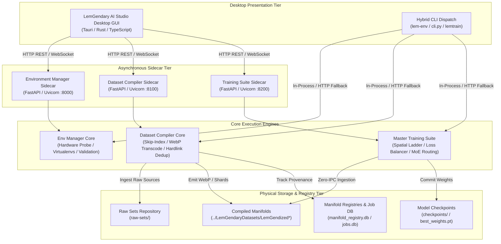

# LemGendary Ecosystem: Master Architecture Map & Multi-Sidecar Topology

## Category 01 ARCH | LemGendary AI Documentation Hub

**Integrated Subpages**:

* [Environment Manager](file:///c:/Development/python/model-training/lemgendary-docs/MD-Papers/PAPER_ENV_MANAGER.md)
* [Dataset Compiler Suite](file:///c:/Development/python/model-training/lemgendary-docs/MD-Papers/PAPER_DATASET_COMPILER.md)
* [Physical Degradation Engine](file:///c:/Development/python/model-training/lemgendary-docs/MD-Papers/PAPER_DEGRADATION_ENGINE.md)
* [Master Training Suite](file:///c:/Development/python/model-training/lemgendary-docs/MD-Papers/PAPER_TRAINING_SUITE.md)
* [AI Studio Desktop GUI Architecture](file:///c:/Development/python/model-training/lemgendary-docs/MD-Papers/PAPER_AI_STUDIO_GUI.md)
* [Unified Versioning Policy](file:///c:/Development/python/model-training/lemgendary-docs/MD-Papers/VERSIONING_POLICY.md)

---

## 1. Abstract & High-Level System Topology

The LemGendary AI Ecosystem is engineered as a decoupled, multi-tier distributed machine learning platform. It seamlessly binds local desktop operators, background sidecar services, high-velocity data synthesis engines, and nuclear-hardened training loops into a unified operational continuum.

---

## 2. The Multi-Sidecar Daemon Topology

To allow desktop applications, external CLI scripts, and cloud orchestrators to control the ecosystem without blocking execution or encountering Python GIL contentions, the ecosystem deploys three specialized asynchronous sidecar daemons across standardized local ports (`8000`, `8100`, and `8200`):

### 2.1 Environment Manager Sidecar (`127.0.0.1:8000`)

* **Framework**: FastAPI + Uvicorn with persistent lifespan queues.
* **Responsibilities**:
  * Real-time hardware discovery (`nvidia-smi`, `rocm-smi`, DirectX DXGI).
  * Virtual environment provisioning, package reconciliation, and version drift analytics.
  * Ecosystem-wide pre-commit compliance validation gating.
  * Live log broadcasting over WebSocket: `ws://127.0.0.1:8000/ws/log`.

### 2.2 Dataset Compiler Sidecar (`127.0.0.1:8100`)

* **Framework**: FastAPI + Uvicorn backed by SQLite job state tracking (`.lgd_server/jobs.db`).
* **Responsibilities**:
  * Background manifold compilation, degradation synthesis, and container export dispatching.
  * Dynamic job lifecycle management (queued, active, completed, failed, interrupted).
  * Real-time byte-metered transfer telemetry and WebP transcoding velocity streaming (`ws://127.0.0.1:8100/api/ws/jobs/{id}/logs`).

### 2.3 Master Training Suite Sidecar (`127.0.0.1:8200`)

* **Framework**: FastAPI + Uvicorn backed by ACID SQLite persistent job queue in `.lemtrain_server/jobs.db` (WAL mode).
* **Responsibilities**:
  * Headless training job dispatching, hyperparameter validation, and GPU device orchestration.
  * Real-time loss telemetry, spatial ladder transitions, epoch milestones, and checkpoint commits.
  * Live log broadcasting over WebSocket: `ws://127.0.0.1:8200/api/ws/jobs/{job_id}/logs` and `ws://127.0.0.1:8200/api/ws/logs`.
  * Local token security in `.lemtrain_server/token` and process PID management.

---

## 3. Repository Boundaries & Subsystem Responsibilities

| Subsystem | Primary Repository | Architecture Role | Key Invariants |
| :--- | :--- | :--- | :--- |
| **Presentation** | `lemgendary-ai-studio-gui` | Desktop operator cockpit (Tauri / TS). | Bound to frozen `openapi.json` contracts. Zero business logic in frontend. |
| **Toolchain & Env** | `lemgendary-env-manager` | Foundation manager (`v16.2.0`). | Strict isolation: Python 3.12+ required. Enforces zero-emoji & zero-suppression rules. |
| **Data Compiler** | `lemgendary-datasets` | Synthesis & ingestion engine (`v16.7.3`). | $\mathcal{O}(1)$ skip-indexing, WebP $q=92/95$, hardlink dedup, 2-tier resumption. |
| **Training Suite** | `lemgendary-training-suite` | Model training engine (`v16.2.9`). | Zero-IPC ThreadPool dataloaders, spatial resolution ladders, nuclear-hardened checkpoints. |
| **Documentation** | `lemgendary-docs` | Documentation hub & whitepapers (`v16.7.3`). | WCAG 2.1 AA accessible, responsive dual-viewport HTML5, synchronized versioning. |

---

## 4. Physical Storage Hierarchy

The ecosystem maintains strict directory isolation across local storage volumes:

* `raw-sets/`: Mutable upstream source archives (TAR, ZIP, Kaggle drops).
* `../LemGendaryDatasets/`: Deterministic training manifolds. Contains only suffix-free modernized datasets (e.g. `LemGendizedNimaAesthetic/`) and preserved legacy folders.
* `checkpoints/`: Epoch-specific model weight tensors (`.pt`, `.safetensors`) and optimizer states.
* `.lgd_server/`: Ephemeral daemon state (`server.pid`, `token`, `jobs.db`, job logs).

---

## 5. Fault Tolerance & Resumption Guarantees

1. **Compilation Interruption**: If a compilation job halts midway, the SQLite transaction register and $\mathcal{O}(1)$ skip-indexer allow immediate resumption without re-processing existing files.
2. **Modernization Interruption**: `tools/modernize_manifold.py` validates terminal manifests and skips already-transcoded `.webp` images in seconds.
3. **Training Crash Recovery**: `lemgendary-training-suite` saves emergency state dumps upon unhandled exceptions and rewinds learning rate schedules on gradient collapse.
