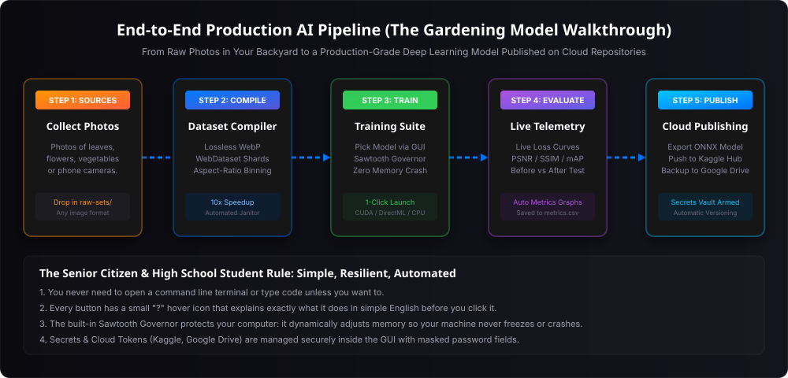
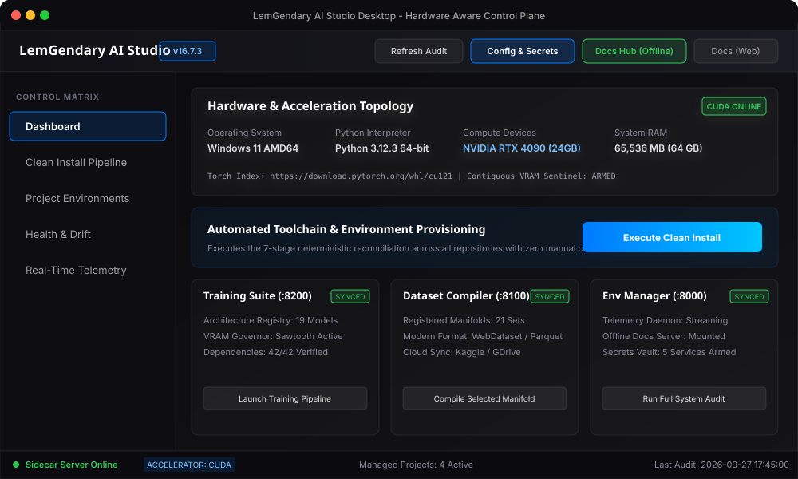
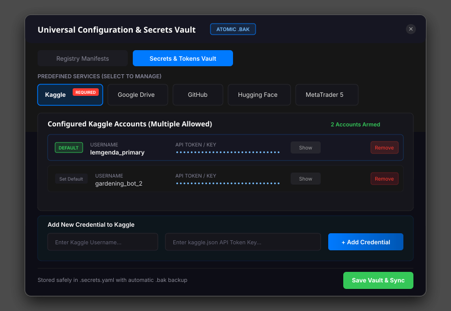

# LemGendary AI Studio GUI: Comprehensive Operator Manual

## Category 03 | LemGendary AI Documentation Hub | Master Operations Manual

---

## Table of Contents

- [1. Abstract & The Gardening Model Philosophy](#1-abstract--the-gardening-model-philosophy)
- [2. Interface Topology & Visual Navigation Matrix](#2-interface-topology--visual-navigation-matrix)
- [3. Universal Configuration & Secrets Vault](#3-universal-configuration--secrets-vault)
- [4. One-Click Environment Setup: The 7-Stage Clean Install Pipeline](#4-one-click-environment-setup-the-7-stage-clean-install-pipeline)
- [5. Dataset Compilation Pipeline: Modernization, Custom Multi-Source Ingestion & Kaggle Sync](#5-dataset-compilation-pipeline-modernization-custom-multi-source-ingestion--kaggle-sync)
- [6. Model Training Pipeline: Architectures, Ladders & Sawtooth Governor](#6-model-training-pipeline-architectures-ladders--sawtooth-governor)
- [7. Evaluation, Export & Cloud Publishing to Kaggle and Google Drive](#7-evaluation-export--cloud-publishing-to-kaggle-and-google-drive)
- [8. Health Matrix & Cross-Project Version Drift Analytics](#8-health-matrix--cross-project-version-drift-analytics)
- [9. Real-Time Telemetry & Monospace Event Diagnostics](#9-real-time-telemetry--monospace-event-diagnostics)
- [10. Contextual UX Help & Interactive Hover Guidance System](#10-contextual-ux-help--interactive-hover-guidance-system)
- [11. Permanent Offline Documentation Hub & Online Synchronization](#11-permanent-offline-documentation-hub--online-synchronization)
- [12. Tripartite Multi-Sidecar Network Architecture](#12-tripartite-multi-sidecar-network-architecture)
- [13. Automated Testing & Ecosystem Quality Assurance](#13-automated-testing--ecosystem-quality-assurance)

---

## 1. Abstract & The Gardening Model Philosophy

The **LemGendary AI Studio Desktop GUI** is a hardware-aware, nuclear-hardened command center engineered to make deep learning dataset synthesis, neural network training, and cloud deployment accessible to everyone—from senior machine learning researchers to high school students and non-technical hobbyists.

### The Gardening Model Rule

To ensure absolute operational clarity, every control, workflow, and safeguard in this manual is designed according to the **Gardening Model Rule**:

> *If a 75-year-old grandmother wants to train an AI model using photos of her garden roses, tomato plants, and soil to automatically detect plant diseases and enhance low-light garden photographs, she should be able to complete the entire pipeline—from environment setup to Kaggle cloud publishing—purely by clicking intuitive buttons in the GUI, with zero command-line commands, zero code editing, and zero risk of freezing her computer.*

The system achieves this through three foundational engineering principles:

1. **Deterministic One-Click Automation**: All complex toolchains, Python virtual environments, CUDA drivers, wheel resolutions, and dependencies are provisioned automatically through the 7-Stage Clean Install Pipeline.
2. **Nuclear Memory Protection (The Sawtooth Governor)**: When training complex vision models, the GUI continuously probes hardware VRAM. If memory approaches capacity, the system automatically downscales batch sizes and applies dynamic gradient accumulation, guaranteeing that your machine never suffers an Out-of-Memory (OOM) crash or system freeze.
3. **Comprehensive Contextual Guidance**: Every single interactive button, switch, input field, and status indicator is accompanied by a contextual hover icon (`?`) delivering instant, plain-English explanations of what the control does, what files are affected, and what safeguards are active.



---

## 2. Interface Topology & Visual Navigation Matrix

The AI Studio interface is organized into five persistent visual regions designed for ergonomic operation:



### 2.1 Workspace Header Bar

The top bar remains permanently anchored across all screens and provides immediate operational context and global commands:

- **Application Brand & Version**: Displays `LemGendary AI Studio` and the active semantic version tag (e.g. `v16.7.3`).
- **Refresh Audit Button**: Triggers an instantaneous asynchronous scan across physical compute devices, GPU temperatures, memory utilization, virtual environment health, and manifest drift.
- **Config & Secrets Button**: Opens the Universal Dynamic Configuration & Registry Editor Modal and Secrets Vault.
- **Docs Hub (Offline) Button**: Launches the local offline Documentation Hub served directly by the Environment Manager sidecar at `http://127.0.0.1:8000/documentation-hub/index.html`. This ensures authoritative technical manuals, whitepapers, and guides remain 100% accessible even during internet outages or isolated field deployments.
- **Docs (Web) Button**: Opens the authoritative documentation portal hosted live on GitHub Pages (`https://lemgenda.github.io/ai-training-whitepapers/index.html`).

### 2.2 Persistent Sidebar Navigation

The left sidebar provides instant single-click switching between the five core views:

1. `Dashboard`: High-level system overview, hardware sentinel cards, accelerator status, and quick-action project launchers.
2. `Clean Install Pipeline`: Interactive orchestrator for the 7-step deterministic environment provisioning sequence.
3. `Project Environments`: Dedicated per-repository cards for `lemgendary-training-suite`, `lemgendary-datasets`, and `lemgendary-env-manager` detailing virtual environment integrity and dependency sync.
4. `Health & Drift`: Real-time audit matrix comparing installed package versions across projects to detect and eliminate dependency divergence.
5. `Real-Time Telemetry`: High-speed monospace event console streaming live logs from background Python processes via WebSockets.

### 2.3 Primary Viewport

The central operational area dynamically loads the active view, rendering hardware cards, interactive sliders, configuration forms, or dataset synthesis matrices.

### 2.4 Persistent Status Footer

The bottom bar provides continuous real-time system heartbeats:

- **Sidecar Connection Glow**: An emerald indicator when all background daemons are active (`Sidecar Server Online`), or a rose alert when services require initialization (`Sidecar Server Offline`).
- **Detected Accelerator Badge**: Displays the active hardware compute backend (`CUDA`, `ROCM`, `DIRECTML`, or `CPU`).
- **Managed Projects Count**: Total registered repositories actively governed by the studio (typically 4: GUI, Training Suite, Datasets, Env Manager).
- **Last Audit Timestamp**: The exact second the last background health telemetry pass completed.

---

## 3. Universal Configuration & Secrets Vault

Deep learning workflows require interacting with external registries, storage backends, and cloud repositories. The AI Studio GUI integrates an in-app **Universal Configuration & Secrets Vault** modal accessible via the `Config & Secrets` header button.



### 3.1 Predefined Cloud Services & Secret Management

The Secrets Vault provides pre-configured integration profiles for all platforms utilized across the LemGendary ecosystem:

| Service | Requirement Level | Primary Function in Ecosystem | Credential Fields Required |
| :--- | :--- | :--- | :--- |
| **Kaggle** | **MANDATORY** | Ingesting source datasets, publishing modern WebDataset manifolds, pushing trained model weights | Username, API Key / Token (`kaggle.json`) |
| **Google Drive** | Optional | Off-site checkpoint backups, raw photo ingestion, long-term cold storage | Client ID, Client Secret, Refresh Token |
| **GitHub** | Optional | Codebase synchronization, release tagging, automated GitHub Actions CI/CD | Personal Access Token (PAT) |
| **Hugging Face** | Optional | Pushing Safetensors models, Parquet feature tables, and model cards | User Access Token (`hf_...`) |
| **MetaTrader 5** | Optional | High-frequency financial tick ingestion for the Forex Predictor suite | Account Login ID, Password, Broker Server |
| **Custom Service** | Optional | User-defined REST endpoints, private S3 buckets, or custom database credentials | Service Name, Username / ID, Secret Key |

### 3.2 Multi-Credential Management Per Service

Operators frequently manage separate personal, research, and production accounts. The Secrets Vault natively supports storing **multiple credentials for each service**:

- Each credential entry includes an optional descriptive label (e.g. `Work Account`, `Gardening Project`, `Cloud Backup`).
- A **Set Default** toggle designates which account active compilation and training runs should utilize automatically.
- **Masked Token Security**: All API keys and secrets are masked by default with bullet characters (`••••••••`). Operators can toggle the `Show` / `Hide` button to inspect tokens safely.
- **Atomic Persistence with Automatic Backup**: When clicking `Save Vault & Sync`, credentials are saved to `.secrets.yaml` using atomic write staging. A timestamped `.secrets.yaml.bak` snapshot is created automatically prior to writing, preventing credential corruption.
- **Legacy Credential Synchronization**: For backwards compatibility with CLI utilities, the vault automatically propagates saved tokens to legacy single-token files (`.kaggle_token`, `.kaggle_users`, `.GITHUB_PAT`, `.GOOGLE_DRIVE`, `.mt5_credentials`, `.huggingface_token`).

---

## 4. One-Click Environment Setup: The 7-Stage Clean Install Pipeline

Before training an AI model, your computer must have the correct software libraries installed. Traditionally, this required typing dozens of cryptic terminal commands. The AI Studio eliminates this completely through the automated **7-Stage Clean Install Pipeline**.

### 4.1 Running the Pipeline

To initialize or repair your environment:

1. Click `Clean Install Pipeline` in the left sidebar (or click `Execute Clean Install` on the Dashboard).
2. Click the primary action button: `Execute Full Clean Install Pipeline`.
3. Sit back and watch the 7 sequential stages execute automatically:

```text
[Stage 1] Hardware Discovery   --> Queries GPU, VRAM, CPU cores, and OS architecture
[Stage 2] Toolchain Audit      --> Verifies Python 3.10+, Git, Node, and Windows SDK tools
[Stage 3] Virtual Environments --> Creates isolated .venv directories for each project
[Stage 4] Requirements Sync    --> Copies centralized manifests and installs wheels
[Stage 5] Dependency Upgrades  --> Performs safe semver-bounded package reconciliation
[Stage 6] Codebase Verify      --> Runs py_compile and zero-emoji compliance audits
[Stage 7] Health Matrix        --> Generates final audit report and arms dashboard badges
```

### 4.2 What Happens If Something Fails?

If a prerequisite is missing (e.g. Python is not installed), the pipeline displays an amber warning card with an exact, copy-pasteable remediation command (e.g. `winget install Python.Python.3.12`). You do not need to diagnose error logs manually.

---

## 5. Dataset Compilation Pipeline: Modernization, Custom Multi-Source Ingestion & Kaggle Sync

High-velocity deep learning requires converting raw, loose image files into modern streaming containers. Traditional loose-image folders cause OS filesystem freezes when training models on hundreds of thousands of images. The LemGendary Dataset Compiler tab provides a complete visual control center for dataset synthesis and cloud storage synchronization.

### 5.1 Compilation Modes: Standard vs. Custom Multi-Source Compilation

The compiler interface features a Segmented Control switch at the top allowing operators to toggle between two operational compilation workflows:

#### Mode 1: Standard Manifold Compilation

Used for re-compiling, sharding, or transcoding existing official ecosystem manifolds:

1. **Select Target Manifold**: Choose from the dropdown of registered manifolds in `unified_data.yaml` (e.g. `Unified Perceptual Net V2`, `MIRNet Low-Light & Exposure`, `NIMA Perceptual Aesthetics`, `YOLOv8n`).
2. **Select Storage Format Preset**:
   - `Streaming WebDataset Shards (.tar)`: Sequential chunking with lossless WebP encoding and zero NTFS lock contention.
   - `Columnar HuggingFace Parquet (.parquet)`: Memory-mapped columnar binary format with snappy/zstd compression.
   - `MosaicML Streaming Shards (.mds)`: High-throughput streaming with fast random access.
   - `PyTorch Lightning LitData (.bin)`: Direct tensor serialization for distributed cloud training.
3. **Samples Per Shard**: Configure chunk sizes (default: `5,000` samples per shard, yielding optimal 300MB–400MB streaming archives).
4. **Purge Loose Images**: When checked, deletes redundant uncompressed source images post-sharding to prevent disk bloat.
5. **Click `Compile Manifold`**: Dispatches high-speed parallel workers with in-flight 12-thread WebP transcoding.

#### Mode 2: Custom Multi-Source Dataset Compilation

Used for creating entirely new custom dataset manifolds by aggregating data across multiple platforms:

1. **Custom Manifold Name**: Specify a descriptive PascalCase identifier (e.g. `SuperResMaster`, `AnimeFaceRestoration`).
2. **Domain Task**: Select target machine learning domain (`Restoration`, `Object Detection`, `Segmentation`, `Aesthetic Quality`, or `General Vision`).
3. **Container Architecture & Preset**: Choose target streaming format and compression quality profile.
4. **Source Repositories & Dataset URLs**: Enter source URLs or repository identifiers into the multi-line input box (one per line). Supported URI schemes:
   - **Kaggle**: `kaggle://username/dataset-slug` or direct URL `https://www.kaggle.com/datasets/username/dataset-slug`
   - **Hugging Face**: `hf://org/dataset-name` or direct URL `https://huggingface.co/datasets/org/dataset-name`
   - **Google Drive**: `gd://folder_or_file_id` or direct Google Drive share link `https://drive.google.com/...`
   - **GitHub**: `gh://owner/repository` or git clone link `https://github.com/owner/repository`
5. **Click `Compile Custom Dataset`**: The engine automatically normalizes all references, persists the new manifold into `unified_data.yaml`, downloads sources, and executes parallel container sharding.

---

### 5.2 Kaggle Cloud Synchronization & Storage Hub

The dedicated **Kaggle Cloud Synchronization & Storage Hub** card provides bidirectional integration with Kaggle Cloud Storage:

- **Credential Status Sentinel**: Automatically detects whether your Kaggle API key is configured (via environment variables, `.kaggle_token`, or `~/.kaggle/kaggle.json`), rendering a green `Kaggle Authenticated` or amber `Kaggle Credentials Required` badge.
- **Download from Kaggle**:
  - **Registry Datasets Mode**: Select from all 20 canonical Kaggle-linked manifolds from `unified_data.yaml`. Each dropdown entry indicates whether the manifold already exists locally (`Present Locally`) or needs to be downloaded (`Not Downloaded`).
  - **Custom Kaggle Link / Slug Mode**: Paste any direct Kaggle dataset URL or repository slug (`owner/dataset`) to pull external research datasets directly into the local storage root.
  - **Target Folder & Force Overwrite**: Optionally specify custom destination directories and toggle force re-downloading.
- **Upload to Kaggle**:
  - Select any locally compiled manifold from the dropdown.
  - Specify the target Kaggle repository slug (or leave blank to auto-resolve from `unified_data.yaml`).
  - Click `Upload to Kaggle` to package, validate, and upload your dataset directly.

---

### 5.3 Production Manifolds Catalog & Format Breakdown

The bottom section of the tab renders real-time metric cards for all **22 verified production manifolds**:

- **Compiled Status Badges**: Displays green `COMPILED` badges across all manifolds, reflecting on-disk shard and container verification.
- **Metrics Breakdown**: Displays total sample counts (e.g. 1.41M samples for MIRNet, 1.37M for UPNv2), physical disk footprint in gigabytes, total container shards, and exact counts across formats (`WebP`, `JPG`, `PNG`).
- **One-Click Refresh**: Clicking `Refresh Catalog` queries the sidecar on Port 8100 with fast filesystem mtime caching, updating metrics in under 50ms.

---

## 6. Model Training Pipeline: Architectures, Ladders & Sawtooth Governor

Once your dataset is compiled, you are ready to train a production-grade neural network.

### 6.1 Selecting an Architecture via GUI

The Training Suite registry (`unified_models_v2.yaml`) contains pre-configured architectures suited for diverse tasks:

- **For Garden Plant & Object Detection**: Choose `YOLOv8n` (ultra-fast, real-time bounding boxes).
- **For Garden Plant Disease Classification**: Choose `EfficientNetV2` or `MobileNetV3` (high accuracy, low compute).
- **For Restoring Blurry or Low-Light Garden Photos**: Choose `MIRNet v2` (illumination enhancement) or `NAFNet` (deblurring and denoising).
- **For Super-Resolving Distant Flower Details**: Choose `UltraZoom-x4` (sharp detail upscaling).

### 6.2 Training Configuration Controls

Operators configure training using visual inputs with safe default values:

- **Number of Epochs**: How many full passes over your dataset the model performs (e.g. 50 epochs).
- **Base Learning Rate**: How fast the model learns (recommended default: `0.0002` with Cosine Annealing).
- **Spatial Ladder Sequence**: Train progressively at $256\times 256 \rightarrow 384\times 384 \rightarrow 512\times 512$. This allows the model to learn coarse shapes rapidly before refining microscopic textures, speeding up training by up to 40%.

### 6.3 The Sawtooth Governor: Zero OOM Guarantee

In traditional machine learning, training runs often crash midway with a terrifying `CUDA Out of Memory` error when processing large photos.
The LemGendary AI Studio includes the **Sawtooth Governor**:

- A background sentinel tracks GPU VRAM every 100 milliseconds.
- If memory usage exceeds 90% of your GPU's capacity, the governor instantly cuts the mini-batch size in half and doubles gradient accumulation steps.
- The training run continues smoothly without interruption, allowing low-end or single-GPU machines to train state-of-the-art models safely.

---

## 7. Evaluation, Export & Cloud Publishing to Kaggle and Google Drive

### 7.1 Real-Time Metrics & Live Loss Curves

During training, the GUI visualizes live training and validation loss curves:

- **Training Loss (Blue Line)**: Decreases as the model memorizes garden patterns.
- **Validation Loss (Green Line)**: Decreases as the model generalizes to new photos it has never seen before.
- **Perceptual Metrics**: PSNR (Peak Signal-to-Noise Ratio), SSIM (Structural Similarity), and mAP (mean Average Precision) are plotted in real time and recorded in `metrics.csv`.

### 7.2 Exporting to Universal Runtimes

Once training completes, you can export your trained model with a single click:

- **ONNX Export**: Generates fixed-shape `.onnx` files compatible with DirectML (Windows laptops), TensorRT (NVIDIA GPUs), OpenVINO (Intel processors), and web browsers (WebGPU).
- **Safetensors Weights**: Saves cryptographic, zero-copy weights free of arbitrary code execution vulnerabilities.

### 7.3 Publishing to Kaggle & Google Drive

Click `Publish Model Package` in the GUI:

1. Select target cloud repository (Kaggle Model Hub or Google Drive).
2. The studio automatically bundles the model weights, model card (`README.md`), evaluation metrics graphs (`metrics.csv`), and before-and-after visual demonstration images.
3. Authenticates using your active credentials from the Secrets Vault and uploads the package as a new release version.

---

## 8. Health Matrix & Cross-Project Version Drift Analytics

In modern multi-project software suites, one project updating a shared library (like `torch` or `numpy`) while another stays on an older version causes insidious bugs.

The **Health & Version Drift Matrix** displays a clear, color-coded comparative grid across all four ecosystem projects:

- **Emerald `[SYNC]` Badge**: All repositories are running the identical package version.
- **Amber `[DRIFT]` Badge**: A version discrepancy was detected (e.g. Training Suite is using `torch 2.6.0` while Datasets is using `torch 2.5.1`).
- **One-Click Reconcile**: Clicking `Reconcile Dependencies` automatically upgrades or aligns the drifting packages to the higher compatible version without manual terminal intervention.

---

## 9. Real-Time Telemetry & Monospace Event Diagnostics

For power operators who want to monitor raw execution logs, the **Real-Time Telemetry** console provides a live, non-blocking log stream:

- **Severity Tagging**:
  - `[INFO]`: Progress milestones, shard numbers, and dataloader batch counters (cyan).
  - `[SUCCESS]`: Verified checksums, saved checkpoints, and completed epochs (emerald).
  - `[WARNING]`: Memory spikes, fallback execution modes, or non-critical notices (amber).
  - `[ERROR]`: Hardware faults, missing paths, or fatal exceptions (rose).
- **Interactive Controls**:
  - `Auto-Scroll Toggle`: Automatically tracks the newest line. Pauses scrolling automatically if you scroll up to inspect earlier logs.
  - `Clear Console`: Flushes buffer memory to isolate a new training session.

---

## 10. Contextual UX Help & Interactive Hover Guidance System

Every single visual control across the AI Studio Desktop GUI features contextual interactive hover guidance:

- **Universal Help Badges**: Interactive elements are paired with a subtle, non-intrusive `?` glyph.
- **Instantaneous Explanations**: Hovering or focusing the badge displays an elevated card detailing:
  1. What the action does in plain English.
  2. The underlying API endpoint or CLI script executed (`/api/...` or `python ...`).
  3. Memory and disk considerations (e.g. temporary storage requirements, VRAM allocation).
  4. Best-practice recommendations for non-technical users.

---

## 11. Permanent Offline Documentation Hub & Online Synchronization

Reliability requires that complete engineering documentation is accessible at all times—including on isolated workstations, offline air-gapped lab servers, or during broadband outages.

### 11.1 The Local Offline Documentation Server

- The Environment Manager daemon (`port 8000`) permanently mounts the entire `lemgendary-docs` directory as a static file server at `/documentation-hub/`.
- Clicking the **Docs Hub (Offline)** button in the header opens:
  `http://127.0.0.1:8000/documentation-hub/index.html`
- The offline hub contains all 46 scientific whitepapers, operator manuals, CLI guides, and API specifications. All stylesheets, SVG vector diagrams, and assets are bundled locally, requiring **zero external network requests**.

### 11.2 The Live GitHub Pages Hub

- Clicking the **Docs (Web)** button opens the live GitHub Pages site:
  `https://lemgenda.github.io/ai-training-whitepapers/index.html`
- The web portal provides identical content for remote sharing, mobile reading, and external research collaboration.

---

## 12. Tripartite Multi-Sidecar Network Architecture

The AI Studio GUI operates as a unified visual client communicating across three specialized local background microservices:

```text
+-----------------------------------------------------------------------+
|                 LemGendary AI Studio Desktop GUI                      |
|                  (Tauri / Rust / React / Vite)                        |
+-------------------+-------------------+-------------------------------+
                    |                   |
                    v                   v
+-----------------------+   +-----------------------+   +-----------------------+
|  Environment Manager  |   |    Dataset Compiler   |   |     Training Suite    |
|     Port :8000        |   |      Port :8100       |   |       Port :8200      |
+-----------------------+   +-----------------------+   +-----------------------+
| * Hardware Probing    |   | * Manifold Synthesis  |   | * Architecture Models |
| * Venv Provisioning   |   | * WebP Transcoding    |   | * Sawtooth Governor   |
| * Secrets Vault       |   | * WebDataset Shards   |   | * Dynamic Ladders     |
| * Offline Docs Server |   | * Cloud Sync (Kaggle) |   | * Live Loss Curves    |
+-----------------------+   +-----------------------+   +-----------------------+
```

The frontend client (`src/api/client.ts`) automatically multiplexes API calls across the three ports, providing unified error recovery, daemon health indicators, and transparent connection fallbacks.

---

## 13. Automated Testing & Ecosystem Quality Assurance

To guarantee system stability, the LemGendary ecosystem includes extensive automated test batteries across all projects. You can verify the health of the entire suite at any time using the unified CLI:

```bash
# Validate individual projects
lem-env validate --project lemgendary-env-manager
lem-env validate --project lemgendary-datasets
lem-env validate --project lemgendary-training-suite
lem-env validate --project lemgendary-ai-studio-gui
lem-env validate --project lemgendary-docs

# Or run complete multi-project ecosystem audit
lem-env validate --all
```

Every test verifies strict code compliance, dependency lockfile validity, and the absolute absence of emojis across all codebases and documentation.
