# LemGendary AI Studio GUI: Comprehensive Operator Manual

## Category 03 | LemGendary AI Documentation Hub | Master Operations Manual

**Authoritative Desktop Client Release**: `v2.0.0` (Tauri v2 Native Desktop Cockpit)  
**Target Backend Ecosystem**: `v16.9.16-STABLE` (Tripartite Sidecar Topology: Ports 8000, 8100, 8200)  
**Parent Authority**: [Master Ecosystem Architecture](file:///c:/Development/python/model-training/lemgendary-docs/MD-Papers/ECOSYSTEM_ARCHITECTURE.md) · [Document Authority Hierarchy & Versioning Policy](file:///c:/Development/python/model-training/lemgendary-docs/MD-Papers/VERSIONING_POLICY.md)

---

## Table of Contents

- [1. Abstract & The Gardening Model Philosophy](#1-abstract--the-gardening-model-philosophy)
- [2. Interface Topology & Visual Navigation Matrix](#2-interface-topology--visual-navigation-matrix)
- [3. Universal Configuration & Secrets Vault](#3-universal-configuration--secrets-vault)
- [4. One-Click Environment Setup: The 7-Stage Clean Install Pipeline](#4-one-click-environment-setup-the-7-stage-clean-install-pipeline)
- [5. Dataset Compilation Pipeline: Modernization, Custom Multi-Source Ingestion & Kaggle Sync](#5-dataset-compilation-pipeline-modernization-custom-multi-source-ingestion--kaggle-sync)
  - [5.1 Dataset Compiler & Storage Modernization Control Card](#51-dataset-compiler--storage-modernization-control-card)
    - [5.1.1 Standard Manifold Compilation](#511-standard-manifold-compilation)
    - [5.1.2 Custom Multi-Source Compilation](#512-custom-multi-source-compilation)
  - [5.2 Kaggle Cloud Synchronization & Storage Hub](#52-kaggle-cloud-synchronization--storage-hub)
    - [5.2.1 Download from Kaggle](#521-download-from-kaggle)
    - [5.2.2 Upload to Kaggle](#522-upload-to-kaggle)
    - [5.2.3 Update Metadata Only](#523-update-metadata-only)
  - [5.3 Production Manifolds Catalog & Format Breakdown](#53-production-manifolds-catalog--format-breakdown)
- [6. Model Training Pipeline: Architectures, Ladders & Sawtooth Governor](#6-model-training-pipeline-architectures-ladders--sawtooth-governor)
- [7. Evaluation, Export & Cloud Publishing to Kaggle and Google Drive](#7-evaluation-export--cloud-publishing-to-kaggle-and-google-drive)
- [8. Health Matrix & Cross-Project Version Drift Analytics](#8-health-matrix--cross-project-version-drift-analytics)
- [9. Real-Time Telemetry & Monospace Event Diagnostics](#9-real-time-telemetry--monospace-event-diagnostics)
- [10. Contextual UX Help & Interactive Hover Guidance System](#10-contextual-ux-help--interactive-hover-guidance-system)
- [11. Permanent Offline Documentation Hub & Online Synchronization](#11-permanent-offline-documentation-hub--online-synchronization)
- [12. Tripartite Multi-Sidecar Network Architecture](#12-tripartite-multi-sidecar-network-architecture)
- [13. Automated Testing & Ecosystem Quality Assurance](#13-automated-testing--ecosystem-quality-assurance)

---

## 1. Abstract & The Gardening Model Philosophy

The **LemGendary AI Studio Desktop GUI** is a hardware-aware, nuclear-hardened command center engineered to make deep learning dataset synthesis, neural network training, and cloud deployment accessible to everyone from senior machine learning researchers to high school students and non-technical hobbyists.

### The Gardening Model Rule

To ensure absolute operational clarity, every control, workflow, and safeguard in this manual is designed according to the **Gardening Model Rule**:

> *If a 75-year-old grandmother wants to train an AI model using photos of her garden roses, tomato plants, and soil to automatically detect plant diseases and enhance low-light garden photographs, she should be able to complete the entire pipeline from environment setup to Kaggle cloud publishing purely by clicking intuitive buttons in the GUI, with zero command-line commands, zero code editing, and zero risk of freezing her computer.*

The system achieves this through three foundational engineering principles:

1. **Deterministic One-Click Automation**: All complex toolchains, Python virtual environments, CUDA drivers, wheel resolutions, and dependencies are provisioned automatically through the 7-Stage Clean Install Pipeline.
2. **Nuclear Memory Protection (The Sawtooth Governor)**: When training complex vision models, the GUI continuously probes hardware VRAM. If memory approaches capacity, the system automatically downscales batch sizes and applies dynamic gradient accumulation, guaranteeing that your machine never suffers an Out-of-Memory (OOM) crash or system freeze.
3. **Comprehensive Contextual Guidance**: Every single interactive button, switch, input field, and status indicator is accompanied by a contextual hover icon (`?`) delivering instant, plain-English explanations of what the control does, what files are affected, and what safeguards are active.


---

## 2. Interface Topology & Visual Navigation Matrix

The AI Studio interface is organized into persistent visual regions designed for ergonomic operation. Every element, card, and control in the live interface is indexed below with corresponding operational workflows and safety boundaries.

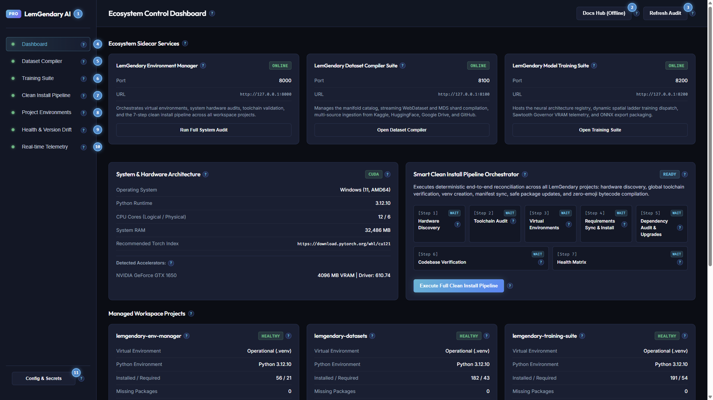

### 2.1 Workspace Global Shell Elements & Numbered Navigation Guide

The live screen capture above displays the complete primary application frame including header, persistent sidebar navigation, active dashboard viewport, and status footer:

1. **Brand Title & Pro Edition Badge**: Displays `LemGendary AI` alongside the professional suite pill. Identifies client application release integrity.
2. **Docs Hub (Offline) Action Button**: Launches the local offline Documentation Hub served by the Environment Manager sidecar at `http://127.0.0.1:8000/documentation-hub/index.html`. Guarantees full offline documentation access during field deployments.
3. **Refresh Audit Telemetry Button**: Triggers an instantaneous asynchronous background scan across physical accelerators, GPU VRAM, system memory, project virtual environments, and manifest version drift.
4. **Dashboard Tab Selector**: Switches primary viewport to the main system dashboard, rendering hardware sentinel cards, sidecar process tiles, project health cards, and the real-time event console.
5. **Dataset Compiler Tab Selector**: Switches primary viewport to the streaming manifold compiler, custom multi-source ingestion interface, Kaggle synchronization hub, and verified manifold catalog.
6. **Training Suite Tab Selector**: Switches primary viewport to the neural architecture matrix, Sawtooth Governor VRAM controls, progressive spatial ladders, and training dispatch orchestrator.
7. **Clean Install Pipeline Tab Selector**: Switches primary viewport to the dedicated 7-stage deterministic environment provisioning and toolchain verification sequence.
8. **Project Environments Tab Selector**: Switches primary viewport to dedicated sub-repository cards (`lemgendary-training-suite`, `lemgendary-datasets`, `lemgendary-env-manager`) with package counts and reconciliation controls.
9. **Health & Version Drift Tab Selector**: Switches primary viewport to host prerequisite audits and cross-project package version comparison matrices.
10. **Real-time Telemetry Tab Selector**: Switches primary viewport to the high-throughput monospace console streaming real-time status packets over local WebSockets.
11. **Config & Secrets Vault Button**: Opens the Universal Configuration, Registry Editor & Secrets Vault Modal for editing YAML manifests and managing Kaggle, Google Drive, GitHub, and MT5 API tokens.

| Callout # | UI Element | Control Type | Triggered Endpoint / Action | Operator Guide & Behavioral Safeguards |
| :--- | :--- | :--- | :--- | :--- |
| **1** | Brand Title & Badge | Static Display | None | Confirms GUI client version and application branding. |
| **2** | Docs Hub (Offline) | Action Button | `window.open('/documentation-hub/')` | Opens browser window to local offline documentation server on port 8000. |
| **3** | Refresh Audit | Action Button | `POST /api/audit` | Queries all three sidecars to refresh hardware metrics and venv health. |
| **4** | Dashboard Tab | Navigation Button | `setCurrentTab("dashboard")` | Navigates to central system overview and launcher tiles. |
| **5** | Dataset Compiler Tab | Navigation Button | `setCurrentTab("datasets")` | Navigates to manifold compiler and Kaggle synchronization tools. |
| **6** | Training Suite Tab | Navigation Button | `setCurrentTab("training")` | Navigates to neural architecture registry and training dispatch. |
| **7** | Clean Install Tab | Navigation Button | `setCurrentTab("pipeline")` | Navigates to the automated 7-step clean install pipeline. |
| **8** | Projects Tab | Navigation Button | `setCurrentTab("projects")` | Navigates to repository cards and individual venv status. |
| **9** | Health & Drift Tab | Navigation Button | `setCurrentTab("health")` | Navigates to package version divergence matrix. |
| **10** | Telemetry Logs Tab | Navigation Button | `setCurrentTab("logs")` | Navigates to monospace WebSocket log terminal. |
| **11** | Config & Secrets | Modal Trigger | `setIsConfigEditorOpen(true)` | Launches modal dialog for manifest editing and secret management. |

---

### 2.5 Tripartite Sidecar Process Control & Auto-Start

The Ecosystem Sidecar Services grid permanently monitors and coordinates the three local microservices:

- **LemGendary Environment Manager (`Port 8000`)**: Core orchestrator and validation authority.
- **LemGendary Dataset Compiler Suite (`Port 8100`)**: Manifold compiler and streaming storage server.
- **LemGendary Model Training Suite (`Port 8200`)**: Neural architecture training and evaluation engine.

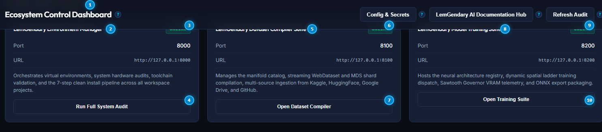

#### Ecosystem Sidecar Cards Numbered Reference

1. **Ecosystem Sidecar Services Section Header**: Overview header accompanied by contextual help tooltip explaining tripartite microservice architecture.
2. **Environment Manager Card Title**: Identifies port 8000 governance daemon governing virtual environments and hardware discovery.
3. **Environment Manager Status Badge**: Real-time indicator displaying green `ONLINE` or red `OFFLINE`.
4. **Run Full System Audit Button**: Triggers deterministic hardware, dependency, and manifest inspection across all workspace projects.
5. **Dataset Compiler Suite Card Title**: Identifies port 8100 service managing WebDataset, Parquet, and MDS manifolds.
6. **Dataset Compiler Status Badge**: Real-time indicator displaying green `ONLINE` or red `OFFLINE`.
7. **Open Dataset Compiler Button**: Navigation shortcut directly switching the active viewport to the Dataset Compiler tab.
8. **Model Training Suite Card Title**: Identifies port 8200 service managing PyTorch neural architectures and Sawtooth Governor VRAM safeguards.
9. **Model Training Suite Status Badge**: Real-time indicator displaying green `ONLINE` or red `OFFLINE`.
10. **Open Training Suite Button**: Navigation shortcut directly switching the active viewport to the Training Suite tab.

| Callout # | UI Element | Control Type | Triggered Endpoint / Action | Operator Guide & Behavioral Safeguards |
| :--- | :--- | :--- | :--- | :--- |
| **1** | Sidecars Header | Section Heading | None | Explains process lifecycle across local background daemons. |
| **2** | Env Manager Title | Card Heading | None | Labels port 8000 primary governance daemon. |
| **3** | Env Manager Status | Status Badge | `GET http://127.0.0.1:8000/health` | Shows connection readiness. Probed automatically every 4 seconds. |
| **4** | Run Full System Audit | Action Button | `POST http://127.0.0.1:8000/api/audit` | Dispatches non-blocking complete audit of all four repositories. |
| **5** | Compiler Title | Card Heading | None | Labels port 8100 streaming dataset compilation daemon. |
| **6** | Compiler Status | Status Badge | `GET http://127.0.0.1:8100/health` | Shows compiler daemon readiness. |
| **7** | Open Dataset Compiler | Action Button | `setCurrentTab("datasets")` | Switches operator viewport to manifold synthesis controls. |
| **8** | Training Suite Title | Card Heading | None | Labels port 8200 PyTorch neural training daemon. |
| **9** | Training Status | Status Badge | `GET http://127.0.0.1:8200/health` | Shows training suite readiness. |
| **10** | Open Training Suite | Action Button | `setCurrentTab("training")` | Switches operator viewport to model orchestration matrix. |

---

## 3. Universal Configuration & Secrets Vault

Deep learning workflows require interacting with external registries, storage backends, and cloud repositories. The AI Studio GUI integrates an in-app Universal Configuration & Secrets Vault modal accessible via the `Config & Secrets` header and sidebar buttons.

### 3.1 Central Manifest Registry Editor

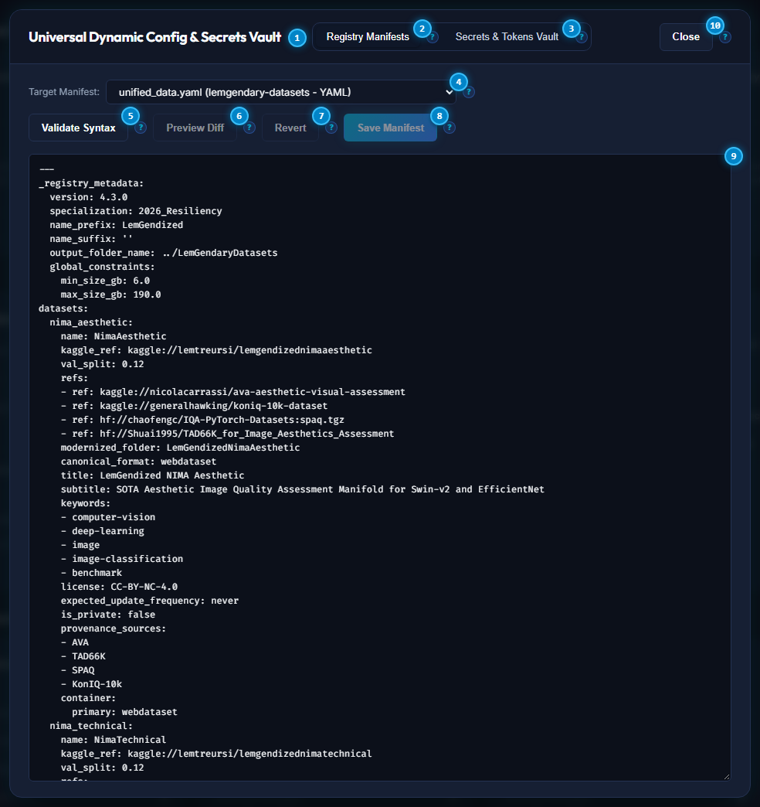

#### Manifest Registry Editor Numbered Reference

1. **Registry Manifests Subtab Switcher**: Selects the central YAML configuration and registry manifest editing workspace.
2. **Secrets & Tokens Vault Subtab Switcher**: Switches modal view to encrypted cloud credentials and API token management.
3. **Target Manifest Selector Dropdown**: Selects from ecosystem manifests including `unified_data.yaml` (dataset definitions), `unified_models_v2.yaml` (architecture registry), `unified_requirements.yaml` (dependency SSOT), and `.secrets.yaml`.
4. **Validate Syntax Button**: Executes in-memory YAML parsing and schema validation without writing to disk, reporting structural errors before persistence.
5. **Save Manifest Button**: Persists verified modifications to disk using atomic temporary write staging and creates a timestamped backup copy.
6. **Monospace Manifest Code Editor**: Full-height in-browser text editor providing direct inspection and modification of central configuration files.
7. **Modal Close Button**: Safely dismisses configuration modal and returns to previous workspace view.

| Callout # | UI Element | Control Type | Triggered Endpoint / Action | Operator Guide & Behavioral Safeguards |
| :--- | :--- | :--- | :--- | :--- |
| **1** | Manifests Tab | Subtab Button | `setActiveTab("manifests")` | Activates central YAML code editor and schema linter. |
| **2** | Secrets Tab | Subtab Button | `setActiveTab("secrets")` | Activates credentials and token management profiles. |
| **3** | Manifest Dropdown | Select Dropdown | `fetchManifest(selected)` | Loads selected file into memory and populates editor view. |
| **4** | Validate Syntax | Action Button | `POST /api/manifests/validate` | Validates YAML syntax and schema without altering files on disk. |
| **5** | Save Manifest | Primary Button | `POST /api/manifests/save` | Writes changes atomically and triggers hot-reload across active sidecars. |
| **6** | Monospace Editor | Textarea Editor | `setCurrentContent(e.target.value)` | Displays raw configuration text with monospaced indentation. |
| **7** | Modal Close | Action Button | `setIsConfigEditorOpen(false)` | Closes dialog without persisting uncommitted text. |

---

### 3.2 Secrets & Cloud Tokens Vault

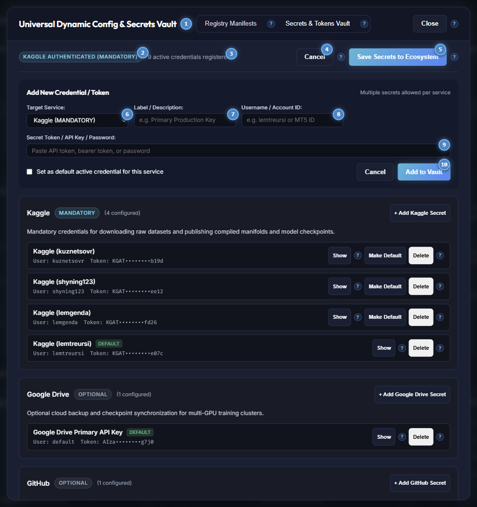

#### Secrets & Tokens Vault Numbered Reference

1. **Registry Manifests Tab**: Switcher to return to the manifest code editor.
2. **Secrets & Tokens Vault Tab**: Active subtab governing authenticated cloud credentials.
3. **Kaggle Authentication Sentinel**: Displays green `KAGGLE AUTHENTICATED (MANDATORY)` when active keys are verified, or amber alert when configuration is required.
4. **Add New Secret Button**: Expands interactive credential registration form to add additional accounts.
5. **Save Secrets to Ecosystem Button**: Persists all registered credentials to encrypted `.secrets.yaml` and propagates legacy single-token files (`.kaggle_token`, `.kaggle_users`, `.mt5_credentials`).
6. **Kaggle Service Card Header**: Primary cloud service profile for dataset ingestion and model checkpoint distribution.
7. **Requirement Level Badge**: Clearly flags mandatory vs optional platform dependencies.
8. **Add Kaggle Secret Shortcut**: Dedicated action button pre-filling service selection for Kaggle credentials.
9. **Google Drive Service Card**: Optional profile for cold storage and multi-GPU checkpoint synchronization.
10. **Modal Close Button**: Safely closes dialog.

| Callout # | UI Element | Control Type | Triggered Endpoint / Action | Operator Guide & Behavioral Safeguards |
| :--- | :--- | :--- | :--- | :--- |
| **1** | Manifests Tab | Subtab Button | `setActiveTab("manifests")` | Navigates back to manifest configuration editor. |
| **2** | Secrets Tab | Subtab Button | `setActiveTab("secrets")` | Confirms active secrets vault workspace. |
| **3** | Kaggle Auth Badge | Status Pill | `GET /api/secrets/status` | Flags ecosystem requirement for official Kaggle API access. |
| **4** | + Add New Secret | Action Button | `setIsAddingSecret(!isAddingSecret)` | Toggles new credential registration form with service dropdown. |
| **5** | Save Secrets | Primary Button | `POST /api/secrets/save` | Encrypts vault to disk, writes backup, and syncs legacy credential files. |
| **6** | Kaggle Service Card | Profile Header | None | Groups all registered personal and institutional Kaggle accounts. |
| **7** | Requirement Badge | Badge Indicator | None | Differentiates mandatory core services from optional cloud mirrors. |
| **8** | + Add Kaggle Secret | Action Button | `openAddForService("kaggle")` | Opens account entry pre-configured for Kaggle username and token. |
| **9** | Google Drive Card | Profile Card | None | Manages Client ID, Client Secret, and Refresh Token for Google Drive. |
| **10** | Close Modal | Action Button | `setIsConfigEditorOpen(false)` | Dismisses secrets view. |

---

## 4. One-Click Environment Setup: The 7-Stage Clean Install Pipeline

Before training an AI model, your computer must have the correct software libraries installed. Traditionally, this required typing dozens of cryptic terminal commands. The AI Studio eliminates this completely through the automated 7-Stage Clean Install Pipeline.

### 4.1 Pipeline Orchestrator Control Card

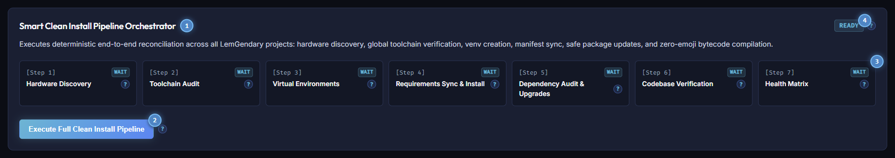

#### Clean Install Pipeline Numbered Reference

1. **Pipeline Orchestrator Title & Help Glyph**: Header detailing deterministic 7-step environment recreation and toolchain verification.
2. **Pipeline Execution State Badge**: Displays cyan `READY` when idle, or amber `PIPELINE ACTIVE` during background execution.
3. **Execute Full Clean Install Pipeline Button**: Launches sequential execution of all seven stages in background worker threads.
4. **Active Stage Progress Bar**: Visual meter showing real-time pipeline execution progress from Stage 1 through Stage 7.
5. **Stage 1 Metric Card (Hardware Discovery)**: Probes CUDA compute devices, driver levels, and CPU architecture.
6. **Stage 4 Metric Card (Requirements Sync & Install)**: Propagates centralized dependencies and installs wheels deterministically.
7. **Stage 7 Metric Card (Health Matrix)**: Generates final multi-project verification report and arms dashboard badges.

| Callout # | UI Element | Control Type | Triggered Endpoint / Action | Operator Guide & Behavioral Safeguards |
| :--- | :--- | :--- | :--- | :--- |
| **1** | Pipeline Title | Section Heading | None | Contextual heading explaining zero-command environment setup. |
| **2** | State Badge | Status Badge | `GET /api/pipeline/status` | Confirms whether pipeline workers are idle or running. |
| **3** | Execute Full Pipeline | Primary Button | `POST /api/pipeline/trigger` | Starts autonomous 7-step provisioning sequence without terminal commands. |
| **4** | Progress Bar | Visual Meter | Real-time WebSocket updates | Displays active completion percentage across all steps. |
| **5** | Stage 1 Card | Step Indicator | Step 1 Execution | Validates GPU, VRAM, and operating system topology. |
| **6** | Stage 4 Card | Step Indicator | Step 4 Execution | Installs PyTorch wheels and package dependencies safely. |
| **7** | Stage 7 Card | Step Indicator | Step 7 Execution | Publishes system state and validates zero-drift matrix. |

---

### 4.2 Hardware Acceleration Sentinel Card

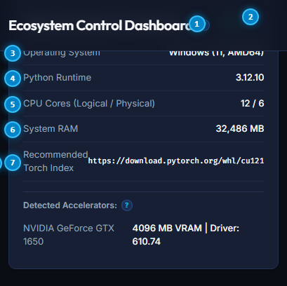

#### Hardware Architecture Card Numbered Reference

1. **System & Hardware Architecture Title**: Heading indicating live results from host platform probing.
2. **Primary Accelerator Backend Badge**: Highlights active execution engine (`CUDA`, `DIRECTML`, `ROCM`, or `CPU`).
3. **Host Operating System & Kernel Metric**: Confirms operating system release and processor architecture (e.g. `Windows (11, AMD64)`).
4. **Host Python Runtime Version**: Displays active host Python interpreter binary (e.g. `3.12.10`).
5. **CPU Cores Allocation**: Displays logical execution threads versus physical CPU cores (e.g. `12 / 6`).
6. **System RAM Capacity**: Displays total physical memory capacity in megabytes (e.g. `32,486 MB`).
7. **Recommended PyTorch Wheel Index**: Authoritative binary index link for CUDA hardware acceleration.
8. **Detected Accelerators & VRAM Readout**: Displays GPU device model, driver revision, and total video memory capacity.

| Callout # | UI Element | Control Type | Triggered Endpoint / Action | Operator Guide & Behavioral Safeguards |
| :--- | :--- | :--- | :--- | :--- |
| **1** | Architecture Title | Section Heading | None | Live probe executed by `env_manager.system_probe`. |
| **2** | Accelerator Badge | Status Pill | None | Shows hardware compute provider utilized by neural runtimes. |
| **3** | Operating System | Metric Value | `os.uname()` / `platform.platform()` | Confirms OS compatibility for binary wheels. |
| **4** | Python Runtime | Metric Value | `sys.version` | Verifies Python 3.10+ requirement compliance. |
| **5** | CPU Cores | Metric Value | `psutil.cpu_count()` | Guides dataloader multi-threading worker allocation. |
| **6** | System RAM | Metric Value | `psutil.virtual_memory()` | Ensures adequate host memory for in-memory image batching. |
| **7** | Recommended Torch | Metric Value | Pre-flight probe | Displays official PyTorch wheel repository URL. |
| **8** | GPU & VRAM | Device Metric | CUDA / DirectML probe | Details physical GPU model, driver level, and dedicated memory. |

---

### 4.3 Managed Workspace Projects Health Cards

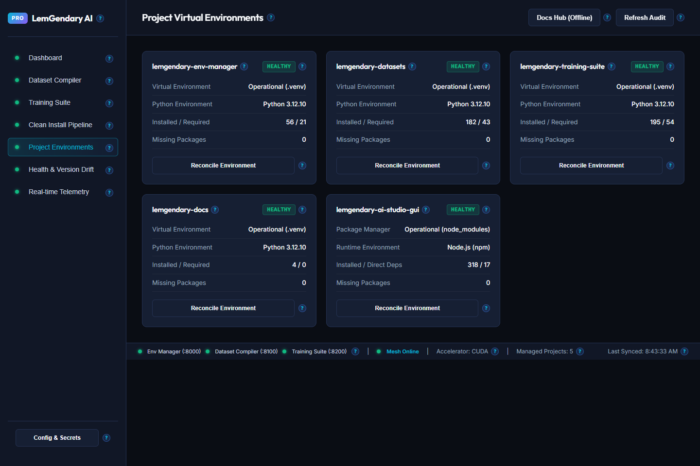

#### Managed Projects Grid Numbered Reference

1. **Environment Manager Sub-Repository Title**: Card identifying `lemgendary-env-manager` codebase.
2. **Environment Manager Health Badge**: Displays green `HEALTHY` when virtual environment and packages match manifests.
3. **Reconcile Virtual Environment Button (Env Manager)**: Triggers single-project dependency alignment for port 8000 daemon.
4. **Dataset Compiler Suite Sub-Repository Title**: Card identifying `lemgendary-datasets` codebase.
5. **Dataset Compiler Health Badge**: Confirms virtual environment status for port 8100 daemon.
6. **Model Training Suite Sub-Repository Title**: Card identifying `lemgendary-training-suite` codebase.
7. **Model Training Suite Health Badge**: Confirms virtual environment status for port 8200 daemon.
8. **Reconcile Virtual Environment Button (Training Suite)**: Triggers single-project dependency alignment for training suite.

| Callout # | UI Element | Control Type | Triggered Endpoint / Action | Operator Guide & Behavioral Safeguards |
| :--- | :--- | :--- | :--- | :--- |
| **1** | Env Manager Title | Card Heading | None | Labels environment governance sub-repository. |
| **2** | Env Manager Health | Status Badge | `GET /api/health` | Shows isolated `.venv` validity and package counts. |
| **3** | Reconcile Env Manager | Action Button | `POST /api/pipeline/reconcile?project=env-manager` | Recreates `.venv` and reconciles missing wheels. |
| **4** | Datasets Title | Card Heading | None | Labels dataset compiler sub-repository. |
| **5** | Datasets Health | Status Badge | `GET /api/health` | Shows dataset compiler `.venv` validity. |
| **6** | Training Suite Title | Card Heading | None | Labels neural training sub-repository. |
| **7** | Training Suite Health | Status Badge | `GET /api/health` | Shows training suite `.venv` validity. |
| **8** | Reconcile Training | Action Button | `POST /api/pipeline/reconcile?project=training-suite` | Reinstalls PyTorch dependencies for training suite. |

---

## 5. Dataset Compilation Pipeline: Modernization, Custom Multi-Source Ingestion & Kaggle Sync

High-velocity deep learning requires converting raw, loose image files into modern streaming containers. Traditional loose-image folders cause OS filesystem freezes when training models on hundreds of thousands of images. The LemGendary Dataset Compiler tab provides a complete visual control center for dataset synthesis and cloud storage synchronization.

### 5.1 Dataset Compiler & Storage Modernization Control Card

#### 5.1.1 Standard Manifold Compilation

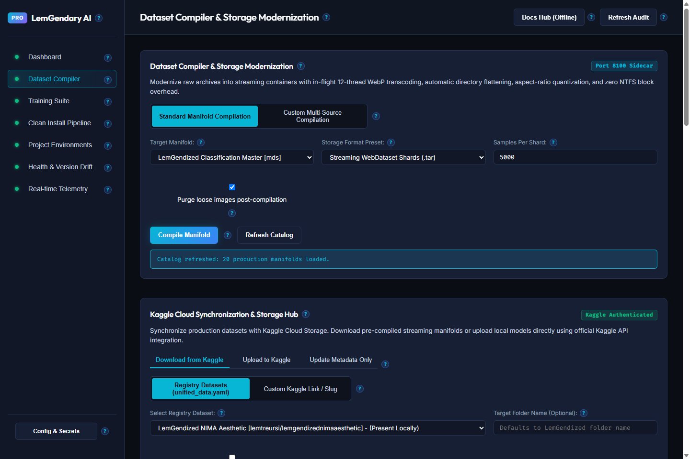

##### Standard Compilation Numbered Reference

1. **Compilation Mode Segmented Control**: Switches between `Standard Manifold Compilation` and `Custom Multi-Source Compilation`. A `HelpTooltip` explains each mode.
2. **Target Manifold Dropdown Selector**: Selects dataset to modernize from registered definitions in `unified_data.yaml`.
3. **Storage Format Preset Dropdown**: Selects container architecture (`Streaming WebDataset Shards`, `Columnar Parquet`, `MosaicML MDS`, `LitData`).
4. **Samples Per Shard Input Field**: Configures container partition size (default: `5,000` samples per shard, yielding optimal 300MB–400MB archives).
5. **Purge Loose Images Checkbox**: When checked, deletes redundant uncompressed source images post-sharding to reclaim disk space.
6. **Compile Manifold Primary Button**: Dispatches multi-threaded parallel workers with in-flight 12-thread WebP transcoding.
7. **Refresh Catalog Button**: Queries port 8100 sidecar to update manifold disk footprint and verification status.

| Callout # | UI Element | Control Type | Triggered Endpoint / Action | Operator Guide & Behavioral Safeguards |
| :--- | :--- | :--- | :--- | :--- |
| **1** | Mode Switcher | Segmented Control | `setCompileMode("standard" \| "custom")` | Toggles between existing manifold sharding and multi-source URL ingestion. |
| **2** | Target Manifold | Select Dropdown | `setSelectedManifold(e.target.value)` | Chooses dataset registered in `unified_data.yaml`. |
| **3** | Storage Preset | Select Dropdown | `setSelectedPreset(e.target.value)` | Selects container format: WebDataset (.tar), Parquet, MDS, or LitData. |
| **4** | Samples Per Shard | Number Input | `setShardSize(Number(e.target.value))` | Sets chunk capacity. Range: 100 to 50,000 samples per archive. |
| **5** | Purge Loose Images | Checkbox Toggle | `setPurgeLooseImages(e.target.checked)` | Deletes loose raw images after verified container compilation. |
| **6** | Compile Manifold | Primary Button | `POST http://127.0.0.1:8100/api/compile` | Initiates parallel container compilation and WebP transcoding. |
| **7** | Refresh Catalog | Action Button | `fetchDatasets()` | Re-scans disk storage and updates sample metrics in under 50ms. |

---

#### 5.1.2 Custom Multi-Source Compilation

Activated by switching the **Compilation Mode Segmented Control** (Callout 1 above) to `Custom Multi-Source Compilation`. This mode ingests datasets from external cloud platforms — Kaggle, HuggingFace, Google Drive, or GitHub — into a brand-new named manifold, without requiring a pre-existing `unified_data.yaml` entry.

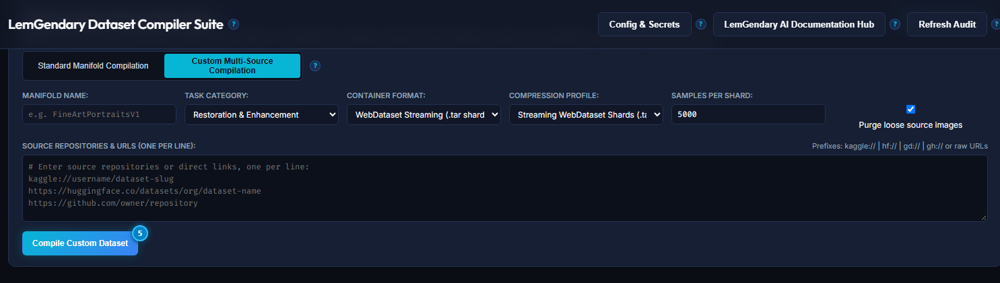

##### Custom Compilation Numbered Reference

1. **Manifold ID Text Input**: Unique canonical name for the new compiled manifold (e.g. `SuperResMaster`, `AnimeDiffusion`, `FaceRestorationPro`). Used as the storage folder name and registry key.
2. **Target Domain Dropdown**: Machine learning task domain (`restoration`, `detection`, `classification`, `segmentation`, `forex`) — governs vetting policies and schema rules applied during compilation.
3. **Storage Format Dropdown**: Container architecture for the custom manifold (`Streaming WebDataset Shards`, `Columnar Parquet`, `MosaicML MDS`, `LitData`).
4. **Quality Preset Dropdown**: Predefined compression profile controlling WebP encode quality bounds and shard density.
5. **Samples Per Shard Number Input**: Target partition size for each container chunk in the custom manifold.
6. **Dataset Source URL / Path Input**: Accepts Kaggle slugs (`kaggle://owner/slug` or `https://kaggle.com/datasets/...`), HuggingFace repos (`hf://dataset-name` or `https://huggingface.co/datasets/...`), Google Drive links (`gd://file-id`), or GitHub repos (`gh://owner/repo`).
7. **Sync Multi-Source Dataset Button**: Initiates authenticated ingestion from the configured source URL into a fresh local manifold directory.
8. **Compile Multi-Source Manifold Button**: After sync, compiles the ingested raw sources into the selected container format with WebP transcoding and integrity vetting.

| Callout # | UI Element | Control Type | Triggered Endpoint / Action | Operator Guide & Behavioral Safeguards |
| :--- | :--- | :--- | :--- | :--- |
| **1** | Manifold ID | Text Input | `setCustomManifoldId(e.target.value)` | Canonical name for new dataset. Lowercase, no spaces recommended (e.g. `face-hq-512`). |
| **2** | Target Domain | Select Dropdown | `setCustomDomain(e.target.value)` | Governs annotation schema, vetting filters, and pre-flight integrity rules. |
| **3** | Storage Format | Select Dropdown | `setCustomFormat(e.target.value)` | Container architecture: WebDataset for streaming, MDS for random access. |
| **4** | Quality Preset | Select Dropdown | `setCustomPreset(e.target.value)` | Compression envelope: `ultra`, `high`, `balanced`, `draft`. |
| **5** | Samples Per Shard | Number Input | `setCustomShardSize(Number(e.target.value))` | Partition density. Default: 5,000 samples per archive. |
| **6** | Source URL / Path | Text Input | `setCustomSourceUrl(e.target.value)` | Accepts Kaggle, HuggingFace, Google Drive, or GitHub URL/slug. |
| **7** | Sync Multi-Source | Action Button | `POST http://127.0.0.1:8100/api/ingest` | Downloads raw data from external source into local staging directory. |
| **8** | Compile Multi-Source | Primary Button | `POST http://127.0.0.1:8100/api/compile/custom` | Runs full compilation pipeline on ingested sources: dedupe, vetting, WebP, sharding. |

---

### 5.2 Kaggle Cloud Synchronization & Storage Hub

The Kaggle hub provides bidirectional cloud synchronization with three distinct operating modes accessible via the subtab navigation row.

#### 5.2.1 Download from Kaggle

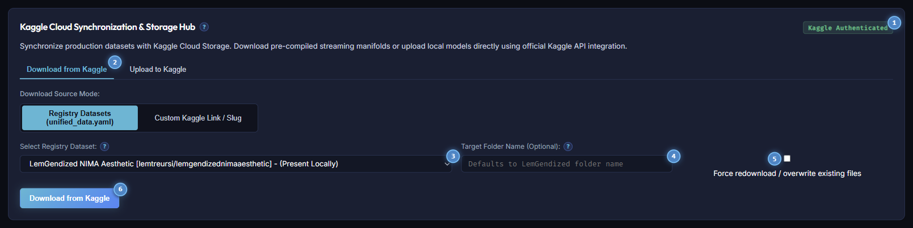

##### Download from Kaggle Numbered Reference

1. **Cloud Action Mode Subtabs**: Toggles between `Download from Kaggle`, `Upload to Kaggle`, and `Update Metadata Only` workflows. A `HelpTooltip` explains all three modes.
2. **Download Source Mode Switcher**: Selects between official `Registry Datasets (unified_data.yaml)` and `Custom Kaggle Link / Slug` input modes. A `HelpTooltip` explains each option.
3. **Select Registry Dataset Dropdown**: Lists all canonical Kaggle-linked manifolds from `unified_data.yaml` with local availability tags (`Present Locally` vs `Not Downloaded`). Visible in Registry mode only.
4. **Custom Kaggle Link / Slug Input**: Accepts a direct Kaggle URL (`https://www.kaggle.com/datasets/username/dataset-name`) or repository slug (`owner/dataset-name`). Visible in Custom mode only.
5. **Target Destination Folder Name Input**: Optional local storage destination subfolder inside `LemGendaryDatasets/`. Defaults to the manifest folder name.
6. **Force Redownload Checkbox**: When enabled, re-downloads all shards even if files exist locally — bypasses local caching for bit-for-bit cloud refresh.
7. **Download from Kaggle Primary Button**: Initiates authenticated multi-threaded download via the official Kaggle API. Requires valid `~/.kaggle/kaggle.json` credentials.

| Callout # | UI Element | Control Type | Triggered Endpoint / Action | Operator Guide & Behavioral Safeguards |
| :--- | :--- | :--- | :--- | :--- |
| **1** | Action Subtabs | Subtab Navigation | `setKaggleActiveTab("download" \| "upload" \| "metadata")` | Switches between cloud pulling, manifold publishing, and metadata-only sync. |
| **2** | Source Mode | Segmented Control | `setKaggleDownloadMode("registry" \| "custom")` | Switches between curated registry manifolds and ad-hoc repository links. |
| **3** | Registry Dataset | Select Dropdown | `setSelectedRegistryKey(e.target.value)` | Picks verified dataset manifold linked in `unified_data.yaml`. Registry mode only. |
| **4** | Custom URL / Slug | Text Input | `setCustomKaggleRef(e.target.value)` | Direct Kaggle link or owner/slug identifier. Custom mode only. |
| **5** | Target Folder | Text Input | `setDownloadTargetFolder(e.target.value)` | Customizes local destination path inside dataset directory. Optional. |
| **6** | Force Redownload | Checkbox Toggle | `setDownloadForce(e.target.checked)` | Bypasses local caching to perform bit-for-bit cloud refresh. |
| **7** | Download from Kaggle | Primary Button | `POST http://127.0.0.1:8100/api/kaggle/download` | Dispatches background downloader streaming from Kaggle API. |

---

#### 5.2.2 Upload to Kaggle

Activated by clicking the `Upload to Kaggle` subtab. Packages a locally compiled manifold and publishes it to Kaggle Datasets cloud storage.

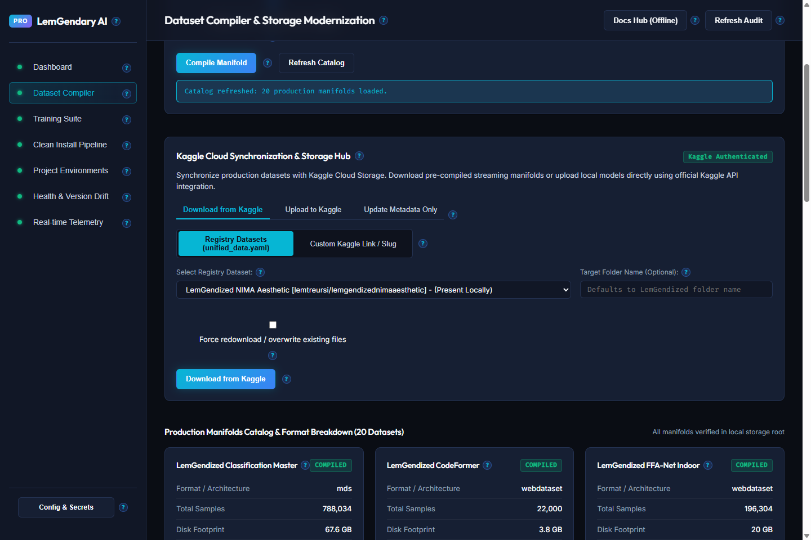

##### Upload to Kaggle Numbered Reference

1. **Action Subtabs (Upload Active)**: The `Upload to Kaggle` subtab is highlighted active. Switches back to `Download from Kaggle` or `Update Metadata Only` when clicked.
2. **Local Compiled Manifold Selector**: Dropdown listing all locally compiled manifolds. Selecting one populates the upload target from its compiled container directory.
3. **Target Kaggle Repository Slug Input**: Optional Kaggle repository identifier in `owner/dataset-slug` format. If left blank, auto-resolved from `unified_data.yaml` bindings for the selected manifold.
4. **Upload to Kaggle Primary Button**: Packages the selected manifold into a Kaggle dataset archive and initiates upload via the official Kaggle API.
5. **Upload Status Banner**: Real-time feedback panel showing upload progress, authentication confirmation, or error messages from the Dataset Compiler sidecar (Port 8100).

| Callout # | UI Element | Control Type | Triggered Endpoint / Action | Operator Guide & Behavioral Safeguards |
| :--- | :--- | :--- | :--- | :--- |
| **1** | Action Subtabs | Subtab Navigation | `setKaggleActiveTab("upload")` | Sets the active Kaggle operation mode to cloud publishing. |
| **2** | Local Manifold Selector | Select Dropdown | `setUploadManifold(e.target.value)` | Picks the compiled local dataset to package and upload. |
| **3** | Target Kaggle Slug | Text Input | `setUploadKaggleRef(e.target.value)` | Kaggle repo ID (`owner/slug`). Leave blank for auto-resolution from registry. |
| **4** | Upload to Kaggle | Primary Button | `POST http://127.0.0.1:8100/api/kaggle/upload` | Initiates multi-part dataset upload to Kaggle cloud storage. |
| **5** | Upload Status Banner | Status Banner | `uploadStatus` state | Displays upload confirmation, progress steps, or API error feedback. |

---

#### 5.2.3 Update Metadata Only

Activated by clicking the `Update Metadata Only` subtab. Pushes `dataset-metadata.json` records (title, description, license, column descriptors) to Kaggle without re-uploading any data files.

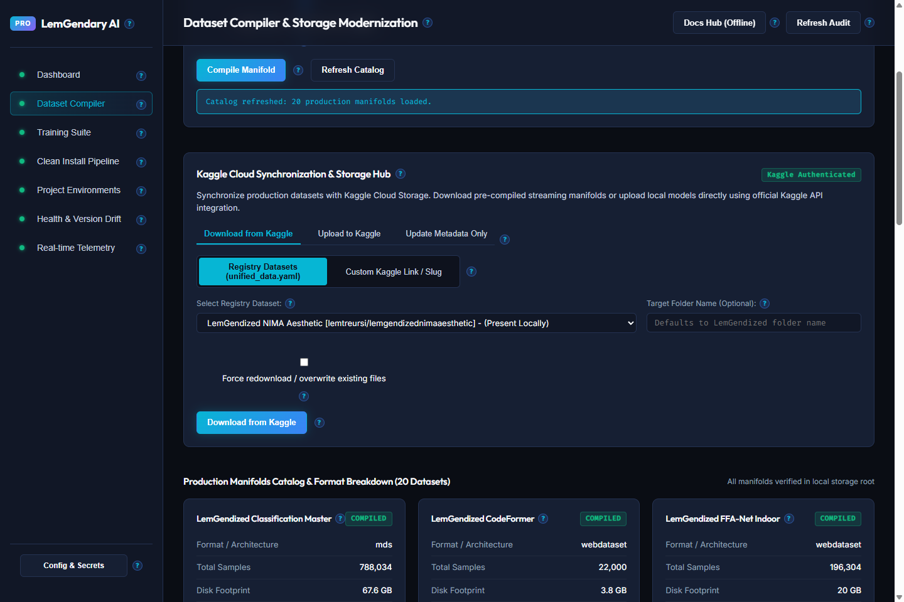

##### Update Metadata Only Numbered Reference

1. **Action Subtabs (Metadata Active)**: The `Update Metadata Only` subtab is highlighted active.
2. **Update Scope Segmented Control**: Switches between `Single Dataset` (one manifold) and `All Datasets (unified_data.yaml)` (batch update all bound datasets).
3. **Local Manifold Selector** *(Single mode only)*: Dropdown to pick which manifold's `dataset-metadata.json` to push to Kaggle.
4. **Kaggle Repository Slug Input** *(Single mode only)*: Optional override slug (`owner/dataset-slug`). Leave blank to auto-resolve from `unified_data.yaml`.
5. **All Datasets Description** *(All mode only)*: Informational text confirming that every dataset in `unified_data.yaml` with a local `dataset-metadata.json` will be updated — no data re-uploaded.
6. **Update Metadata on Kaggle Primary Button**: Triggers the metadata push for the selected scope. Only metadata records (JSON fields) are updated via the Kaggle API — zero data transfer.
7. **Metadata Update Status Banner**: Real-time feedback panel showing per-dataset push status, success confirmations, or API error messages.

| Callout # | UI Element | Control Type | Triggered Endpoint / Action | Operator Guide & Behavioral Safeguards |
| :--- | :--- | :--- | :--- | :--- |
| **1** | Action Subtabs | Subtab Navigation | `setKaggleActiveTab("metadata")` | Sets the active Kaggle operation mode to metadata-only sync. |
| **2** | Update Scope | Segmented Control | `setMetaUpdateMode("single" \| "all")` | Single: one manifold. All: batch-push metadata for every registered dataset. |
| **3** | Local Manifold | Select Dropdown | `setMetaUpdateManifold(e.target.value)` | Single mode only. Selects which manifold's metadata file to push. |
| **4** | Kaggle Slug Override | Text Input | `setMetaUpdateRef(e.target.value)` | Optional. Leave blank to auto-resolve slug from `unified_data.yaml`. |
| **5** | All Datasets Info | Informational Text | None | Explains scope of batch operation — all datasets with local metadata file. |
| **6** | Update Metadata | Primary Button | `POST http://127.0.0.1:8100/api/kaggle/update-metadata` | Pushes metadata JSON records to Kaggle. Zero data bytes transferred. |
| **7** | Status Banner | Status Banner | `metaUpdateStatus` state | Shows per-dataset push results and API confirmation or error codes. |

---

### 5.3 Production Manifolds Catalog & Format Breakdown

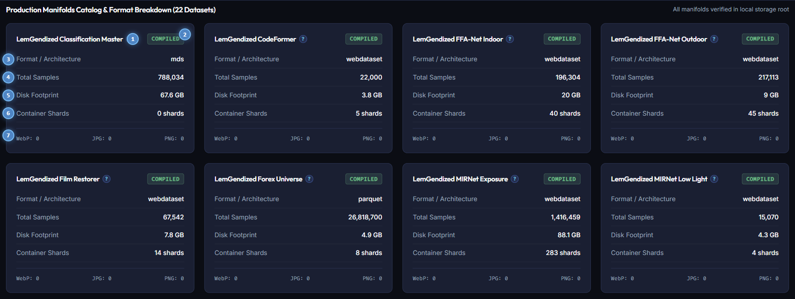

#### Production Manifolds Catalog Numbered Reference

1. **Primary Manifold Title**: Displays display name and canonical identifier (`LemGendized Classification Master`).
2. **Compiled Status Badge**: Displays green `COMPILED` reflecting verified on-disk container archives.
3. **Storage Format Architecture Metric**: Identifies binary container format (e.g. `mds` or `webdataset`).
4. **Total Verified Sample Counter**: Exact count of image/target pairs packaged within the manifold (e.g. `788,034`).
5. **Disk Storage Footprint Metric**: Physical volume occupied on local disk in gigabytes (e.g. `67.6 GB`).
6. **Container Shards Counter**: Number of container shards partitioned across disk (e.g. `0 shards` or `14 shards`).
7. **Image Encoding Distribution Bar**: Real-time counter of samples formatted as WebP, JPG, or PNG (`WebP: 0 JPG: 0 PNG: 0`).

| Callout # | UI Element | Control Type | Triggered Endpoint / Action | Operator Guide & Behavioral Safeguards |
| :--- | :--- | :--- | :--- | :--- |
| **1** | Manifold Heading | Card Heading | None | Identifies dataset name and task domain. |
| **2** | Compiled Badge | Status Pill | On-disk validation | Green badge indicates streaming archive is fully built and ready for training. |
| **3** | Format Architecture | Metric Readout | Sourced from `unified_data.yaml` | Displays container protocol: WebDataset, Parquet, or MDS. |
| **4** | Total Samples | Metric Readout | Shard header inspection | Shows exact quantity of training sample pairs available. |
| **5** | Disk Footprint | Metric Readout | `os.stat` recursive sum | Displays disk volume occupied by compressed shards. |
| **6** | Container Shards | Metric Readout | Shard count verification | Confirms number of container files written to local storage. |
| **7** | Format Breakdown | Encoding Stats | Metadata inspection | Quantifies WebP, JPEG, and PNG image components. |

---

## 6. Model Training Pipeline: Architectures, Ladders & Sawtooth Governor

Once your dataset is compiled, you are ready to train a production-grade neural network. The LemGendary AI Studio provides dynamic hyperparameter management and nuclear memory safeguards.

### 6.1 Master Training Suite & Model Orchestration Card

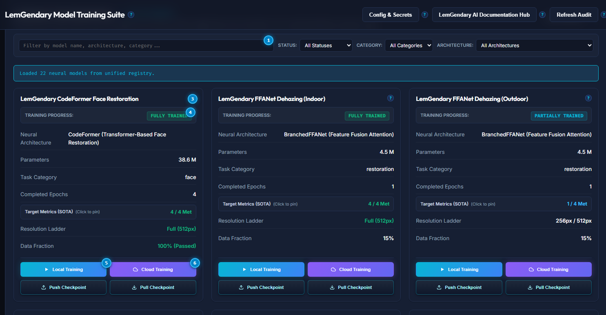

#### Training Orchestrator Numbered Reference

1. **Target Architecture Selector (Hero Row)**: Prominent full-width dropdown to select neural models from `unified_models_v2.yaml`.
2. **Training Duration Epochs (Config Governed)**: Read-only display of total training epochs configured in `unified_models_v2.yaml` (e.g. `300` for YOLOv8n, `50` for Forex). Adjustable via the Config Editor.
3. **In-Memory Minibatch Size (Config Governed)**: Read-only display of configured sample batch size per optimization step. Dynamically adjusted at runtime by the Sawtooth Governor.
4. **Initial Learning Rate (Config Governed)**: Read-only display of base optimizer learning rate from canonical model specifications (e.g. `0.01` or `0.0002`). Adjustable via the Config Editor.
5. **Spatial Ladder Stage Selector (Config Governed)**: Read-only display of progressive multi-resolution training stage or timeframe confluence horizon.
6. **Config Governed Parameter Banner & Adjust Button**: Informational header confirming parameter locking with direct shortcut button (`Adjust via Config Editor`) to edit underlying YAML manifests.
7. **Enable Sawtooth VRAM Governor Checkbox**: Toggle enabling automatic dynamic batch reduction and gradient accumulation upon VRAM spikes.
8. **Sawtooth Sentinel Status Badge**: Real-time indicator displaying green `ACTIVE (92% VRAM Sentinel)`.
9. **Dynamic Training Action Button (Start / Stop Training)**: Context-aware dispatch button. Displays cyan `Start Training` when idle; dynamically transforms into red `Stop Training` (`.btn-danger`) while a training job is actively executing. Clicking `Stop Training` dispatches cancellation signal `POST /api/jobs/{job_id}/cancel`.
10. **Refresh Models Registry Button**: Re-reads `unified_models_v2.yaml` and updates checkpoint availability in under 50ms.

| Callout # | UI Element | Control Type | Triggered Endpoint / Action | Operator Guide & Behavioral Safeguards |
| :--- | :--- | :--- | :--- | :--- |
| **1** | Target Architecture | Select Dropdown | `setSelectedModel(e.target.value)` | Hero row selector. Automatically synchronizes recommended default parameters. |
| **2** | Training Epochs | Read-Only Input | None (Locked to Manifest) | Governed by `unified_models_v2.yaml`. Adjustable via Config Editor modal. |
| **3** | Minibatch Size | Read-Only Input | None (Locked to Manifest) | Governed by `unified_models_v2.yaml`. Dynamically scaled by Sawtooth Governor. |
| **4** | Initial Learning Rate | Read-Only Input | None (Locked to Manifest) | Governed by `unified_models_v2.yaml`. Adjustable via Config Editor modal. |
| **5** | Spatial Ladder Stage | Read-Only Select | None (Locked to Manifest) | Governed by `unified_models_v2.yaml`. Progressive curriculum stage indicator. |
| **6** | Config Governed Banner | Banner & Action | `onOpenConfigEditor()` | Informs operators of SSOT governance and opens in-app Config Editor modal. |
| **7** | Sawtooth Checkbox | Checkbox Toggle | `setSawtoothGovernorActive(e.target.checked)` | Arms nuclear Out-of-Memory protection. |
| **8** | Sentinel Badge | Status Badge | Hardware monitor | Confirms that 92% VRAM ceiling protection is actively monitoring memory. |
| **9** | Start / Stop Training | Dynamic Action Button | `POST /api/gui/quick-train` or `POST /api/jobs/{id}/cancel` | Launches training when idle; gracefully cancels running job when active. |
| **10** | Refresh Models | Action Button | `fetchModels()` | Reloads weights status and latest SOTA metrics from disk. |

---

### 6.2 Real-Time Telemetry Stream & Responsive Cancellation

To ensure optimal situational awareness, the **Real-time Telemetry & Pipeline Stream** console is embedded directly below the Training Orchestration controls and immediately above the Registered Architectures catalog:

1. **Top-of-Fold Workflow Alignment**: Operators can initiate training and immediately inspect live gradient streaming, validation progress bars, and resolution ladder rungs without scrolling past 20 architecture cards.
2. **Sub-Second Minibatch Cancellation**: Clicking the red `Stop Training` button sends an immediate abort signal to the sidecar daemon (`POST /api/jobs/{id}/cancel`). The training engine hooks into inner minibatch iterations (via `on_train_batch_end`), setting `trainer.stop = True` within milliseconds, freeing GPU VRAM instantly without runaway execution.
3. **Dual-Path Checkpoint Synchronization**: On every completed epoch and ladder transition, the governor mirrors intermediate weights (`best.pt`, `last.pt`, `progress.pth`) to `checkpoints/` and `LemGendaryModels/<model>/checkpoints/`, ensuring live checkpoint telemetry cards reflect up-to-the-minute weights.

---

### 6.4 Registered Architectures & Checkpoint Telemetry Grid

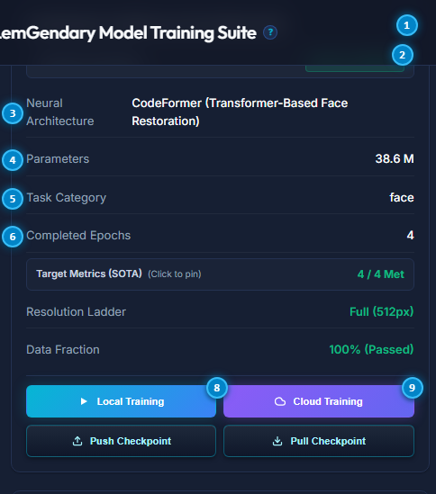

#### Architecture Telemetry Grid Numbered Reference

1. **Primary Model Card Heading**: Displays model name (`LemGendary CodeFormer Face Restoration`).
2. **Three-Pillar Training Status Badge**: Authoritative status badge (`FULLY TRAINED`, `PARTIALLY TRAINED`, or `WEIGHTS READY`).
3. **Neural Backbone Architecture Metric**: Displays deep learning backbone type (`CodeFormer (Transformer-Based Face Restoration)`).
4. **Trainable Parameter Counter**: Volume of trainable weights in millions of parameters (e.g. `38.6 M`).
5. **Best Validation Metric**: Top academic evaluation score recorded (e.g. PSNR in dB, mAP50, SRCC).
6. **SOTA Targets Met Progress Ratio**: Ratio of passed state-of-the-art benchmarks (e.g. `0 / 4 Met` or `4 / 4 Met (All Passed)`).
7. **Primary Target Metric**: Target numerical convergence threshold (e.g. `30.5`).
8. **Resolution / Confluence Ladder Metric**: Progressive training resolution or timeframe stage (e.g. `0px / 512px` or `Full (512px)`).

| Callout # | UI Element | Control Type | Triggered Endpoint / Action | Operator Guide & Behavioral Safeguards |
| :--- | :--- | :--- | :--- | :--- |
| **1** | Model Card Header | Card Title | None | Labels neural architecture name and specialization. |
| **2** | 3-Pillar Status Badge | Status Badge | Multi-pillar verification | Certified status reflecting training completion and checkpoint readiness. |
| **3** | Neural Architecture | Metric Readout | Sourced from `unified_models_v2.yaml` | Specifies network layer topology and block design. |
| **4** | Parameter Counter | Metric Readout | Weight tensor count | Quantifies parameter count to guide hardware VRAM requirements. |
| **5** | Best Metric | Metric Readout | Validation pass output | Records benchmark evaluation score against academic baselines. |
| **6** | SOTA Targets Met | Progress Ratio | Evaluation benchmark | Tracks progress toward target convergence criteria. |
| **7** | Primary Target | Metric Readout | Convergence threshold | Indicates targeted benchmark score for full training certification. |
| **8** | Resolution Ladder | Metric Readout | Progressive curriculum | Displays active multi-scale spatial ladder stage. |

---

## 7. Evaluation, Export & Cloud Publishing to Kaggle and Google Drive

### 7.1 Real-Time Metrics & Live Loss Curves

During training, the GUI visualizes live training and validation loss curves:

- **Training Loss (Blue Line)**: Decreases as the model memorizes garden patterns.
- **Validation Loss (Green Line)**: Decreases as the model generalizes to new photos it has never seen before.
- **Perceptual Metrics**: PSNR (Peak Signal-to-Noise Ratio), SSIM (Structural Similarity), and mAP (mean Average Precision) are plotted in real time and recorded in `metrics.csv`.

### 7.2 Exporting to Universal Runtimes

Once training completes, you can export your trained model with a single click:

- **ONNX Export**: Generates fixed-shape `.onnx` files compatible with DirectML (Windows laptops), TensorRT (NVIDIA GPUs), OpenVINO (Intel processors), and web browsers (WebGPU).
- **Safetensors Weights**: Saves cryptographic, zero-copy weights free of arbitrary code execution vulnerabilities.

### 7.3 Publishing to Kaggle & Google Drive

Click `Publish Model Package` in the GUI:

1. Select target cloud repository (Kaggle Model Hub or Google Drive).
2. The studio automatically bundles the model weights, model card (`README.md`), evaluation metrics graphs (`metrics.csv`), and before-and-after visual demonstration images.
3. Authenticates using your active credentials from the Secrets Vault and uploads the package as a new release version.

---

## 8. Health Matrix & Cross-Project Version Drift Analytics

In modern multi-project software suites, one project updating a shared library (like `torch` or `numpy`) while another stays on an older version causes insidious bugs. The LemGendary AI Studio provides continuous real-time cross-project dependency audits.

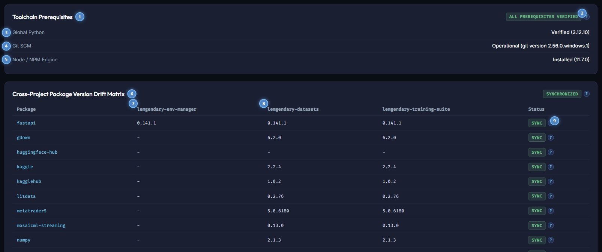

### 8.1 Toolchain Prerequisites & Version Drift Matrix Numbered Reference

1. **Toolchain Prerequisites Section Header**: Overview header inspecting host developer environment prerequisites.
2. **All Prerequisites Verified Badge**: Certified green status badge confirming all prerequisites meet system standards (`ALL PREREQUISITES VERIFIED`).
3. **Global Python Binary Audit**: Validates host Python interpreter release (`Verified (3.12.10)`).
4. **Git SCM Version Control Engine**: Confirms operational Git binary for automated repository synchronization.
5. **Node / NPM Runtime Engine**: Validates Node.js execution runtime for the Tauri desktop GUI.
6. **Cross-Project Package Version Drift Matrix Header**: Table heading comparing installed package versions across all projects.
7. **Package Dependency Name Column**: Alphabetical index of shared ecosystem Python libraries (`fastapi`, `torch`, `numpy`, etc.).
8. **Target Workspace Environments Column Headers**: Identifies virtual environments across `lemgendary-env-manager`, `lemgendary-datasets`, and `lemgendary-training-suite`.
9. **Synchronize Package Version Action**: Action button to reconcile package version drift across environments.

| Callout # | UI Element | Control Type | Triggered Endpoint / Action | Operator Guide & Behavioral Safeguards |
| :--- | :--- | :--- | :--- | :--- |
| **1** | Toolchains Heading | Section Heading | None | Details host prerequisite validation. |
| **2** | Prerequisite Badge | Status Pill | Platform audit | Flags whether all developer toolchains meet minimum versions. |
| **3** | Python Audit | Metric Readout | `python --version` | Ensures host runs Python 3.10 or higher. |
| **4** | Git SCM Audit | Metric Readout | `git --version` | Ensures Git is present in system PATH. |
| **5** | Node / NPM Audit | Metric Readout | `node --version` | Validates Node engine for GUI frontend development. |
| **6** | Drift Matrix Title | Table Heading | None | Labels cross-project dependency comparison matrix. |
| **7** | Package Name | Table Column | Manifest inspection | Lists library identifier across ecosystem projects. |
| **8** | Target Environments | Table Column | Manifest inspection | Compares installed releases across active project virtual environments. |
| **9** | Synchronize Action | Action Button | Environment reconciliation | Reconciles version drift for the target package. |

---

## 9. Real-Time Telemetry & Monospace Event Diagnostics

For power operators who want to monitor raw execution logs, the Real-Time Telemetry console provides a live, non-blocking log stream.

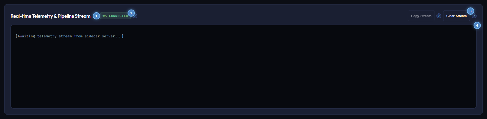

### 9.1 Telemetry Terminal Numbered Reference

1. **Real-time Telemetry & Pipeline Stream Card Title**: Header explaining WebSocket log stream reception.
2. **Live WebSocket Connection Badge**: Real-time connection sentinel displaying green `WS CONNECTED`.
3. **Copy Stream Action Button**: Copies the entire terminal buffer history to the operating system clipboard with timestamps and service tags.
4. **Clear Stream Action Button**: Flushes terminal buffer memory to isolate a fresh training run or audit pass.
5. **Monospace Terminal Console Viewport**: High-performance scrolling container streaming live JSON-RPC packets and process stdout.

| Callout # | UI Element | Control Type | Triggered Endpoint / Action | Operator Guide & Behavioral Safeguards |
| :--- | :--- | :--- | :--- | :--- |
| **1** | Telemetry Title | Card Heading | None | Explains live background telemetry capture. |
| **2** | WebSocket Badge | Connection Pill | `ws://127.0.0.1:8000/ws/log` | Displays socket connection state. Reconnects automatically if interrupted. |
| **3** | Copy Stream | Action Button | Clipboard copy | Formats buffer text with timestamps and step tags for debugging. |
| **4** | Clear Stream | Action Button | Buffer purge | Clears visible terminal lines without affecting background processes. |
| **5** | Console Viewport | Monospace Terminal | Real-time DOM stream | Monospace log stream auto-scrolling to newest events. |

---

## 10. Contextual UX Help & Interactive Hover Guidance System

Every single visual control across the AI Studio Desktop GUI features contextual interactive hover guidance:

- **Universal Help Badges**: Interactive elements are paired with a subtle, non-intrusive `?` glyph.
- **Instantaneous Explanations**: Hovering or focusing the badge displays an elevated card detailing:
  1. What the action does in plain English.
  2. The underlying API endpoint or CLI script executed (`/api/...` or `python ...`).
  3. Memory and disk considerations (e.g. temporary storage requirements, VRAM allocation).
  4. Best-practice recommendations for non-technical users.

---

## 11. Permanent Offline Documentation Hub & Online Synchronization

Reliability requires that complete engineering documentation is accessible at all times including on isolated workstations, offline air-gapped lab servers, or during broadband outages.

### 11.1 The Local Offline Documentation Server

- The Environment Manager daemon (`port 8000`) permanently mounts the entire `lemgendary-docs` directory as a static file server at `/documentation-hub/`.
- Clicking the **Docs Hub (Offline)** button in the header opens:
  `http://127.0.0.1:8000/documentation-hub/index.html`
- The offline hub contains all 46 scientific whitepapers, operator manuals, CLI guides, and API specifications. All stylesheets, SVG vector diagrams, and assets are bundled locally, requiring **zero external network requests**.

### 11.2 The Live GitHub Pages Hub

- Clicking the **Docs (Web)** button opens the live GitHub Pages site:
  `https://lemgenda.github.io/ai-training-whitepapers/index.html`
- The web portal provides identical content for remote sharing, mobile reading, and external research collaboration.

---

## 12. Tripartite Multi-Sidecar Network Architecture

The AI Studio GUI operates as a unified visual client communicating across three specialized local background microservices:

```text
+-----------------------------------------------------------------------+
|                 LemGendary AI Studio Desktop GUI                      |
|                  (Tauri / Rust / React / Vite)                        |
+-------------------+-------------------+-------------------------------+
                    |                   |
                    v                   v
+-----------------------+   +-----------------------+   +-----------------------+
|  Environment Manager  |   |    Dataset Compiler   |   |     Training Suite    |
|     Port :8000        |   |      Port :8100       |   |       Port :8200      |
+-----------------------+   +-----------------------+   +-----------------------+
| * Hardware Probing    |   | * Manifold Synthesis  |   | * Architecture Models |
| * Venv Provisioning   |   | * WebP Transcoding    |   | * Sawtooth Governor   |
| * Secrets Vault       |   | * WebDataset Shards   |   | * Dynamic Ladders     |
| * Offline Docs Server |   | * Cloud Sync (Kaggle) |   | * Live Loss Curves    |
+-----------------------+   +-----------------------+   +-----------------------+
```

The frontend client (`src/api/client.ts`) automatically multiplexes API calls across the three ports, providing unified error recovery, daemon health indicators, and transparent connection fallbacks.

---

## 13. Automated Testing & Ecosystem Quality Assurance

To guarantee system stability, the LemGendary ecosystem includes extensive automated test batteries across all projects. You can verify the health of the entire suite at any time using the unified CLI:

```bash
# Validate individual projects
lem-env validate --project lemgendary-env-manager
lem-env validate --project lemgendary-datasets
lem-env validate --project lemgendary-training-suite
lem-env validate --project lemgendary-ai-studio-gui
lem-env validate --project lemgendary-docs

# Or run complete multi-project ecosystem audit
lem-env validate --all
```

Every test verifies strict code compliance, dependency lockfile validity, and the absolute absence of emojis across all codebases and documentation.
