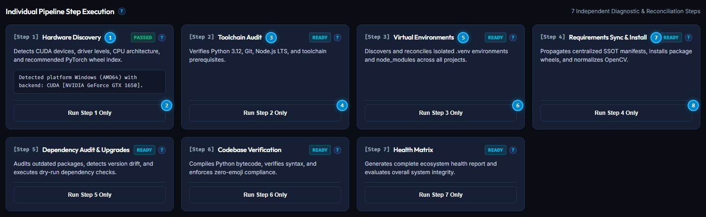
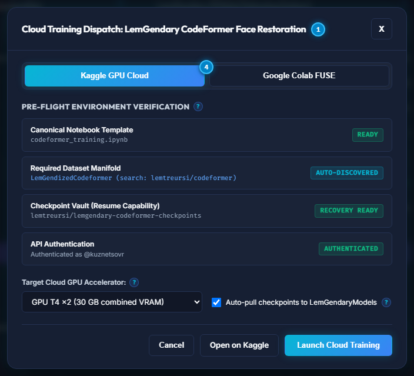

# LemGendary AI Studio GUI: Comprehensive Operator Manual

## Category 03 | LemGendary AI Documentation Hub | Master Operations Manual

**Authoritative Desktop Client Release**: `v2.0.0` (Tauri v2 Native Desktop Cockpit)  
**Target Backend Ecosystem**: `v16.9.16-STABLE` (Tripartite Sidecar Topology: Ports 8000, 8100, 8200)  
**Parent Authority**: [Master Ecosystem Architecture](file:///c:/Development/python/model-training/lemgendary-docs/MD-Papers/ECOSYSTEM_ARCHITECTURE.md) · [Document Authority Hierarchy & Versioning Policy](file:///c:/Development/python/model-training/lemgendary-docs/MD-Papers/VERSIONING_POLICY.md)

---

## Table of Contents

- [1. Abstract & The Gardening Model Philosophy](#1-abstract--the-gardening-model-philosophy)
- [2. Interface Topology & Visual Navigation Matrix](#2-interface-topology--visual-navigation-matrix)
  - [2.1 Workspace Global Shell Elements & Numbered Navigation Guide](#21-workspace-global-shell-elements--numbered-navigation-guide)
  - [2.5 Tripartite Sidecar Process Control & Auto-Start](#25-tripartite-sidecar-process-control--auto-start)
- [3. Universal Configuration & Secrets Vault](#3-universal-configuration--secrets-vault)
  - [3.1 Central Manifest Registry Editor](#31-central-manifest-registry-editor)
  - [3.2 Secrets & Cloud Tokens Vault](#32-secrets--cloud-tokens-vault)
- [4. One-Click Environment Setup: The 7-Stage Clean Install Pipeline](#4-one-click-environment-setup-the-7-stage-clean-install-pipeline)
  - [4.1 Pipeline Orchestrator Control Card](#41-pipeline-orchestrator-control-card)
  - [4.2 Individual Pipeline Step Execution Cards](#42-individual-pipeline-step-execution-cards)
  - [4.3 Hardware Acceleration Sentinel Card](#43-hardware-acceleration-sentinel-card)
  - [4.4 Managed Workspace Projects Health Cards](#44-managed-workspace-projects-health-cards)
- [5. Dataset Compilation Pipeline: Modernization, Custom Multi-Source Ingestion & Kaggle Sync](#5-dataset-compilation-pipeline-modernization-custom-multi-source-ingestion--kaggle-sync)
  - [5.1 Dataset Compiler & Storage Modernization Control Card](#51-dataset-compiler--storage-modernization-control-card)
    - [5.1.1 Standard Manifold Compilation](#511-standard-manifold-compilation)
    - [5.1.2 Custom Multi-Source Compilation](#512-custom-multi-source-compilation)
  - [5.2 Kaggle Cloud Synchronization & Storage Hub](#52-kaggle-cloud-synchronization--storage-hub)
    - [5.2.1 Download from Kaggle](#521-download-from-kaggle)
    - [5.2.2 Upload to Kaggle](#522-upload-to-kaggle)
    - [5.2.3 Update Metadata Only](#523-update-metadata-only)
  - [5.3 Production Manifolds Catalog & Format Breakdown](#53-production-manifolds-catalog--format-breakdown)
- [6. Model Training Pipeline: Architectures, Ladders & Sawtooth Governor](#6-model-training-pipeline-architectures-ladders--sawtooth-governor)
  - [6.1 LemGendary Model Training Suite & Model Orchestration Card](#61-lemgendary-model-training-suite--model-orchestration-card)
  - [6.2 Registered Architectures & Checkpoint Telemetry Grid](#62-registered-architectures--checkpoint-telemetry-grid)
  - [6.3 Interactive Cloud Training Modal](#63-interactive-cloud-training-modal)
  - [6.4 Real-Time Telemetry Stream & Responsive Cancellation](#64-real-time-telemetry-stream--responsive-cancellation)
  - [6.5 Revamped 1/4 - 3/4 Training Dashboard Topology & Interactive SOTA Inspection](#65-revamped-14---34-training-dashboard-topology--interactive-sota-inspection)
- [7. Evaluation, Export & Cloud Publishing to Kaggle and Google Drive](#7-evaluation-export--cloud-publishing-to-kaggle-and-google-drive)
- [8. Health Matrix & Cross-Project Version Drift Analytics](#8-health-matrix--cross-project-version-drift-analytics)
  - [8.1 Toolchain Prerequisites & Version Drift Matrix](#81-toolchain-prerequisites--version-drift-matrix)
- [9. Real-Time Telemetry & Monospace Event Diagnostics](#9-real-time-telemetry--monospace-event-diagnostics)
  - [9.1 Telemetry Terminal Numbered Reference](#91-telemetry-terminal-numbered-reference)
- [10. Contextual UX Help & Interactive Hover Guidance System](#10-contextual-ux-help--interactive-hover-guidance-system)
- [11. Permanent Offline Documentation Hub & Online Synchronization](#11-permanent-offline-documentation-hub--online-synchronization)
- [12. Tripartite Multi-Sidecar Network Architecture](#12-tripartite-multi-sidecar-network-architecture)
- [13. Automated Testing & Ecosystem Quality Assurance](#13-automated-testing--ecosystem-quality-assurance)

---

## 1. Abstract & The Gardening Model Philosophy

The **LemGendary AI Studio Desktop GUI** is a hardware-aware, nuclear-hardened command center engineered to make deep learning dataset synthesis, neural network training, and cloud deployment accessible to everyone from senior machine learning researchers to high school students and non-technical hobbyists.

### The Gardening Model Rule

To ensure absolute operational clarity, every control, workflow, and safeguard in this manual is designed according to the **Gardening Model Rule**:

> *If a 75-year-old grandmother wants to train an AI model using photos of her garden roses, tomato plants, and soil to automatically detect plant diseases and enhance low-light garden photographs, she should be able to complete the entire pipeline from environment setup to Kaggle cloud publishing purely by clicking intuitive buttons in the GUI, with zero command-line commands, zero code editing, and zero risk of freezing her computer.*

The system achieves this through three foundational engineering principles:

1. **Deterministic One-Click Automation**: All complex toolchains, Python virtual environments, CUDA drivers, wheel resolutions, and dependencies are provisioned automatically through the 7-Stage Clean Install Pipeline.
2. **Nuclear Memory Protection (The Sawtooth Governor)**: When training complex vision models, the GUI continuously probes hardware VRAM. If memory approaches capacity, the system automatically downscales batch sizes and applies dynamic gradient accumulation, guaranteeing that your machine never suffers an Out-of-Memory (OOM) crash or system freeze.
3. **Comprehensive Contextual Guidance**: Every single interactive button, switch, input field, and status indicator is accompanied by a contextual hover icon (`?`) delivering instant, plain-English explanations of what the control does, what files are affected, and what safeguards are active.


---

## 2. Interface Topology & Visual Navigation Matrix

The AI Studio interface is organized into persistent visual regions designed for ergonomic operation. Every element, card, and control in the live interface is indexed below with corresponding operational workflows and safety boundaries.


### 2.1 Workspace Global Shell Elements & Numbered Navigation Guide

The live screen capture above displays the complete primary application frame including header, persistent sidebar navigation, active dashboard viewport, and status footer:

1. **Brand Title & Brand Icon**: Displays `LemGendary AI Studio` alongside the official vector icon (`lemgenda-icon.svg`). Clicking the header identity opens the official portal `https://www.lemgenda.hr/`.
2. **Config & Secrets Header Action Button**: Opens the Universal Configuration, Registry Editor & Secrets Vault Modal for editing YAML manifests and managing Kaggle, Google Drive, GitHub, and MT5 API tokens directly from the top navigation bar.
3. **Docs Hub (Offline) Action Button**: Launches the local offline Documentation Hub served by the LemGendary Environment Manager sidecar at `http://127.0.0.1:8000/documentation-hub/index.html`. Guarantees full offline documentation access during field deployments.
4. **Refresh Audit Telemetry Button**: Triggers an instantaneous asynchronous background scan across physical accelerators, GPU VRAM, system memory, project virtual environments, and manifest version drift.
5. **Dashboard Tab Selector**: Switches primary viewport to the main system dashboard, rendering hardware sentinel cards, sidecar process tiles, project health cards, and the real-time event console.
6. **Dataset Compiler Tab Selector**: Switches primary viewport to the LemGendary Dataset Compiler Suite (`.\lemgendary-datasets\`), streaming manifold compiler, custom multi-source ingestion interface, Kaggle synchronization hub, and verified manifold catalog.
7. **Training Suite Tab Selector**: Switches primary viewport to the LemGendary Model Training Suite (`.\lemgendary-training-suite\`), neural architecture matrix, Sawtooth Governor VRAM controls, progressive spatial ladders, and training dispatch orchestrator.
8. **Clean Install Pipeline Tab Selector**: Switches primary viewport to the dedicated 7-stage deterministic environment provisioning and toolchain verification sequence.
9. **Project Environments Tab Selector**: Switches primary viewport to dedicated sub-repository cards (`lemgendary-env-manager`, `lemgendary-datasets`, `lemgendary-training-suite`, `lemgendary-ai-studio-gui`, `lemgendary-docs`) with package counts and reconciliation controls, displaying clean relative paths without absolute filesystem exposure.
10. **Health & Version Drift Tab Selector**: Switches primary viewport to host prerequisite audits and cross-project package version comparison matrices.
11. **Real-time Telemetry Tab Selector**: Switches primary viewport to the high-throughput monospace console streaming real-time status packets over local WebSockets.
12. **LemGenda Brand Logo Sidebar Footer**: Anchors the persistent sidebar with the official vector brand signature (`lemgenda-logo.svg`), providing a direct link to `https://www.lemgenda.hr/`.
13. **System Status Bar Indicator**: Live footer status indicator reporting real-time connectivity across all active sidecar services.

| Callout # | UI Element | Control Type | Triggered Endpoint / Action | Operator Guide & Behavioral Safeguards |
| :--- | :--- | :--- | :--- | :--- |
| **1** | Brand Title & Icon | Navigation Link | `window.open('https://www.lemgenda.hr/')` | Displays official brand icon and title; links to web home. |
| **2** | Config & Secrets | Header Action Button | `setIsConfigEditorOpen(true)` | Launches modal dialog for manifest editing and secret management. |
| **3** | Docs Hub (Offline) | Action Button | `window.open('/documentation-hub/')` | Opens browser window to local offline documentation server on port 8000. |
| **4** | Refresh Audit | Action Button | `POST /api/audit` | Queries all three sidecars to refresh hardware metrics and venv health. |
| **5** | Dashboard Tab | Navigation Button | `setCurrentTab("dashboard")` | Navigates to central system overview and launcher tiles. |
| **6** | Dataset Compiler Tab | Navigation Button | `setCurrentTab("datasets")` | Navigates to LemGendary Dataset Compiler Suite. |
| **7** | Training Suite Tab | Navigation Button | `setCurrentTab("training")` | Navigates to LemGendary Model Training Suite. |
| **8** | Clean Install Tab | Navigation Button | `setCurrentTab("pipeline")` | Navigates to the automated 7-step clean install pipeline. |
| **9** | Projects Tab | Navigation Button | `setCurrentTab("projects")` | Navigates to repository cards and individual venv status. |
| **10** | Health & Drift Tab | Navigation Button | `setCurrentTab("health")` | Navigates to package version divergence matrix. |
| **11** | Telemetry Logs Tab | Navigation Button | `setCurrentTab("logs")` | Navigates to monospace WebSocket log terminal. |
| **12** | Brand Signature Logo | Navigation Link | `window.open('https://www.lemgenda.hr/')` | Persistent sidebar brand signature linking to corporate portal. |
| **13** | System Status Bar | Status Indicator | Real-time WebSocket Heartbeat | Displays global operational health and network readiness. |

---

### 2.5 Tripartite Sidecar Process Control & Auto-Start

The Ecosystem Sidecar Services grid permanently monitors and coordinates the three local microservices:

- **LemGendary Environment Manager (`Port 8000`)**: Core orchestrator and validation authority (`.\lemgendary-env-manager\`).
- **LemGendary Dataset Compiler Suite (`Port 8100`)**: Manifold compiler and streaming storage server (`.\lemgendary-datasets\`).
- **LemGendary Model Training Suite (`Port 8200`)**: Neural architecture training and evaluation engine (`.\lemgendary-training-suite\`).


#### Ecosystem Sidecar Cards Numbered Reference

1. **Ecosystem Sidecar Services Section Header**: Overview header accompanied by contextual help tooltip explaining tripartite microservice architecture.
2. **Environment Manager Card Title**: Identifies port 8000 governance daemon governing virtual environments and hardware discovery.
3. **Environment Manager Status Badge**: Real-time indicator displaying green `ONLINE` or red `OFFLINE`.
4. **Run Full System Audit Button**: Triggers deterministic hardware, dependency, and manifest inspection across all workspace projects.
5. **Dataset Compiler Suite Card Title**: Identifies port 8100 service managing WebDataset, Parquet, and MDS manifolds.
6. **Dataset Compiler Status Badge**: Real-time indicator displaying green `ONLINE` or red `OFFLINE`.
7. **Open Dataset Compiler Button**: Navigation shortcut directly switching the active viewport to the Dataset Compiler tab.
8. **Model Training Suite Card Title**: Identifies port 8200 service managing PyTorch neural architectures and Sawtooth Governor VRAM safeguards.
9. **Model Training Suite Status Badge**: Real-time indicator displaying green `ONLINE` or red `OFFLINE`.
10. **Open Training Suite Button**: Navigation shortcut directly switching the active viewport to the Training Suite tab.

| Callout # | UI Element | Control Type | Triggered Endpoint / Action | Operator Guide & Behavioral Safeguards |
| :--- | :--- | :--- | :--- | :--- |
| **1** | Sidecars Header | Section Heading | None | Explains process lifecycle across local background daemons. |
| **2** | Env Manager Title | Card Heading | None | Labels port 8000 primary governance daemon. |
| **3** | Env Manager Status | Status Badge | `GET http://127.0.0.1:8000/health` | Shows connection readiness. Probed automatically every 4 seconds. |
| **4** | Run Full System Audit | Action Button | `POST http://127.0.0.1:8000/api/audit` | Dispatches non-blocking complete audit of all four repositories. |
| **5** | Compiler Title | Card Heading | None | Labels port 8100 streaming dataset compilation daemon. |
| **6** | Compiler Status | Status Badge | `GET http://127.0.0.1:8100/health` | Shows compiler daemon readiness. |
| **7** | Open Dataset Compiler | Action Button | `setCurrentTab("datasets")` | Switches operator viewport to manifold synthesis controls. |
| **8** | Training Suite Title | Card Heading | None | Labels port 8200 PyTorch neural training daemon. |
| **9** | Training Status | Status Badge | `GET http://127.0.0.1:8200/health` | Shows training suite readiness. |
| **10** | Open Training Suite | Action Button | `setCurrentTab("training")` | Switches operator viewport to model orchestration matrix. |

---

## 3. Universal Configuration & Secrets Vault

Deep learning workflows require interacting with external registries, storage backends, and cloud repositories. The AI Studio GUI integrates an in-app Universal Configuration & Secrets Vault modal accessible via the `Config & Secrets` header button.

### 3.1 Central Manifest Registry Editor


#### Manifest Registry Editor Numbered Reference

1. **Configuration Editor Modal Title**: Header identifying the central configuration and manifest governance workspace.
2. **Registry Manifests Subtab Switcher**: Selects the central YAML configuration and registry manifest editing workspace.
3. **Secrets & Tokens Vault Subtab Switcher**: Switches modal view to encrypted cloud credentials and API token management.
4. **Target Manifest Selector Dropdown**: Selects from ecosystem manifests including `unified_data.yaml` (dataset definitions), `unified_models_v2.yaml` (architecture registry), `unified_requirements.yaml` (dependency SSOT), and `.secrets.yaml`.
5. **Validate Syntax Button**: Executes in-memory YAML parsing and schema validation without writing to disk, reporting structural errors before persistence.
6. **Hot-Reload Services Button**: Triggers in-flight configuration reload across active sidecar daemons without restarting processes.
7. **Create Backup Button**: Generates a timestamped snapshot of the active configuration manifest prior to edits.
8. **Save Manifest Button**: Persists verified modifications to disk using atomic temporary write staging and creates a backup copy.
9. **Monospace Manifest Code Editor**: Full-height in-browser text editor providing direct inspection and modification of central configuration files.
10. **Modal Close Button**: Safely dismisses configuration modal and returns to previous workspace view.

| Callout # | UI Element | Control Type | Triggered Endpoint / Action | Operator Guide & Behavioral Safeguards |
| :--- | :--- | :--- | :--- | :--- |
| **1** | Modal Title | Modal Heading | None | Identifies configuration workspace and active target file. |
| **2** | Manifests Tab | Subtab Button | `setActiveTab("manifests")` | Activates central YAML code editor and schema linter. |
| **3** | Secrets Tab | Subtab Button | `setActiveTab("secrets")` | Activates credentials and token management profiles. |
| **4** | Manifest Dropdown | Select Dropdown | `fetchManifest(selected)` | Loads selected file into memory and populates editor view. |
| **5** | Validate Syntax | Action Button | `POST /api/manifests/validate` | Validates YAML syntax and schema without altering files on disk. |
| **6** | Hot-Reload Services | Action Button | `POST /api/manifests/reload` | Triggers sidecar configuration reload without process restarts. |
| **7** | Create Backup | Action Button | `POST /api/manifests/backup` | Writes timestamped backup copy to `backups/` directory. |
| **8** | Save Manifest | Primary Button | `POST /api/manifests/save` | Writes changes atomically and triggers hot-reload across active sidecars. |
| **9** | Monospace Editor | Textarea Editor | `setCurrentContent(e.target.value)` | Displays raw configuration text with monospaced indentation. |
| **10** | Modal Close | Action Button | `setIsConfigEditorOpen(false)` | Closes dialog without persisting uncommitted text. |

---

### 3.2 Secrets & Cloud Tokens Vault


#### Secrets & Tokens Vault Numbered Reference

1. **Configuration Editor Modal Title**: Header confirming active credentials and token management workspace.
2. **Active Cloud Service Profile Badge**: Visual badge identifying service provider (e.g. `Kaggle`, `Google Drive`, `GitHub`, `MetaTrader 5`).
3. **Requirement Level Badge**: Clearly flags mandatory vs optional platform dependencies (`MANDATORY` for Kaggle API access, `OPTIONAL` for secondary mirrors).
4. **Toggle Add New Secret Form Button**: Expands interactive credential registration form to add additional service accounts.
5. **Save All Secrets & Synchronize Button**: Persists all registered credentials to encrypted `.secrets.yaml` and propagates legacy single-token files (`.kaggle_token`, `.kaggle_users`, `.mt5_credentials`).
6. **New Secret Service Type Dropdown**: Selects target cloud platform for new credential entry.
7. **Secret Label / Description Input**: Human-readable label for credential identification (e.g. `Personal Primary Account`).
8. **Account Username / Identifier Input**: Cloud service username or account identifier.
9. **API Token / Credential Secret Input Field**: Cloud API token, key, or private secret password.
10. **Add Secret Submit Button**: Adds the validated credential pair to the active in-memory vault profile.

| Callout # | UI Element | Control Type | Triggered Endpoint / Action | Operator Guide & Behavioral Safeguards |
| :--- | :--- | :--- | :--- | :--- |
| **1** | Modal Title | Modal Heading | None | Identifies secrets management dialog. |
| **2** | Service Badge | Status Pill | None | Displays service profile identity. |
| **3** | Requirement Level | Badge Indicator | None | Differentiates mandatory core services from optional cloud mirrors. |
| **4** | + Add New Secret | Action Button | `setIsAddingSecret(!isAddingSecret)` | Toggles new credential registration form with service dropdown. |
| **5** | Save All Secrets | Primary Button | `POST /api/secrets/save` | Encrypts vault to disk, writes backup, and syncs legacy credential files. |
| **6** | Service Type | Select Dropdown | `setNewService(e.target.value)` | Selects target cloud platform: Kaggle, Google Drive, GitHub, MT5. |
| **7** | Secret Label | Text Input | `setNewLabel(e.target.value)` | Descriptive tag for account differentiation. |
| **8** | Account Username | Text Input | `setNewUsername(e.target.value)` | Service login or API user identifier. |
| **9** | Secret Token | Password Input | `setNewSecret(e.target.value)` | Secret token or private key string. Masked in UI. |
| **10** | Add Secret Submit | Primary Button | Form Submission | Appends verified credential to active profile staging area. |

---

## 4. One-Click Environment Setup: The 7-Stage Clean Install Pipeline

Before training an AI model, your computer must have the correct software libraries installed. Traditionally, this required typing dozens of cryptic terminal commands. The AI Studio eliminates this completely through the automated 7-Stage Clean Install Pipeline.

### 4.1 Pipeline Orchestrator Control Card


#### Clean Install Pipeline Numbered Reference

1. **Pipeline Orchestrator Title & Help Glyph**: Header detailing deterministic 7-step environment recreation and toolchain verification.
2. **Execute Full Clean Install Pipeline Button**: Launches sequential execution of all seven stages in background worker threads without opening terminal consoles.
3. **Active Stage Progress Bar**: Visual meter showing real-time pipeline execution progress from Stage 1 through Stage 7.
4. **Pipeline Execution State Badge**: Displays cyan `READY` when idle, or amber `PIPELINE ACTIVE` during background execution.

| Callout # | UI Element | Control Type | Triggered Endpoint / Action | Operator Guide & Behavioral Safeguards |
| :--- | :--- | :--- | :--- | :--- |
| **1** | Pipeline Title | Section Heading | None | Contextual heading explaining zero-command environment setup. |
| **2** | Execute Full Pipeline | Primary Button | `POST /api/pipeline/trigger` | Starts autonomous 7-step provisioning sequence without terminal commands. |
| **3** | Progress Bar | Visual Meter | Real-time WebSocket updates | Displays active completion percentage across all steps. |
| **4** | State Badge | Status Badge | `GET /api/pipeline/status` | Confirms whether pipeline workers are idle or running. |

---

### 4.2 Individual Pipeline Step Execution Cards

In addition to running the full automated sequence, operators can execute individual stages in isolation for granular troubleshooting, inspection, and rapid re-verification:



#### Pipeline Step Execution Cards Numbered Reference

1. **Stage 1 Card Title (Hardware & Platform Discovery)**: Probes host platform, CPU architecture, system RAM, NVIDIA driver levels, CUDA compute capabilities, cuDNN, and TensorRT availability.
2. **Stage 1 Run Step Action Button**: Dispatches isolated execution of Step 1 (`POST /api/pipeline/run-step?step=1`), refreshing system hardware telemetry without touching virtual environments.
3. **Stage 2 Card Title (Ecosystem Prerequisites Audit)**: Validates host toolchain requirements (Python 3.10+, Git SCM, Node.js, and npm).
4. **Stage 2 Run Step Action Button**: Dispatches isolated execution of Step 2 (`POST /api/pipeline/run-step?step=2`), verifying host prerequisites against ecosystem requirements.
5. **Stage 3 Card Title (Virtual Environments Provisioning)**: Audits and safely provisions isolated Python virtual environments (`.venv`) across all managed repositories.
6. **Stage 3 Run Step Action Button**: Dispatches isolated execution of Step 3 (`POST /api/pipeline/run-step?step=3`), recreating missing or corrupted `.venv` folders idempotently.
7. **Stage 4 Card Title (Requirements Sync & Wheel Installation)**: Propagates centralized dependencies from `unified_requirements.yaml` and installs verified binary wheels.
8. **Stage 4 Run Step Action Button**: Dispatches isolated execution of Step 4 (`POST /api/pipeline/run-step?step=4`), synchronizing packages and installing missing dependencies.

*Note: Stages 5 (Cross-Project Dependencies Reconciliation), 6 (Manifest & Storage Directory Alignment), and 7 (System Health Matrix Certification) feature identical dedicated execution cards enabling single-click granular validation.*

| Callout # | UI Element | Control Type | Triggered Endpoint / Action | Operator Guide & Behavioral Safeguards |
| :--- | :--- | :--- | :--- | :--- |
| **1** | Stage 1 Title | Card Heading | None | Identifies hardware and compute acceleration discovery stage. |
| **2** | Stage 1 Run Step | Action Button | `POST /api/pipeline/run-step?step=1` | Runs hardware probe in background worker thread. |
| **3** | Stage 2 Title | Card Heading | None | Identifies toolchain prerequisite verification stage. |
| **4** | Stage 2 Run Step | Action Button | `POST /api/pipeline/run-step?step=2` | Runs toolchain prerequisites audit. |
| **5** | Stage 3 Title | Card Heading | None | Identifies virtual environments provisioning stage. |
| **6** | Stage 3 Run Step | Action Button | `POST /api/pipeline/run-step?step=3` | Recreates and verifies project `.venv` structures. |
| **7** | Stage 4 Title | Card Heading | None | Identifies requirements synchronization and wheel install stage. |
| **8** | Stage 4 Run Step | Action Button | `POST /api/pipeline/run-step?step=4` | Installs verified dependencies from unified manifests. |

---

### 4.3 Hardware Acceleration Sentinel Card


#### Hardware Architecture Card Numbered Reference

1. **System & Hardware Architecture Title**: Heading indicating live results from host platform probing.
2. **Primary Accelerator Backend Badge**: Highlights active execution engine (`CUDA`, `DIRECTML`, `ROCM`, or `CPU`).
3. **Host Operating System & Kernel Metric**: Confirms operating system release and processor architecture (e.g. `Windows (11, AMD64)`).
4. **Host Python Runtime Version**: Displays active host Python interpreter binary (e.g. `3.12.10`).
5. **CPU Cores Allocation**: Displays logical execution threads versus physical CPU cores (e.g. `12 / 6`).
6. **System RAM Capacity**: Displays total physical memory capacity in megabytes (e.g. `32,486 MB`).
7. **Recommended PyTorch Wheel Index**: Authoritative binary index link for CUDA hardware acceleration.
8. **Detected Accelerators & VRAM Readout**: Displays GPU device model, driver revision, and total video memory capacity.

| Callout # | UI Element | Control Type | Triggered Endpoint / Action | Operator Guide & Behavioral Safeguards |
| :--- | :--- | :--- | :--- | :--- |
| **1** | Architecture Title | Section Heading | None | Live probe executed by `env_manager.system_probe`. |
| **2** | Accelerator Badge | Status Pill | None | Shows hardware compute provider utilized by neural runtimes. |
| **3** | Operating System | Metric Value | `os.uname()` / `platform.platform()` | Confirms OS compatibility for binary wheels. |
| **4** | Python Runtime | Metric Value | `sys.version` | Verifies Python 3.10+ requirement compliance. |
| **5** | CPU Cores | Metric Value | `psutil.cpu_count()` | Guides dataloader multi-threading worker allocation. |
| **6** | System RAM | Metric Value | `psutil.virtual_memory()` | Ensures adequate host memory for in-memory image batching. |
| **7** | Recommended Torch | Metric Value | Pre-flight probe | Displays official PyTorch wheel repository URL. |
| **8** | GPU & VRAM | Device Metric | CUDA / DirectML probe | Details physical GPU model, driver level, and dedicated memory. |

---

### 4.4 Managed Workspace Projects Health Cards

The Project Environments workspace displays dedicated cards for each sub-project in the ecosystem. All cards display clean relative paths without exposing sensitive host absolute paths:


#### Managed Projects Grid Numbered Reference

1. **Managed Workspace Project Title**: Card identifying the managed project with canonical uniform naming (e.g. `1. LemGendary Environment Manager`, `2. LemGendary Dataset Compiler Suite`, `3. LemGendary Model Training Suite`, `4. LemGendary AI Studio GUI`, `5. LemGendary AI Documentation Hub`).
2. **Project Health Badge**: Displays green `HEALTHY` when virtual environment and installed packages match manifest specifications.
3. **Installed Packages & Status Metric Row**: Displays total installed library count and environment synchronization status.
4. **Reconcile Virtual Environment Button**: Triggers single-project dependency alignment to restore missing wheels and reconcile version drift.

| Callout # | UI Element | Control Type | Triggered Endpoint / Action | Operator Guide & Behavioral Safeguards |
| :--- | :--- | :--- | :--- | :--- |
| **1** | Project Title | Card Heading | None | Canonical uniform project title; relative path shown. |
| **2** | Health Badge | Status Badge | `GET /api/health` | Shows isolated `.venv` validity and manifest conformance. |
| **3** | Packages Metric | Metric Row | `pip list` / manifest scan | Displays total installed package count and synchronization status. |
| **4** | Reconcile Button | Action Button | `POST /api/pipeline/reconcile?project={name}` | Recreates `.venv` and reconciles missing wheels for selected project. |

---

## 5. Dataset Compilation Pipeline: Modernization, Custom Multi-Source Ingestion & Kaggle Sync

High-velocity deep learning requires converting raw, loose image files into modern streaming containers. Traditional loose-image folders cause OS filesystem freezes when training models on hundreds of thousands of images. The LemGendary Dataset Compiler tab provides a complete visual control center for dataset synthesis and cloud storage synchronization.

### 5.1 Dataset Compiler & Storage Modernization Control Card

#### 5.1.1 Standard Manifold Compilation


##### Standard Compilation Numbered Reference

1. **Target Manifold Dropdown Selector**: Selects dataset to modernize from registered definitions in `unified_data.yaml`.
2. **Storage Format Preset Dropdown**: Selects container architecture (`Streaming WebDataset Shards`, `Columnar Parquet`, `MosaicML MDS`, `LitData`).
3. **Samples Per Shard Input Field**: Configures container partition size (default: `5,000` samples per shard, yielding optimal 300MB–400MB archives).
4. **Purge Loose Images Checkbox**: When checked, deletes redundant uncompressed source images post-sharding to reclaim disk space.
5. **Compile Manifold Primary Button**: Dispatches multi-threaded parallel workers with in-flight 12-thread WebP transcoding.
6. **Compilation Mode Switcher**: Toggles between `Standard Manifold Compilation` and `Custom Multi-Source Compilation`.

| Callout # | UI Element | Control Type | Triggered Endpoint / Action | Operator Guide & Behavioral Safeguards |
| :--- | :--- | :--- | :--- | :--- |
| **1** | Target Manifold | Select Dropdown | `setSelectedManifold(e.target.value)` | Chooses dataset registered in `unified_data.yaml`. |
| **2** | Storage Preset | Select Dropdown | `setSelectedPreset(e.target.value)` | Selects container format: WebDataset (.tar), Parquet, MDS, or LitData. |
| **3** | Samples Per Shard | Number Input | `setShardSize(Number(e.target.value))` | Sets chunk capacity. Range: 100 to 50,000 samples per archive. |
| **4** | Purge Loose Images | Checkbox Toggle | `setPurgeLooseImages(e.target.checked)` | Deletes loose raw images after verified container compilation. |
| **5** | Compile Manifold | Primary Button | `POST http://127.0.0.1:8100/api/gui/quick-compile` | Initiates parallel container compilation and WebP transcoding. |
| **6** | Mode Switcher | Segmented Control | `setCompileMode("standard" \| "custom")` | Toggles between existing manifold sharding and multi-source URL ingestion. |

---

#### 5.1.2 Custom Multi-Source Compilation

Activated by switching the **Compilation Mode Switcher** (Callout 6 above) to `Custom Multi-Source Compilation`. This mode ingests datasets from external cloud platforms — Kaggle, HuggingFace, Google Drive, or GitHub — into a brand-new named manifold.


##### Custom Compilation Numbered Reference

1. **Custom Manifold Identifier / Key Text Input**: Unique canonical name for the new compiled manifold (e.g. `SuperResMaster`, `AnimeDiffusion`, `FaceRestorationPro`). Used as the storage folder name and registry key.
2. **Custom Format & Compression Preset Dropdown**: Container architecture and compression profile for the custom manifold (`Streaming WebDataset Shards`, `Columnar Parquet`, `MosaicML MDS`, `LitData`).
3. **Dataset Source URL / Path Ingestion Input Field**: Accepts Kaggle slugs (`kaggle://owner/slug` or `https://kaggle.com/datasets/...`), HuggingFace repos (`hf://dataset-name` or `https://huggingface.co/datasets/...`), Google Drive links (`gd://file-id`), or GitHub repos (`gh://owner/repo`).
4. **Register in Manifest Checkbox**: When checked, automatically registers the newly compiled manifold in `unified_data.yaml`.
5. **Compile Multi-Source Manifold Primary Button**: Ingests the remote data sources and compiles them into the selected container format with WebP transcoding and integrity vetting.

| Callout # | UI Element | Control Type | Triggered Endpoint / Action | Operator Guide & Behavioral Safeguards |
| :--- | :--- | :--- | :--- | :--- |
| **1** | Manifold Key | Text Input | `setCustomManifoldId(e.target.value)` | Canonical name for new dataset. Lowercase, no spaces recommended. |
| **2** | Format Preset | Select Dropdown | `setCustomFormat(e.target.value)` | Container architecture: WebDataset for streaming, MDS for random access. |
| **3** | Source URL / Path | Text Input | `setCustomSourceUrl(e.target.value)` | Accepts Kaggle, HuggingFace, Google Drive, or GitHub URL/slug. |
| **4** | Register in Manifest | Checkbox Toggle | `setPersistToManifest(e.target.checked)` | Appends verified dataset specification to `unified_data.yaml`. |
| **5** | Compile Multi-Source | Primary Button | `POST http://127.0.0.1:8100/api/gui/custom-compile` | Runs full multi-source compilation pipeline: dedupe, vetting, WebP, sharding. |

---

### 5.2 Kaggle Cloud Synchronization & Storage Hub

The Kaggle hub provides bidirectional cloud synchronization with three distinct operating modes accessible via the subtab navigation row.

#### 5.2.1 Download from Kaggle


##### Download from Kaggle Numbered Reference

1. **Cloud Action Subtabs (Download Active)**: Toggles between `Download from Kaggle`, `Upload to Kaggle`, and `Update Metadata Only` workflows.
2. **Select Registry Dataset Dropdown**: Lists all canonical Kaggle-linked manifolds from `unified_data.yaml` with local availability tags (`Present Locally` vs `Not Downloaded`).
3. **Custom Kaggle Link / Slug Input Field**: Accepts a direct Kaggle URL (`https://www.kaggle.com/datasets/username/dataset-name`) or repository slug (`owner/dataset-name`).
4. **Target Destination Folder Name Input**: Optional local storage destination subfolder inside `LemGendaryDatasets/`. Defaults to the manifest folder name.
5. **Force Redownload Checkbox**: When enabled, re-downloads all shards even if files exist locally — bypasses local caching for bit-for-bit cloud refresh.
6. **Download from Kaggle Primary Button**: Initiates authenticated multi-threaded download via the official Kaggle API. Requires valid credentials in the Secrets Vault.

| Callout # | UI Element | Control Type | Triggered Endpoint / Action | Operator Guide & Behavioral Safeguards |
| :--- | :--- | :--- | :--- | :--- |
| **1** | Action Subtabs | Subtab Navigation | `setKaggleActiveTab("download")` | Switches between cloud pulling, manifold publishing, and metadata-only sync. |
| **2** | Registry Dataset | Select Dropdown | `setSelectedRegistryKey(e.target.value)` | Picks verified dataset manifold linked in `unified_data.yaml`. |
| **3** | Custom URL / Slug | Text Input | `setCustomKaggleRef(e.target.value)` | Direct Kaggle link or owner/slug identifier. |
| **4** | Target Folder | Text Input | `setDownloadTargetFolder(e.target.value)` | Customizes local destination path inside dataset directory. Optional. |
| **5** | Force Redownload | Checkbox Toggle | `setDownloadForce(e.target.checked)` | Bypasses local caching to perform bit-for-bit cloud refresh. |
| **6** | Download from Kaggle | Primary Button | `POST http://127.0.0.1:8100/api/kaggle/download` | Dispatches background downloader streaming from Kaggle API. |

---

#### 5.2.2 Upload to Kaggle

Activated by clicking the `Upload to Kaggle` subtab. Packages a locally compiled manifold and publishes it to Kaggle Datasets cloud storage.


##### Upload to Kaggle Numbered Reference

1. **Cloud Action Subtabs (Upload Active)**: The `Upload to Kaggle` subtab is highlighted active.
2. **Local Compiled Manifold Selector Dropdown**: Dropdown listing all locally compiled manifolds in `LemGendary Compiled Manifolds Repo` (`./LemGendaryDatasets/`). Selecting one populates upload parameters.
3. **Dataset Title Input Field**: Human-readable title for the dataset on Kaggle (e.g. `LemGendized Super-Resolution Master`).
4. **Target Kaggle Repository Slug Input**: Kaggle repository identifier in `owner/dataset-slug` format. If left blank, auto-resolved from `unified_data.yaml`.
5. **Private Dataset Checkbox**: When checked, creates the dataset with private visibility; unchecked publishes as public.
6. **Upload to Kaggle Primary Button**: Packages the selected manifold into a Kaggle dataset archive and initiates upload via the official Kaggle API.

| Callout # | UI Element | Control Type | Triggered Endpoint / Action | Operator Guide & Behavioral Safeguards |
| :--- | :--- | :--- | :--- | :--- |
| **1** | Action Subtabs | Subtab Navigation | `setKaggleActiveTab("upload")` | Sets the active Kaggle operation mode to cloud publishing. |
| **2** | Local Manifold | Select Dropdown | `setUploadManifold(e.target.value)` | Picks the compiled local dataset to package and upload. |
| **3** | Dataset Title | Text Input | `setUploadTitle(e.target.value)` | Sets dataset display title on Kaggle. |
| **4** | Target Kaggle Slug | Text Input | `setUploadKaggleRef(e.target.value)` | Kaggle repo ID (`owner/slug`). Leave blank for auto-resolution from registry. |
| **5** | Private Dataset | Checkbox Toggle | `setIsPrivate(e.target.checked)` | Sets access permissions on cloud repository. |
| **6** | Upload to Kaggle | Primary Button | `POST http://127.0.0.1:8100/api/kaggle/upload` | Initiates multi-part dataset upload to Kaggle cloud storage. |

---

#### 5.2.3 Update Metadata Only

Activated by clicking the `Update Metadata Only` subtab. Pushes `dataset-metadata.json` records (title, description, license, column descriptors) to Kaggle without re-uploading data files.


##### Update Metadata Only Numbered Reference

1. **Cloud Action Subtabs (Metadata Active)**: The `Update Metadata Only` subtab is highlighted active.
2. **Local Compiled Manifold Selector Dropdown**: Selects which manifold's metadata file to push to Kaggle.
3. **Metadata Title Override Input**: Custom title for the metadata record update.
4. **Metadata Description Input Field**: Extended markdown description for the Kaggle dataset overview page.
5. **Update Metadata on Kaggle Primary Button**: Triggers the metadata push. Only metadata records (JSON fields) are updated via the Kaggle API — zero data transfer.

| Callout # | UI Element | Control Type | Triggered Endpoint / Action | Operator Guide & Behavioral Safeguards |
| :--- | :--- | :--- | :--- | :--- |
| **1** | Action Subtabs | Subtab Navigation | `setKaggleActiveTab("metadata")` | Sets the active Kaggle operation mode to metadata-only sync. |
| **2** | Local Manifold | Select Dropdown | `setMetaUpdateManifold(e.target.value)` | Selects which manifold's metadata file to push. |
| **3** | Title Override | Text Input | `setMetaUpdateTitle(e.target.value)` | Custom title for cloud dataset listing. |
| **4** | Description Input | Textarea Input | `setMetaUpdateDesc(e.target.value)` | Markdown description updated on Kaggle overview. |
| **5** | Update Metadata | Primary Button | `POST http://127.0.0.1:8100/api/kaggle/update-metadata` | Pushes metadata JSON records to Kaggle. Zero data bytes transferred. |

---

### 5.3 Production Manifolds Catalog & Format Breakdown

The Production Manifolds catalog presents all verified datasets within the **LemGendary Compiled Manifolds Repo** (`./LemGendaryDatasets/`):


#### Production Manifolds Catalog Numbered Reference

1. **Compiled Manifold Card Title**: Displays canonical manifold identifier (e.g. `LemGendized Classification Master`).
2. **Compiled Status Badge**: Displays green `COMPILED` reflecting verified on-disk container archives.
3. **Storage Format Architecture Metric**: Identifies binary container format (e.g. `webdataset` or `mds`).
4. **Total Verified Sample Counter**: Exact count of image/target pairs packaged within the manifold (e.g. `788,034`).
5. **Disk Storage Footprint Metric**: Physical volume occupied on local disk in gigabytes (e.g. `67.6 GB`).
6. **Container Shards Counter**: Number of container shards partitioned across disk.
7. **Format Breakdown Stats & Cloud Actions**: Real-time counter of samples formatted as WebP, JPG, or PNG, paired with one-click Kaggle Cloud synchronization buttons.

| Callout # | UI Element | Control Type | Triggered Endpoint / Action | Operator Guide & Behavioral Safeguards |
| :--- | :--- | :--- | :--- | :--- |
| **1** | Manifold Heading | Card Heading | None | Identifies dataset name and task domain. |
| **2** | Compiled Badge | Status Pill | On-disk validation | Green badge indicates streaming archive is fully built and ready for training. |
| **3** | Format Architecture | Metric Readout | Sourced from `unified_data.yaml` | Displays container protocol: WebDataset, Parquet, or MDS. |
| **4** | Total Samples | Metric Readout | Shard header inspection | Shows exact quantity of training sample pairs available. |
| **5** | Disk Footprint | Metric Readout | `os.stat` recursive sum | Displays disk volume occupied by compressed shards. |
| **6** | Container Shards | Metric Readout | Shard count verification | Confirms number of container files written to local storage. |
| **7** | Format Breakdown | Encoding Stats | Metadata inspection | Quantifies WebP, JPEG, and PNG image components. |

---

## 6. Model Training Pipeline: Architectures, Ladders & Sawtooth Governor

Once your dataset is compiled, you are ready to train a production-grade neural network. The LemGendary Model Training Suite (`.\lemgendary-training-suite\`) provides dynamic hyperparameter management and nuclear memory safeguards.

### 6.1 LemGendary Model Training Suite & Model Orchestration Card


#### Training Orchestrator Numbered Reference

1. **Model Name Search & Filter Input Field**: Real-time search filter allowing instant narrowing of the registered architecture catalog by model key or architecture name.
2. **Machine Learning Task Domain Filter Dropdown**: Domain filter selector (`All Domains`, `restoration`, `detection`, `classification`, `segmentation`, `forex`).
3. **Model Architecture Card Title**: Primary heading identifying the model architecture (e.g. `LemGendary CodeFormer Face Restoration`).
4. **Three-Pillar Training Status Badge**: Authoritative status badge evaluating training completion (`FULLY TRAINED`, `PARTIALLY TRAINED`, or `WEIGHTS READY`).
5. **Start Training Dynamic Action Button**: Launches local training dispatch (`POST /api/gui/quick-train`) and automatically focuses the live telemetry stream.
6. **Cloud Training Modal Trigger Button**: Opens the interactive Cloud Training modal (`btn-cloud`) for deploying training jobs to Kaggle or Colab GPU clusters.
7. **Push Weights to Cloud Action Button**: Packages current best checkpoints and uploads them to cloud storage repositories.
8. **Pull Weights from Cloud Action Button**: Downloads remote checkpoint weights from cloud mirrors to the local **LemGendary Trained Models Repo** (`.\LemGendaryModels\`).

| Callout # | UI Element | Control Type | Triggered Endpoint / Action | Operator Guide & Behavioral Safeguards |
| :--- | :--- | :--- | :--- | :--- |
| **1** | Model Search Filter | Text Input | Client-side filter | Filters architecture catalog in real time by name or keyword. |
| **2** | Domain Filter | Select Dropdown | Client-side filter | Restricts catalog display to specific ML task domains. |
| **3** | Model Title | Card Heading | None | Labels neural architecture name and specialization. |
| **4** | 3-Pillar Status Badge | Status Badge | Multi-pillar verification | Certified status reflecting training completion and checkpoint readiness. |
| **5** | Start Training | Dynamic Action Button | `POST /api/gui/quick-train` | Dispatches local training execution and focuses telemetry console. |
| **6** | Cloud Training | Modal Trigger Button | `setIsCloudModalOpen(true)` | Opens the interactive Cloud Training modal. |
| **7** | Push Weights | Action Button | `POST /api/training/cloud/push` | Packages and uploads model weights to remote cloud storage. |
| **8** | Pull Weights | Action Button | `POST /api/training/cloud/pull` | Fetches verified remote checkpoints to `LemGendaryModels/`. |

---

### 6.2 Registered Architectures & Checkpoint Telemetry Grid

Clicking any architecture card reveals detailed telemetry metrics and persistent SOTA evaluation targets:


#### Architecture Telemetry Grid Numbered Reference

1. **Primary Model Architecture Title**: Displays model name (`LemGendary CodeFormer Face Restoration`).
2. **Three-Pillar Training Status Badge**: Certified status indicator (`FULLY TRAINED`, `PARTIALLY TRAINED`, or `WEIGHTS READY`).
3. **Neural Backbone Architecture Metric**: Displays deep learning backbone type (`CodeFormer (Transformer-Based Face Restoration)`).
4. **Trainable Parameter Counter**: Volume of trainable weights in millions of parameters (e.g. `38.6 M`).
5. **Best Validation Benchmark Metric**: Top academic evaluation score recorded (e.g. PSNR in dB, mAP50, SRCC).
6. **Progressive Resolution / Confluence Ladder Indicator**: Current training resolution or timeframe stage (e.g. `Full (512px)`).
7. **Pinned SOTA Targets & Convergence Tooltip Readout**: Interactive tooltip displaying all target convergence benchmarks, current best scores, and evaluation thresholds.
8. **Start Training Action Button**: Local training execution trigger.
9. **Cloud Training Action Button**: Opens cloud dispatch modal for remote GPU execution.

| Callout # | UI Element | Control Type | Triggered Endpoint / Action | Operator Guide & Behavioral Safeguards |
| :--- | :--- | :--- | :--- | :--- |
| **1** | Model Card Header | Card Title | None | Labels neural architecture name and specialization. |
| **2** | 3-Pillar Status Badge | Status Badge | Multi-pillar verification | Certified status reflecting training completion and checkpoint readiness. |
| **3** | Neural Architecture | Metric Readout | Sourced from `unified_models_v2.yaml` | Specifies network layer topology and block design. |
| **4** | Parameter Counter | Metric Readout | Weight tensor count | Quantifies parameter count to guide hardware VRAM requirements. |
| **5** | Best Metric | Metric Readout | Validation pass output | Records benchmark evaluation score against academic baselines. |
| **6** | Resolution Ladder | Metric Readout | Progressive curriculum | Displays active multi-scale spatial ladder stage. |
| **7** | SOTA Tooltip | Interactive Tooltip | Hover / Click Pin | Displays benchmark metrics, targets, and convergence ratios. |
| **8** | Start Training | Primary Button | `POST /api/gui/quick-train` | Dispatches local training loop. |
| **9** | Cloud Training | Cloud Button | `setIsCloudModalOpen(true)` | Launches remote cloud training configuration modal. |

---

### 6.3 Interactive Cloud Training Modal

The Cloud Training modal enables zero-friction dispatch of intensive neural training workloads to remote GPU compute clusters:



#### Cloud Training Modal Numbered Reference

1. **Cloud Training Modal Header**: Displays modal title and active model name selected for remote dispatch.
2. **Kaggle GPU Kernel Option Card**: Selects Kaggle compute environment supporting Dual-T4 (`nvidia-tesla-t4-x2`) and P100 (`nvidia-tesla-p100`) accelerators with automatic manifold attaching and checkpoint syncing.
3. **Google Colab Enterprise Option Card**: Selects Google Colab runtime with Google Drive checkpoint mirroring and GPU acceleration.
4. **Dispatch Cloud Training Primary Button**: Authenticates using active Secrets Vault credentials, compiles remote launch manifest, and dispatches the cloud training kernel.
5. **Close Modal Action Button**: Dismisses the cloud training dialog without dispatching remote workloads.

| Callout # | UI Element | Control Type | Triggered Endpoint / Action | Operator Guide & Behavioral Safeguards |
| :--- | :--- | :--- | :--- | :--- |
| **1** | Modal Header | Modal Title | None | Confirms model selection and target deployment workflow. |
| **2** | Kaggle Option Card | Selection Card | `setSelectedCloudProvider("kaggle")` | Configures Kaggle GPU cluster deployment. |
| **3** | Colab Option Card | Selection Card | `setSelectedCloudProvider("colab")` | Configures Google Colab enterprise runtime deployment. |
| **4** | Dispatch Cloud Run | Primary Button | `POST /api/training/cloud/dispatch` | Dispatches authenticated cloud training job. |
| **5** | Close Dialog | Action Button | `setIsCloudModalOpen(false)` | Dismisses modal safely. |

---

### 6.4 Real-Time Telemetry Stream & Responsive Cancellation

To ensure optimal situational awareness, the **Real-time Telemetry & Pipeline Stream** console is embedded directly below the Training Orchestration controls and immediately above the Registered Architectures catalog:

1. **Top-of-Fold Workflow Alignment**: Operators can initiate training and immediately inspect live gradient streaming, validation progress bars, and resolution ladder rungs without scrolling past 20 architecture cards.
2. **Sub-Second Minibatch Cancellation**: Clicking the red `Stop Training` button sends an immediate abort signal to the sidecar daemon (`POST /api/jobs/{id}/cancel`). The training engine hooks into inner minibatch iterations (via `on_train_batch_end`), setting `trainer.stop = True` within milliseconds, freeing GPU VRAM instantly without runaway execution.
3. **Dual-Path Checkpoint Synchronization**: On every completed epoch and ladder transition, the governor mirrors intermediate weights (`best.pt`, `last.pt`, `progress.pth`) to `checkpoints/` and `LemGendaryModels/<model>/checkpoints/`, ensuring live checkpoint telemetry cards reflect up-to-the-minute weights.

---

### 6.5 Revamped 1/4 - 3/4 Training Dashboard Topology & Interactive SOTA Inspection

The modern Training Panel employs a high-productivity 1/4 - 3/4 split layout:

1. **Left 1/4 Sidebar (Global Orchestrator)**: Houses high-level configuration controls, including Global Training Presets (`quick-sota`, `forex-production`, `vision-standard`), runtime hyperparameters, VRAM safety limits, and one-click Sidecar Services management.
2. **Right 3/4 Workspace (Model Catalog & Telemetry)**: Displays the active Model Card Grid with top-level metric filters and the interactive bottom-docked Telemetry Console.
3. **Full-Width Model Card Header**: Every architecture card features a full-width header bar displaying the model title, domain badges, parameter count, and an inline progress bar showing the active spatial ladder progress or SOTA target completion.
4. **Interactive Pinned/Persisted SOTA Tooltip**: Hovering over SOTA targets reveals all metrics, targets, and actual best scores; clicking pins the tooltip open for persistent comparison during training.
5. **Dual Local vs. Cloud Execution Triggers**: Card action buttons provide **"Start Training"** (local dispatch) and **"Cloud Training"** (opens the interactive Cloud Training modal). Both triggers automatically scroll down to focus the bottom Telemetry console.
6. **Interactive Cloud Training Modal**: Dedicated dialog allowing users to choose target cloud notebooks (`Kaggle`, `Colab`, `SageMaker`), verify manifold bindings, review required secrets (`SUITE_PAT`, `KAGGLE_KEY`), and launch cloud runs with zero manual setup.

---

## 7. Evaluation, Export & Cloud Publishing to Kaggle and Google Drive

### 7.1 Real-Time Metrics & Live Loss Curves

During training, the GUI visualizes live training and validation loss curves:

- **Training Loss (Blue Line)**: Decreases as the model memorizes garden patterns.
- **Validation Loss (Green Line)**: Decreases as the model generalizes to new photos it has never seen before.
- **Perceptual Metrics**: PSNR (Peak Signal-to-Noise Ratio), SSIM (Structural Similarity), and mAP (mean Average Precision) are plotted in real time and recorded in `metrics.csv`.

### 7.2 Exporting to Universal Runtimes

Once training completes, you can export your trained model with a single click:

- **ONNX Export**: Generates fixed-shape `.onnx` files compatible with DirectML (Windows laptops), TensorRT (NVIDIA GPUs), OpenVINO (Intel processors), and web browsers (WebGPU).
- **Safetensors Weights**: Saves cryptographic, zero-copy weights free of arbitrary code execution vulnerabilities.

### 7.3 Publishing to Kaggle & Google Drive

Click `Publish Model Package` in the GUI:

1. Select target cloud repository (Kaggle Model Hub or Google Drive).
2. The studio automatically bundles the model weights, model card (`README.md`), evaluation metrics graphs (`metrics.csv`), and before-and-after visual demonstration images.
3. Authenticates using your active credentials from the Secrets Vault and uploads the package as a new release version into the **LemGendary Trained Models Repo** (`.\LemGendaryModels\`).

---

## 8. Health Matrix & Cross-Project Version Drift Analytics

In modern multi-project software suites, one project updating a shared library (like `torch` or `numpy`) while another stays on an older version causes insidious bugs. The LemGendary AI Studio provides continuous real-time cross-project dependency audits.


### 8.1 Toolchain Prerequisites & Version Drift Matrix

#### Prerequisites & Drift Matrix Numbered Reference

1. **Toolchain Prerequisites Section Header**: Overview header inspecting host developer environment prerequisites.
2. **All Prerequisites Verified Status Badge**: Certified green status badge confirming all prerequisites meet system standards (`ALL PREREQUISITES VERIFIED`).
3. **Global Python Binary Audit Metric**: Validates host Python interpreter release (`Verified (3.12.10)`).
4. **Git SCM Version Control Engine Metric**: Confirms operational Git binary for automated repository synchronization.
5. **Node / NPM Runtime Engine Metric**: Validates Node.js execution runtime for the Tauri desktop GUI.
6. **Cross-Project Package Version Drift Matrix Header**: Table heading comparing installed package versions across all projects.
7. **Package Dependency Name Column Header**: Alphabetical index of shared ecosystem Python libraries (`fastapi`, `torch`, `numpy`, etc.).
8. **Target Workspace Environments Column Header**: Identifies virtual environments across `lemgendary-env-manager`, `lemgendary-datasets`, and `lemgendary-training-suite`.
9. **Package Drift Status & Synchronization Pill**: Real-time status indicator showing synchronized versions or highlighting version divergences.

| Callout # | UI Element | Control Type | Triggered Endpoint / Action | Operator Guide & Behavioral Safeguards |
| :--- | :--- | :--- | :--- | :--- |
| **1** | Toolchains Heading | Section Heading | None | Details host prerequisite validation. |
| **2** | Prerequisite Badge | Status Pill | Platform audit | Flags whether all developer toolchains meet minimum versions. |
| **3** | Python Audit | Metric Readout | `python --version` | Ensures host runs Python 3.10 or higher. |
| **4** | Git SCM Audit | Metric Readout | `git --version` | Ensures Git is present in system PATH. |
| **5** | Node / NPM Audit | Metric Readout | `node --version` | Validates Node engine for GUI frontend development. |
| **6** | Drift Matrix Title | Table Heading | None | Labels cross-project dependency comparison matrix. |
| **7** | Package Name | Table Column | Manifest inspection | Lists library identifier across ecosystem projects. |
| **8** | Target Environments | Table Column | Manifest inspection | Compares installed releases across active project virtual environments. |
| **9** | Drift Status Pill | Status Indicator | Automated comparison | Flags synchronized packages or highlights version drift. |

---

## 9. Real-Time Telemetry & Monospace Event Diagnostics

For power operators who want to monitor raw execution logs, the Real-Time Telemetry console provides a live, non-blocking log stream.


### 9.1 Telemetry Terminal Numbered Reference

1. **Real-time Telemetry & Pipeline Stream Heading**: Header explaining WebSocket log stream reception.
2. **Live WebSocket Connection Badge**: Real-time connection sentinel displaying green `WS CONNECTED`.
3. **Clear Terminal Buffer Action Button**: Flushes terminal buffer memory to isolate a fresh training run or audit pass.
4. **Monospace Terminal Console Viewport**: High-performance scrolling container streaming live JSON-RPC packets and process stdout.

| Callout # | UI Element | Control Type | Triggered Endpoint / Action | Operator Guide & Behavioral Safeguards |
| :--- | :--- | :--- | :--- | :--- |
| **1** | Telemetry Title | Card Heading | None | Explains live background telemetry capture. |
| **2** | WebSocket Badge | Connection Pill | `ws://127.0.0.1:8000/ws/log` | Displays socket connection state. Reconnects automatically if interrupted. |
| **3** | Clear Stream | Action Button | Buffer purge | Clears visible terminal lines without affecting background processes. |
| **4** | Console Viewport | Monospace Terminal | Real-time DOM stream | Monospace log stream auto-scrolling to newest events. |

---

## 10. Contextual UX Help & Interactive Hover Guidance System

Every single visual control across the AI Studio Desktop GUI features contextual interactive hover guidance:

- **Universal Help Badges**: Interactive elements are paired with a subtle, non-intrusive `?` glyph.
- **Instantaneous Explanations**: Hovering or focusing the badge displays an elevated card detailing:
  1. What the action does in plain English.
  2. The underlying API endpoint or CLI script executed (`/api/...` or `python ...`).
  3. Memory and disk considerations (e.g. temporary storage requirements, VRAM allocation).
  4. Best-practice recommendations for non-technical users.

---

## 11. Permanent Offline Documentation Hub & Online Synchronization

Reliability requires that complete engineering documentation is accessible at all times including on isolated workstations, offline air-gapped lab servers, or during broadband outages.

### 11.1 The Local Offline Documentation Server

- The Environment Manager daemon (`port 8000`) permanently mounts the entire `lemgendary-docs` directory as a static file server at `/documentation-hub/`.
- Clicking the **Docs Hub (Offline)** button in the header opens:
  `http://127.0.0.1:8000/documentation-hub/index.html`
- The offline hub contains all 46 scientific whitepapers, operator manuals, CLI guides, and API specifications. All stylesheets, SVG vector diagrams, and assets are bundled locally, requiring **zero external network requests**.

### 11.2 The Live GitHub Pages Hub

- Clicking the **Docs (Web)** button opens the live GitHub Pages site:
  `https://lemgenda.github.io/ai-training-whitepapers/index.html`
- The web portal provides identical content for remote sharing, mobile reading, and external research collaboration.

---

## 12. Tripartite Multi-Sidecar Network Architecture

The AI Studio GUI operates as a unified visual client communicating across three specialized local background microservices:

```text
+-----------------------------------------------------------------------+
|                 LemGendary AI Studio Desktop GUI                      |
|                  (Tauri / Rust / React / Vite)                        |
+-------------------+-------------------+-------------------------------+
                    |                   |
                    v                   v
+-----------------------+   +-----------------------+   +-----------------------+
|  Environment Manager  |   |    Dataset Compiler   |   |     Training Suite    |
|     Port :8000        |   |      Port :8100       |   |       Port :8200      |
+-----------------------+   +-----------------------+   +-----------------------+
| * Hardware Probing    |   | * Manifold Synthesis  |   | * Architecture Models |
| * Venv Provisioning   |   | * WebP Transcoding    |   | * Sawtooth Governor   |
| * Secrets Vault       |   | * WebDataset Shards   |   | * Dynamic Ladders     |
| * Offline Docs Server |   | * Cloud Sync (Kaggle) |   | * Live Loss Curves    |
+-----------------------+   +-----------------------+   +-----------------------+
```

The frontend client (`src/api/client.ts`) automatically multiplexes API calls across the three ports, providing unified error recovery, daemon health indicators, and transparent connection fallbacks.

---

## 13. Automated Testing & Ecosystem Quality Assurance

To guarantee system stability, the LemGendary ecosystem includes extensive automated test batteries across all projects. You can verify the health of the entire suite at any time using the unified CLI:

```bash
# Validate individual projects
lem-env validate --project lemgendary-env-manager
lem-env validate --project lemgendary-datasets
lem-env validate --project lemgendary-training-suite
lem-env validate --project lemgendary-ai-studio-gui
lem-env validate --project lemgendary-docs

# Or run complete multi-project ecosystem audit
lem-env validate --all
```

Every test verifies strict code compliance, dependency lockfile validity, and the absolute absence of emojis across all codebases and documentation.
