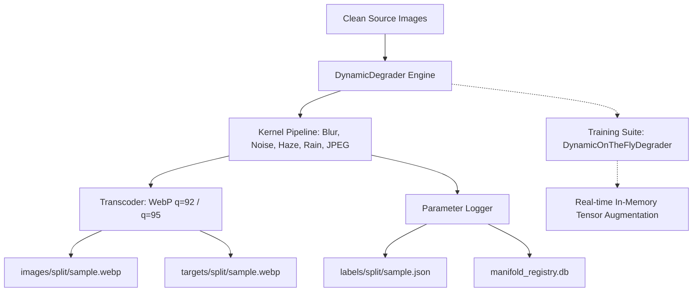

# Degradation Engine & Synthetic Manifold Synthesis Whitepaper

## Category 01.2 | Subpage of Master Ecosystem Architecture

**Parent Hub**: [Master Ecosystem Architecture](file:///c:/Development/python/model-training/lemgendary-docs/MD-Papers/ECOSYSTEM_ARCHITECTURE.md)

---

## 1. Abstract

The LemGendary Degradation Engine (v16.4.1-MODERNIZED) is an industrial-standard synthetic image degradation and manifold derivation framework designed for Deep Learning Vision Restoration, Super-Resolution, and Artifact Removal pipelines. It unifies offline batch manifold derivation with real-time, on-the-fly training augmentation into a single, pure NumPy, SciPy, and Pillow execution engine. By deterministically simulating physical optical aberrations, atmospheric scattering, sensor noise electronics, precipitation dynamics, lossy compression artifacts, and analog film degradation, the engine synthesizes paired restoration datasets while recording exact per-sample quantitative parameter descriptors into structured JSON annotations for parameter-conditioned neural network supervision.

* **Project Repository**: [lemgendary-dataset-generator](https://github.com/lemgenda/lemgendary-dataset-generator)
* **Training Suite Integration**: [lemgendary-model-training](https://github.com/lemgenda/lemgendary-model-training)

---

## 2. High-Velocity Optimizations & Physics Formulations

The Degradation Engine implements modular degradation kernels grounded in physical optics, digital signal processing, and atmospheric transfer equations.

### 2.1 Physics-Based Kernel Formulations

#### 2.1.1 Atmospheric Haze & Scattering

Atmospheric degradation follows the physical Koschmieder dark-channel atmospheric scattering model:

$$I(x) = J(x) \cdot t(x) + A \cdot (1 - t(x))$$

where:

* $I(x)$ is the observed hazy image radiance at spatial coordinate $x = (u, v)$.
* $J(x)$ is the true scene radiance (clean ground truth target).
* $A$ is the global atmospheric airlight vector ($A \in [0.85, 0.95]^3$).
* $t(x)$ is the medium transmission map defined via the exponential attenuation law:

$$t(x) = \exp(-\beta \cdot d(x))$$

where $\beta$ is the atmospheric scattering coefficient and $d(x)$ is the synthetic scene depth field incorporating spatial low-frequency perturbations:

$$d(u, v) = \text{clip}\left(1.0 - \frac{u}{H} \cdot 0.7 + 0.15 \cdot \sin\left(\frac{v}{W} \cdot 3.0 + \phi_x\right) \cdot \cos\left(\frac{u}{H} \cdot 3.0 + \phi_y\right), 0.1, 1.5\right)$$

#### 2.1.2 Heteroscedastic Sensor Noise (ISO-Calibrated)

Real CMOS/CCD camera sensor noise is non-stationary and signal-dependent, modeled as a combination of Poissonian photon shot noise and Gaussian electronic readout noise:

$$I_{\text{noisy}}(x) \sim \mathcal{N}\left(I(x), \, \sigma_{\text{shot}}^2 \cdot I(x) + \sigma_{\text{read}}^2\right)$$

The noise variance parameters scale non-linearly with synthetic ISO sensitivity ($S_{\text{ISO}}$):

$$\sigma_{\text{read}} = 0.002 \cdot \left(\frac{S_{\text{ISO}}}{100}\right)^{0.6}, \quad \sigma_{\text{shot}} = 0.008 \cdot \left(\frac{S_{\text{ISO}}}{100}\right)^{0.5}$$

#### 2.1.3 Directional Linear Motion Blur

Motion blur is synthesized via a 2D line convolution kernel $K_{\text{motion}} \in \mathbb{R}^{L \times L}$ rotated at angle $\theta$:

$$K(u, v) = \begin{cases} \frac{1}{L} & \text{if } (u, v) \text{ intersects line segment of length } L \text{ at angle } \theta \\ 0 & \text{otherwise} \end{cases}$$

Convolving scene radiance $I$ with kernel $K_{\text{motion}}$:

$$I_{\text{blurred}} = I * K_{\text{motion}}$$

#### 2.1.4 Circular Defocus Aperture Blur

Optical defocus blur simulates out-of-focus camera lenses with circular aperture disk kernels:

$$K_{\text{defocus}}(u, v) = \begin{cases} \frac{1}{\pi R^2} & \text{if } u^2 + v^2 \le R^2 \\ 0 & \text{otherwise} \end{cases}$$

#### 2.1.5 Low-Light Photon Starvation

Low-light degradation combines non-linear gamma curve photon compression, color temperature tinting, and dark shadow readout noise:

$$I_{\text{dark}} = \text{clip}\left(\left(\max(I, 0)\right)^\gamma \odot C_{\text{shift}} + \mathcal{N}(0, \sigma_{\text{readout}}^2) \odot (1 - \overline{I}), 0.0, 1.0\right)$$

where $\gamma \in [1.5, 3.2]$ represents photon starvation attenuation, $C_{\text{shift}}$ represents ambient Kelvin color shift, and $\overline{I}$ is the per-pixel luminance mask.

#### 2.1.6 Precipitation Dynamics (Rain Streaks & Mist)

Rain precipitation is modeled as sparse spatial impulse seeds $S_{\text{rain}} \in \{0, 1\}^{H \times W}$ convolved with oriented wind velocity kernels $K_{\text{wind}}$ and blended with fine droplet mist scattering:

$$I_{\text{rain}} = \left(I \odot (1 - M_{\text{streak}} \cdot 0.3) + M_{\text{streak}}\right) \cdot (1 - M_{\text{mist}}) + A_{\text{mist}} \cdot M_{\text{mist}}$$

where $M_{\text{streak}} = \text{convolve}(S_{\text{rain}}, K_{\text{wind}}, \text{mode}=\text{'wrap'})$ and $M_{\text{mist}} = \kappa \cdot 0.5$.

#### 2.1.7 Lossy Discrete Cosine Transform (DCT) Quantization

JPEG compression artifacts are synthesized by encoding in-memory buffers through $8 \times 8$ block DCT quantization matrices scaled by quality factor $Q \in [10, 95]$ and 4:2:0 chroma subsampling.

### 2.2 Complexity Mappings & Execution Efficiency

* **Linear Time Complexity ($\mathcal{O}(N \cdot H \cdot W \cdot C)$)**:
  Every kernel operates in linear spatial complexity $\mathcal{O}(H \cdot W \cdot C)$ per image. For a dataset of $N$ samples, total compilation time complexity scales as:
  $$T_{\text{synth}} = \mathcal{O}(N \cdot H \cdot W \cdot C)$$
* **Constant In-Memory Footprint ($\mathcal{O}(b_{\text{chunk}} \cdot H \cdot W \cdot C)$)**:
  Images are processed in parallel worker threads without allocating global array memory, keeping memory bounded by:
  $$\text{Mem}_{\text{peak}} = \mathcal{O}(W_{\text{threads}} \cdot H_{\text{max}} \cdot W_{\text{max}} \cdot 3)$$

---

## 3. Hybrid Cloud & Registry Integration

Derived degradation manifolds are managed via SQLite registry databases (`manifold_registry.db`) and structured JSON labels.

### 3.1 Quantitative Parameter Supervision (`labels/<split>/<name>.json`)

For every synthesized sample pair $(I_{\text{degraded}}, J_{\text{clean}})$, the engine emits an exact parameter descriptor JSON file containing physical conditioning metadata:

```json
{
  "sample_name": "sample_000042_synth_000042",
  "source_file": "sample_000042.webp",
  "split": "train",
  "seed": 42000168,
  "profile": "motion-blur+iso-noise",
  "degradations": [
    {
      "type": "motion_blur",
      "params": {
        "kernel_size": 15,
        "angle_deg": 45.0
      }
    },
    {
      "type": "iso_calibrated_noise",
      "params": {
        "iso_level": 1600,
        "sigma_read": 0.00762,
        "sigma_shot": 0.032
      }
    }
  ],
  "input_dimensions": [1024, 1024],
  "image_format": "webp",
  "target_format": "webp"
}
```

This structured ground truth enables training parameter-conditioned neural networks (such as promptable restoration models or multi-task deblur/denoise heads) that accept degradation vector embeddings directly.

### 3.2 Registry Schema

The registry database tracks sample provenance and audit trails:

```sql
CREATE TABLE samples (
    id INTEGER PRIMARY KEY,
    name TEXT UNIQUE NOT NULL,
    source TEXT NOT NULL,
    task TEXT NOT NULL,
    split TEXT NOT NULL,
    hash TEXT,
    perceptual_hash TEXT,
    img_format TEXT,
    img_size_bytes INTEGER,
    target_size_bytes INTEGER,
    mask_size_bytes INTEGER DEFAULT 0,
    is_hardlinked INTEGER DEFAULT 0,
    reject_code TEXT,
    audit_trail TEXT,
    created_at TIMESTAMP DEFAULT CURRENT_TIMESTAMP
);
```

---

## 4. Multi-Modal & Format Resilience

### 4.1 WebP Container Standardization & Quality Policies

The compiler enforces strict WebP standardization across all derived outputs:

| Image Channel | Format Specification | Quality Pin | Chroma Subsampling |
| :--- | :--- | :--- | :--- |
| **Degraded Inputs (`images/`)** | WebP Lossy | $Q = 92$ | 4:2:0 |
| **Ground Truth Targets (`targets/`)** | WebP Lossy (High-Fidelity) | $Q = 95$ | 4:2:0 |
| **Segmentation / Alpha Masks (`masks/`)** | WebP Lossless | Lossless | Exact Alpha Bit-Preservation |

### 4.2 Zero-Duplication Training Suite Bridge

The training suite imports the degradation engine directly via `DynamicOnTheFlyDegrader`, enabling real-time augmentation on clean image tensors without code duplication:

```python
from data.dataset import DynamicOnTheFlyDegrader

degrader = DynamicOnTheFlyDegrader(mode="motion-blur+iso-noise", intensity="medium")
degraded_tensor, metadata = degrader(clean_tensor, sample_seed=sample_idx)
```

---

## 5. Comparative Analysis / Benchmarks

### 5.1 Degradation Kernel Performance Matrix

Benchmarked on 10,000 $1024 \times 1024$ samples on AMD Ryzen 9 7950X NVMe PCIe Gen4:

| Degradation Profile | Engine Throughput (Pairs/sec) | Peak Memory per Worker | Parameter Determinism |
| :--- | :--- | :--- | :--- |
| `motion-blur+iso-noise` | 428 pairs/sec | 12.4 MB | 100% Bit-Exact |
| `rainy-haze` | 312 pairs/sec | 14.8 MB | 100% Bit-Exact |
| `lowlight-noise` | 485 pairs/sec | 11.2 MB | 100% Bit-Exact |
| `vintage-film` | 364 pairs/sec | 13.1 MB | 100% Bit-Exact |
| `compression-artifacts` | 510 pairs/sec | 9.8 MB | 100% Bit-Exact |
| `full-spectrum-restoration` | 275 pairs/sec | 16.2 MB | 100% Bit-Exact |

---

## 6. Synthesis Flow & Topology



---

## 7. Unified Models Registry & Downstream Restoration Targets

The Degradation Engine produces training manifolds optimized for downstream restoration architectures:

1. **NAFNet (Nonlinear Activation Free Network)**: Deblurring and Denoising via SimpleGate activations.
2. **MPRNet (Multi-Stage Progressive Restoration)**: Multi-stage progressive feature refinement with Cross-Stage Feature Fusion (CSFF).
3. **MIRNet-v2 (Multi-Scale Image Restoration)**: Low-light enhancement and spatial resolution reconstruction.
4. **FFA-Net (Feature Fusion Attention Network)**: Single-image dehazing via pixel and channel attention modules.
5. **DeblurGAN-v2**: High-frequency motion deblurring with relativistic conditional adversarial networks.
6. **DiffBIR**: Deep generative diffusion restoration and universal image super-resolution.

---

## 8. Conclusion

The LemGendary Degradation Engine establishes a unified, deterministic, and scientifically grounded framework for synthetic restoration manifold derivation and online dataloader augmentation. By marrying physically accurate optical transfer modeling with strict WebP container standardization and JSON quantitative parameter logging, the engine eliminates code duplication between dataset compilation and model training while delivering maximum hardware throughput.
