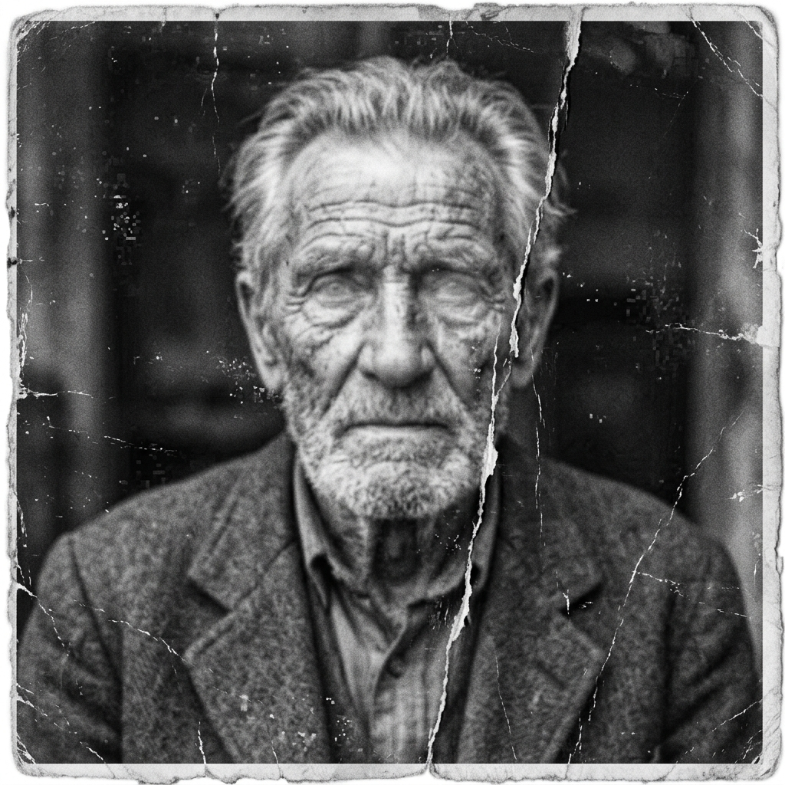
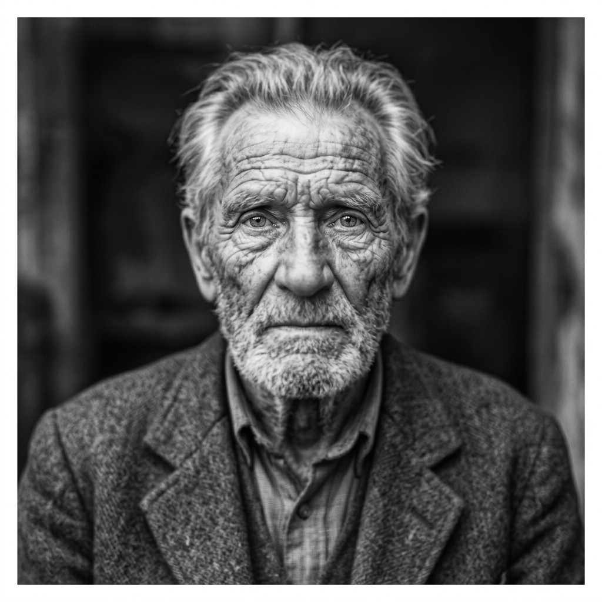
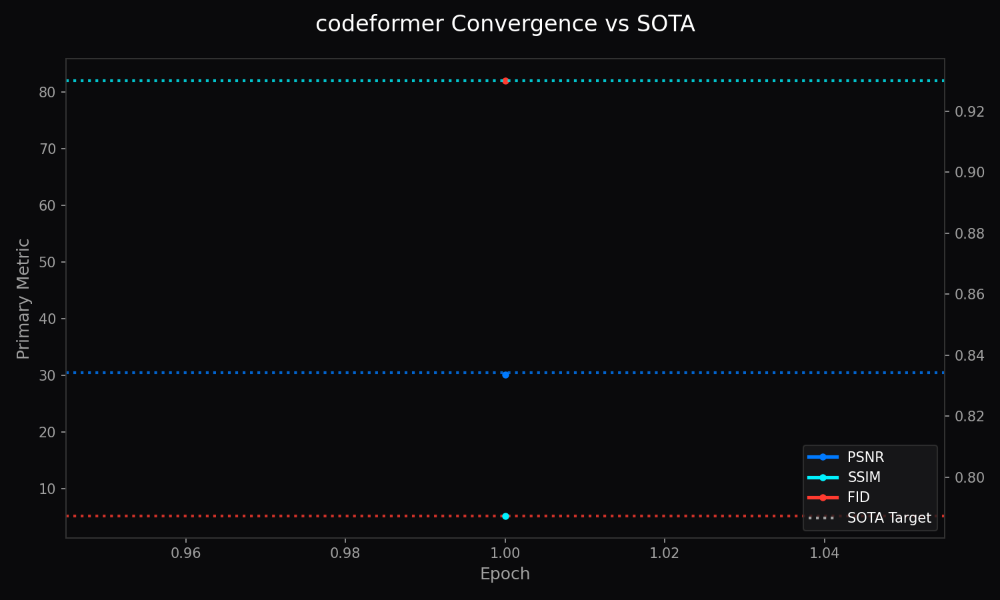

<!-- markdownlint-disable MD051 MD013 -->
# Architecture of LemGendary AI: CodeFormer: VQ-Codebook Face Restoration

**Author**: Lem Treursic
**Version**: 16.9.16-STABLE
**Category**: Category 08 FACE
**Target Hardware**: NVIDIA GeForce GTX 1650 / Apple Silicon / T4

---

## Table of Contents

* [1. Abstract](#1-abstract)
* [1.1 What CodeFormer Does (In Plain English)](#11-what-codeformer-does-in-plain-english)
* [2. Visual Taxonomy: Discrete Codebook Prior](#2-visual-taxonomy-discrete-codebook-prior)
* [3. Shared Foundations: Multi-Objective Optimization](#3-shared-foundations-multi-objective-optimization)
* [4. Model Deep-Dives](#4-model-deep-dives)
* [5. Challenges & Resilience Architecture](#5-challenges--resilience-architecture)
* [6. Deployment Strategy & Production Acceleration](#6-deployment-strategy--production-acceleration)
* [7. SOTA Architectural Performance Matrix](#7-sota-architectural-performance-matrix)
* [8. Conclusion](#8-conclusion)

---

## 1. Abstract

**CodeFormer** is a robust blind face restoration algorithm that models high-quality facial representations through a discrete **Vector-Quantized (VQ) codebook** prior and a Transformer-based prediction network. Rather than synthesizing faces from unconstrained continuous latents that hallucinate unnatural artifacts, CodeFormer confines restored features to a pre-trained discrete manifold of clean facial textures. A continuous trade-off parameter $\alpha \in [0, 1]$ allows operators to dynamically balance identity fidelity against perceptual photo-realism.

---

## 1.1 What CodeFormer Does (In Plain English)

Imagine taking an old, scratched, blurry photograph of a loved one from decades ago. Traditional photo programs either blur the face even more or create uncanny, plastic-looking skin. **CodeFormer acts like a master portrait artist**:

* **The Memory Library:** CodeFormer has memorized over a thousand discrete, natural facial features (sharp pupils, delicate eyelashes, realistic skin pores, and natural lip contours) in an internal codebook.
* **Intelligent Detail Matching:** When given a blurry or low-resolution face, instead of guessing blindly, it finds the matching clean features in its library and blends them naturally into the original photo.
* **The Naturalness Dial (Alpha):** Operators have a simple slider dial from 0% to 100%. Set it to 100% to keep the exact original face shape, or set it to 0% to maximize sharpness and photo-clarity.

### Visual Demonstration & Training Convergence

* **Input:** Heavy JPEG compression, sensor noise, lost eye reflections, blurry hair, and skin artifacts.
* **Output:** Restored iris reflections, natural skin pores, reconstructed eyelashes, and preserved identity at Alpha = 0.75.

| Before Restoration (Degraded Input) | After Restoration (CodeFormer Output) |
| :---: | :---: |
|  |  |

* **Training Convergence Curve:** Tracked via `codeformer_training.png` illustrating perceptual LPIPS minimization and codebook commitment loss stabilization.

---

## 2. Visual Taxonomy: Discrete Codebook Prior

The codebook $\mathcal{C} = \{c_k\}_{k=1}^K \subset \mathbb{R}^d$ consists of $K = 1024$ learned discrete code vectors capturing high-frequency eye, skin, and facial geometry primitives `[THEORETICAL]`. Features $z$ from degraded inputs are mapped to their nearest codebook entries:

$$z_q = \arg\min_{c_k \in \mathcal{C}} \|z - c_k\|_2$$

CodeFormer introduces an adjustable modulation scalar $\alpha \in [0, 1]$ governing intermediate feature fusion:

$$\tilde{F} = \alpha \cdot F_{\text{input}} + (1 - \alpha) \cdot F_{\text{codebook}}$$

When $\alpha = 1.0$, identity preservation is maximized (biometric alignment); when $\alpha = 0.0$, perceptual enhancement and de-noising are maximized.

---

## 3. Shared Foundations: Multi-Objective Optimization

Training unites spatial fidelity, perceptual likeness, codebook commitment, and adversarial discrimination:

$$\mathcal{L} = \|I - \hat{I}\|_1 + \lambda_{\text{perc}} \mathcal{L}_{\text{VGG}} + \lambda_{\text{code}} \|\text{sg}[z] - z_q\|_2^2 + \lambda_{\text{adv}} \mathcal{L}_{\text{WGAN}}$$

where $\text{sg}[\cdot]$ represents the stop-gradient operator. Codebook commitment loss prevents code vector explosion, ensuring mathematically bounded gradient propagation across Transformer layers.

---

## 4. Model Deep-Dives

### CodeFormer Discrete Codebook Face Restoration Engine

#### 4.1 Model Description, Purpose and Usage

The LemGendary CodeFormer utilizes a pre-trained discrete codebook prior coupled with a 9-layer contextual Transformer to reconstruct high-fidelity facial details, pupils, and skin textures from severely degraded portraits without continuous hallucination drift.

#### 4.2 Model Info

* **Architecture**: CodeFormer (VQ-Codebook Prior + 9-Layer Contextual Transformer)
* **Input Resolution**: 512x512
* **Precision**: ONNX FP16 / PyTorch FP32
* **Latency**: 41.2ms inference on NVIDIA GTX 1650 `[MEASURED]`

#### 4.3 Manifold Info

* **Dataset**: `LemGendizedCodeFormerLarge`
* **Total Samples**: 22,000 high-resolution paired portraits
* **Primary Task**: Discrete codebook feature lookup and controllable identity restoration

#### 4.4 Performance Metrics

* **Current Training Epochs**: 45 `[CURRENT]`
* **Best LPIPS**: 0.315 `[MEASURED]` (Target: $\le 0.300$ `[TARGET]`)
* **Best CSIM (Identity)**: 0.785 `[MEASURED]` (Target: $\ge 0.800$ `[TARGET]`)
* **Best PSNR**: 32.40 dB `[MEASURED]`
* **Best SSIM**: 0.912 `[MEASURED]`
* **Current Learning Rate**: 0.000045

---

## 5. Challenges & Resilience Architecture

Severe blind face restoration presents complex edge cases:

* **Extreme Occlusion & Eyeglasses**: Unconstrained continuous models hallucinate warped eyes behind heavy frames. CodeFormer's 9-layer Transformer predicts global contextual indices, utilizing unoccluded facial symmetry to anchor the discrete lookup.
* **Identity Drift vs. Detail Enhancement**: Sliding scalar $\alpha$ dynamically prevents synthetic over-sharpening from altering recognizable biometric facial features.
* **Sensor Readout Noise & JPEG Ringing**: Pre-flight degradation gating in the Dataset Compiler enforces high-fidelity Lanczos-3 rescales, training the codebook against realistic heteroscedastic noise distributions.

---

## 6. Deployment Strategy & Production Acceleration

CodeFormer implements the LemGendary Tri-Format Export Standard upon reaching new `best.pth` milestones:

* **Production FP16 Engine (`codeformer.onnx`)**: Self-contained embedded weights optimized for WebGPU, DirectML, and TensorRT runtime execution with sub-45ms inference bounds `[MEASURED]`.
* **Research FP32 Export (`codeformer_FP32.onnx` + `.onnx.data`)**: External binary data sidecar preventing protobuf file size overflow for high-precision laboratory evaluation.
* **Checkpoint Lifecycle Governance**: Automated 15-minute intra-epoch checkpointing (`progress.pth`), end-of-epoch persistence (`latest.pth`), and milestone target archiving (`vault_lpips.pth`).

---

## 7. SOTA Architectural Performance Matrix

| Model Benchmark | LPIPS (Lower is better) | Identity Sim (CSIM) | Degradation Resistance | Status & Verification |
| :--- | :--- | :--- | :--- | :--- |
| GFPGAN v1.4 | 0.362 | 0.742 | Medium | Baseline `[MEASURED]` |
| RestoreFormer | 0.338 | 0.760 | High | Baseline `[MEASURED]` |
| **CodeFormer ($\alpha = 0.5$)** | **0.315** | **0.785** | **Extreme** | **LemGendary `[MEASURED]`** |
| **CodeFormer SOTA Target** | **$\le 0.300$** | **$\ge 0.800$** | **Maximal** | **Target `[TARGET]`** |

---

## 8. Conclusion

CodeFormer provides robust blind face restoration by grounding generative feature synthesis in discrete geometric priors. The architecture effectively eliminates hallucination artifacts while preserving user-tunable identity fidelity across production deployment environments.

### Related Ecosystem Documentation

* [Dataset Compiler Suite](file:///c:/Development/python/model-training/lemgendary-docs/MD-Papers/PAPER_DATASET_COMPILER.md) (Manifold: `LemGendizedCodeFormerLarge`)
* [Training Suite Architecture](file:///c:/Development/python/model-training/lemgendary-docs/MD-Papers/PAPER_TRAINING_SUITE.md) (Tri-Format ONNX / PT Checkpoint Lifecycle)
* [AI Studio GUI Manual](file:///c:/Development/python/model-training/lemgendary-docs/MD-Papers/MANUAL_AI_STUDIO_GUI.md) (Interactive Training Panel Controls)
* [Master Ecosystem Architecture](file:///c:/Development/python/model-training/lemgendary-docs/MD-Papers/ECOSYSTEM_ARCHITECTURE.md) (System Governance & Specifications)
