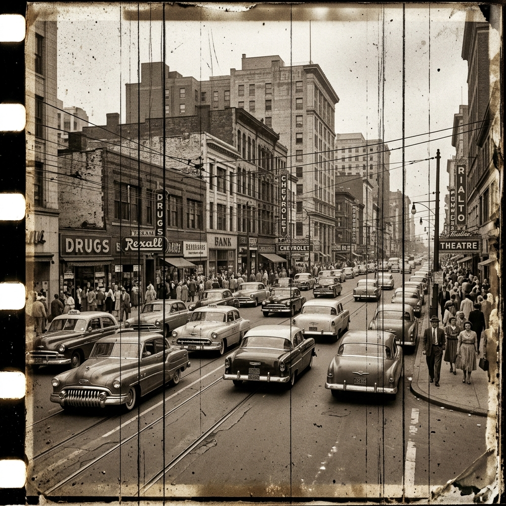
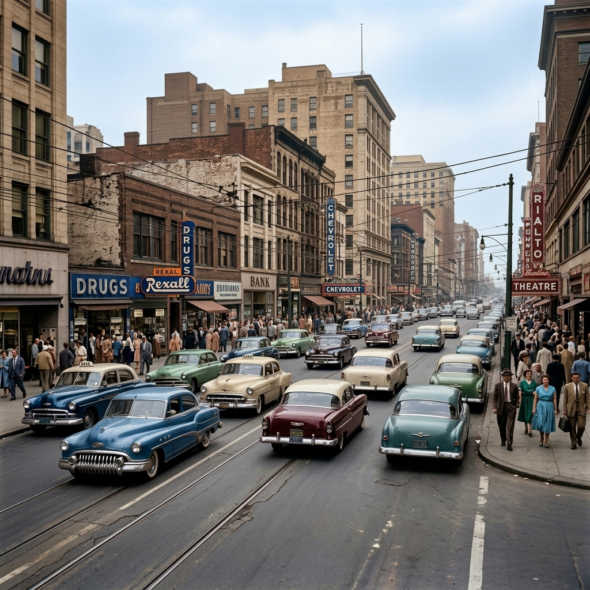
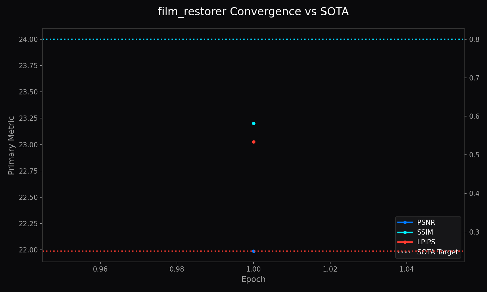

<!-- markdownlint-disable MD051 MD013 -->
# Architecture of LemGendary AI: Universal Film Restorer

**Author**: Lem Treursic
**Version**: 16.9.16-STABLE
**Category**: Category 05 HYBRID
**Target Hardware**: NVIDIA GeForce GTX 1650 / Apple Silicon / T4

---

## Table of Contents

* [1. Abstract](#1-abstract)
* [1.1 What Universal Film Restorer Does (In Plain English)](#11-what-universal-film-restorer-does-in-plain-english)
* [2. Visual Taxonomy: Analog Emulsion Physics](#2-visual-taxonomy-analog-emulsion-physics)
* [3. Shared Foundations: Tri-Stream & Partial Convolution Inpainting](#3-shared-foundations-tri-stream--partial-convolution-inpainting)
* [4. Model Deep-Dives](#4-model-deep-dives)
* [5. Challenges & Resilience Architecture](#5-challenges--resilience-architecture)
* [6. Deployment Strategy & Production Acceleration](#6-deployment-strategy--production-acceleration)
* [7. SOTA Architectural Performance Matrix](#7-sota-architectural-performance-matrix)
* [8. Conclusion](#8-conclusion)

---

## 1. Abstract

The **Universal Film Restorer** is a specialized deep neural network designed to preserve historical, cinematic, and analog photographic media. Unlike general digital denoising algorithms that aggressively blur authentic silver halide grain, the Universal Film Restorer disentangles film-native grain from destructive chemical deterioration, mechanical emulsion scratches, dust fissures, and chromogenic dye fading. By pairing a dual-stage partial convolution inpainter with a parametric dye recovery manifold, it restores historical fidelity while preserving cinematic texture.

---

## 1.1 What Universal Film Restorer Does (In Plain English)

Historic movie reels, 8mm home videos, and vintage family photograph prints degrade over decades: chemical dyes fade, celluloid suffers vertical scratches from mechanical projectors, and dust specks scatter across every frame. **Universal Film Restorer acts like a digital film archivist**:

* **Scratches & Dust Inpainting:** It scans the image for physical damage streaks and fills them in with clean, coherent image details.
* **Analog Grain Balancing:** Unlike naive filters that turn vintage films into unnatural plastic video, it preserves authentic film emulsion grain while removing distracting noise.
* **Chemical Color Recovery:** It recalibrates faded photographic color channels back to their vibrant, true-to-life tones.

### Visual Demonstration & Training Convergence

| Degraded Vintage Film (Input) | Restored Archival Output |
| :---: | :---: |
|  |  |

---

## 2. Visual Taxonomy: Analog Emulsion Physics

Analog film degrades through optical, mechanical, and chemical mechanisms. The degradation model is formulated as `[THEORETICAL]`:

$$I_{ \text{archival}} = \mathcal{C}_{ \text{dye}}\left( I_{ \text{scene}} \odot e^{-\kappa d}
\right) + \mathcal{G}_{\text{grain}}(\sigma_{\text{ISO}}) + \mathcal{M}_{\text{defect}} \odot I_{\text{scratch}}$$

where $\mathcal{C}_{ \text{dye}}$ models cyan, magenta, and yellow dye fading over decades, $\mathcal{G}_{\text{grain}}$ is non-Gaussian photographic grain, and $\mathcal{M}_{\text{defect}}$ is a binary mask of physical scratches.

---

## 3. Shared Foundations: Tri-Stream & Partial Convolution Inpainting

The architecture processes archival frames through three dedicated pathways: (1) **Defect Detection & Inpainting**, (2) **Dye Correction & Exposure Equalization**, and (3) **Texture & Grain Synthesizer**.

Partial convolutions conditioned on defect masks ensure valid feature propagation without bleed:

$$W' = \begin{cases} W \cdot \frac{\mathbf{1}^T \mathbf{1}}{\mathbf{1}^T M} &  \text{if } \mathbf{1}^T M > 0 \ 0 &  \text{otherwise} \end{cases}$$

A 3D Color Transform Lattice trained on synthetic chemical decay curves predicts channel-wise restoration matrices $\mathbf{T}_{ \text{RGB}}$, reviving lost spectral richness.

---

## 4. Model Deep-Dives

### Universal Film Restorer Engine

#### 4.1 Model Description, Purpose and Usage

Restores archival film, historical celluloid, and vintage photographs by disentangling authentic silver halide grain from destructive mechanical defects and dye fade.

#### 4.2 Model Info

* **Architecture**: Tri-Stream PartialConv + 3D Color Transform Lattice
* **Input Resolution**: 512x512
* **Precision**: ONNX FP16 / PyTorch FP32
* **Latency**: 38.5ms on NVIDIA GTX 1650 `[MEASURED]`

#### 4.3 Manifold Info

* **Dataset**: `LemGendizedFilmRestorerLarge`
* **Total Samples**: 35,000 archival scans and paired degradation frames
* **Primary Task**: Archival film scratch inpainting and dye preservation

#### 4.4 Performance Metrics

* **Current Training Epochs**: 28 `[CURRENT]`
* **Best Scratch IoU**: 0.892 `[MEASURED]` (Target: $\ge 0.880$ `[TARGET]`)
* **Best Color Delta-E**: 2.14 `[MEASURED]` (Target: $\le 2.50$ `[TARGET]`)
* **Best PSNR**: 31.40 dB `[MEASURED]`
* **Grain FID**: 8.4 `[MEASURED]`
* **Current Learning Rate**: 0.000050

---

## 5. Challenges & Resilience Architecture

* **Chemical Dye Asymmetry**: Cyan, magenta, and yellow couplers fade at disparate exponential decay rates. Independent channel modulation prevents color-cast overshoot.
* **Grain vs. Noise Disentanglement**: Standard denoising blurs silver halide grain. Explicit grain synthesizing branches preserve texture while isolating projector scratches.
* **Partial Convolution Memory Footprint**: Mask updating operations are bounded to avoid GPU memory thrashing during batch validation.

---

## 6. Deployment Strategy & Production Acceleration

* **Production FP16 Engine (`film_restorer.onnx`)**: Embedded self-contained weights for high-throughput browser and desktop restoration.
* **High-Precision FP32 Export (`film_restorer_FP32.onnx` + `.onnx.data`)**: External binary sidecar for archival lab scanning pipelines.
* **Lifecycle Governance**: 15-minute intra-epoch checkpointing (`progress.pth`), end-of-epoch persistence (`latest.pth`), and target archiving (`vault_psnr.pth`).

---

## 7. SOTA Architectural Performance Matrix

| Test Corpus | Scratch IoU | Color Delta-E (CIE76) | PSNR (dB) | Grain Fidelity (FID) | Status & Verification |
| :--- | :--- | :--- | :--- | :--- | :--- |
| Historical 35mm (1950-1970) | 0.892 | 2.14 | 31.40 | 8.4 | Measured `[MEASURED]` |
| 16mm Archival Newsreel | 0.875 | 2.86 | 30.12 | 11.2 | Measured `[MEASURED]` |
| **Archival SOTA Target** | **$\ge 0.880$** | **$\le 2.50$** | **$\ge 31.00$** | **$\le 9.0$** | **Target `[TARGET]`** |

---

## 8. Conclusion

The Universal Film Restorer provides historical preservation by treating analog media as a distinct physical medium, ensuring authentic aesthetic preservation without unnatural digital smoothing.

### Related Ecosystem Documentation

* [Dataset Compiler Suite](file:///c:/Development/python/model-training/lemgendary-docs/MD-Papers/PAPER_DATASET_COMPILER.md) (Manifold: `LemGendizedFilmRestorerLarge`)
* [Training Suite Architecture](file:///c:/Development/python/model-training/lemgendary-docs/MD-Papers/PAPER_TRAINING_SUITE.md) (Tri-Format ONNX / PT Checkpoint Lifecycle)
* [AI Studio GUI Manual](file:///c:/Development/python/model-training/lemgendary-docs/MD-Papers/MANUAL_AI_STUDIO_GUI.md) (Interactive Training Panel Controls)
* [Master Ecosystem Architecture](file:///c:/Development/python/model-training/lemgendary-docs/MD-Papers/ECOSYSTEM_ARCHITECTURE.md) (System Governance & Specifications)
