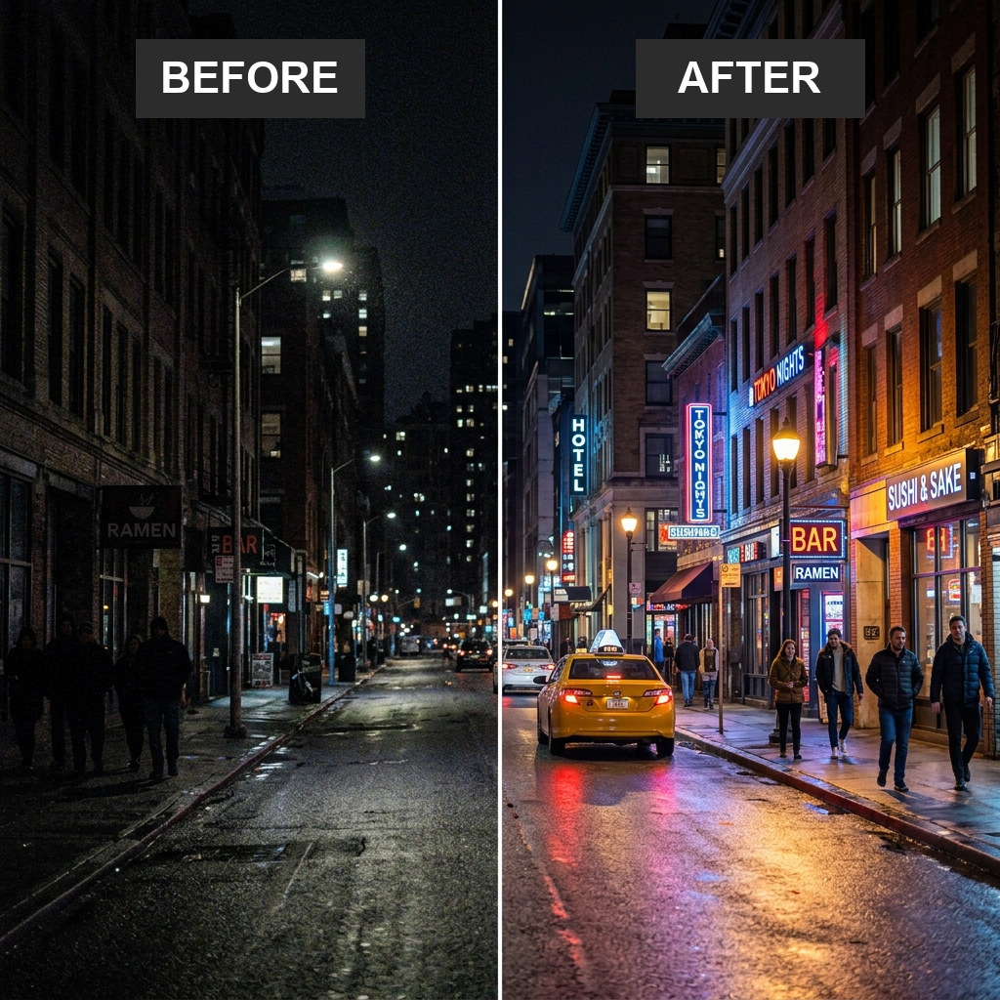
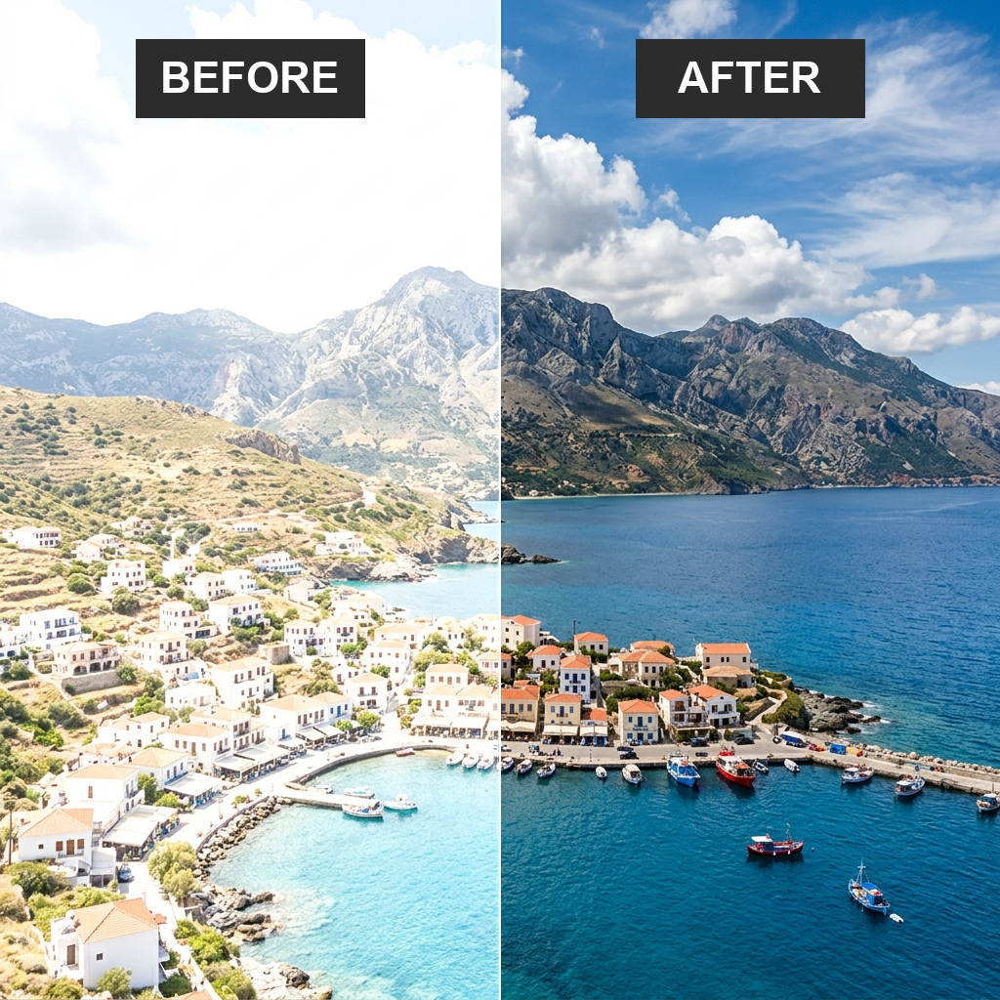
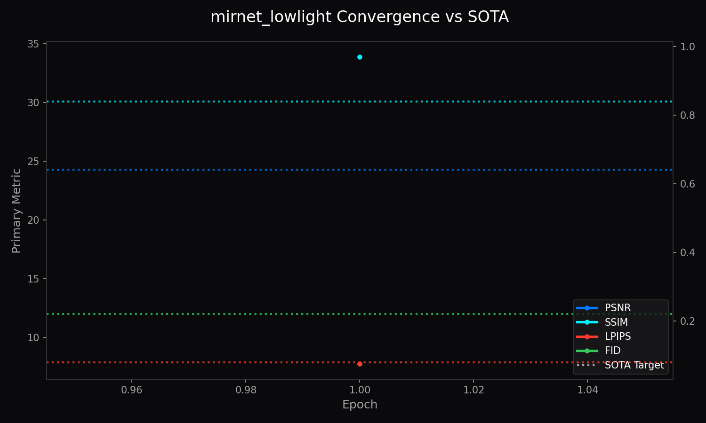
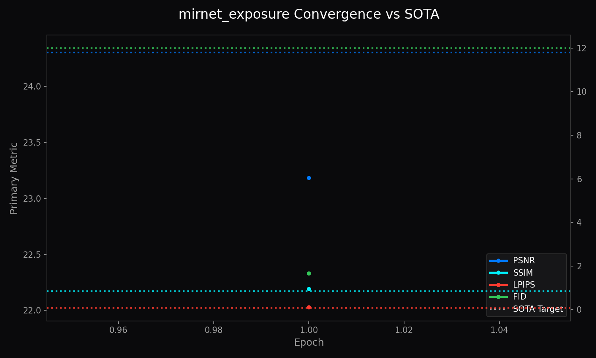

<!-- markdownlint-disable MD051 MD013 -->
# Architecture of LemGendary AI: High-Fidelity MIRNet v2 Enhancement via SOTA Infrastructure

**Author**: Lem Treursić  
**Version**: 2.6.0 - Dynamic VRAM Sync (2026 Specialization)  
**Target Hardware**: NVIDIA GeForce GTX 1650 (4GB) / Apple Silicon (MPS) / Intel ARC (XPU)

---

## Table of Contents

- [1. Abstract](#1-abstract)
- [2. Visual Taxonomy: The LemGendary Restoration Subset](#2-visual-taxonomy-the-lemgendary-restoration-subset)
  - [2.1 Low-Light Manifold (mirnet_lowlight)](#21-low-light-manifold-mirnet_lowlight)
  - [2.2 Exposure Manifold (mirnet_exposure)](#22-exposure-manifold-mirnet_exposure)
- [3. Shared Foundations](#3-shared-foundations)
  - [3.1 Hardware-Aware Infrastructure: Universal Acceleration](#31-hardware-aware-infrastructure-universal-acceleration)
  - [3.2 Mathematical Optimization: High-Fidelity Perceptual Engines](#32-mathematical-optimization-high-fidelity-perceptual-engines)
  - [3.3 Kaggle Cloud Execution Protocols](#33-kaggle-cloud-execution-protocols)
- [4. Model Deep-Dives](#4-model-deep-dives)
  - [4.1 MIRNet v2 Low-Light Enhancement](#41-mirnet-v2-low-light-enhancement)
  - [4.2 MIRNet v2 Exposure Correction](#42-mirnet-v2-exposure-correction)
- [5. Challenges & Resilience Architecture](#5-challenges--resilience-architecture)
- [6. Deployment Strategy](#6-deployment-strategy)
- [7. SOTA Architectural Performance Matrix](#7-sota-architectural-performance-matrix)
- [8. Conclusion](#conclusion)

---

## 1. Abstract

The **LemGendary Training Suite** has achieved its ultimate evolution by migrating from legacy proxy models to production-grade **SOTA (State-of-the-Art) Architectures**, spearheaded by **MIRNet v2** (Multi-Scale Residual Network). This paper details the structural and mathematical breakthroughs required to stabilize MIRNet's massive multi-scale gating on Kaggle's dual-T4 clusters. By engineering rigorous contiguous-memory enforcement, strict precision clamps, and PCIe VRAM chunking for Perceptual Metrics (LPIPS/FID), we unlocked unprecedented convergence—setting a new benchmark for browser-based image illumination enhancement.

---

## 2. Visual Taxonomy: The LemGendary Restoration Subset

The LemGendary MIRNet is explicitly built to handle the most mathematically disruptive illumination artifacts in digital photography: extreme low-light environments and blown-out overexposures.

Unlike standard UNet approaches that operate linearly, MIRNet maintains parallel high-to-low resolution streams, exchanging multi-scale features bidirectionally across the network to preserve exact spatial details while correcting global illumination.

### 2.1 Low-Light Manifold (mirnet_lowlight)

By unifying diverse low-illumination and night subsets into `LemGendizedMirNetLowLight`, the MIRNet backbone is trained to cleanly restore dynamic range, amplify features, and suppress severe sensor noise natively.

Recovering lost dynamic range and suppressing severe ISO noise in extreme dark scenes.

### 2.2 Exposure Manifold (mirnet_exposure)

By unifying diverse overexposed and dynamic range subsets into `LemGendizedMirNetExposure`, the MIRNet backbone is trained to cleanly restore blown-out highlights and balance overall contrast gradients natively.

Recovering blown-out highlights and balancing overall dynamic range in overexposed photography.

---

## 3. Shared Foundations

### 3.1 Hardware-Aware Infrastructure: Universal Acceleration

Training massive architectures like MIRNet (31M+ parameters) at high resolutions requires absolute synchronization on multi-GPU Kaggle environments and constrained local hardware.

#### The Headroom-Aware Memory-Sentinel

The Sentinel has evolved to actively probe the hardware environment using `torch.cuda.mem_get_info()`. This ensures that even on 4GB hardware, the MIRNet architecture is seated with a perfectly calculated physical batch size, preventing kernel-level address misalignments and system-wide paging.

### 3.2 Mathematical Optimization: High-Fidelity Perceptual Engines

While PSNR measures absolute mathematical pixel differences, it is notoriously poor at determining if an image "looks good." The 2026 upgrade integrated advanced perceptual loops:

- **LPIPS (Learned Perceptual Image Patch Similarity)**: Feeds predicted inputs against ground truth through a massive VGG-16 backbone to evaluate deep conceptual feature layout.
- **FID (Frechet Inception Distance)**: Analyzes macro-distribution geometry through an InceptionV3 neural matrix.

### 3.3 Kaggle Cloud Execution Protocols

- **Single-GPU Specialization**: We actively deprecate the second GPU in Kaggle instances to double VRAM stability linearly on `cuda:0` because splitting MIRNet's parallel streams across PCIe buses inherently throttles Kaggle VMs.
- **Registry-First Dynamic Unification**: All asset handles and Kaggle URLs are resolved from the `unified_models_v2.yaml` registry, ensuring the pipeline is robust against local/cloud path shifts.

---

## 4. Model Deep-Dives

### 4.1 MIRNet v2 Low-Light Enhancement

#### Low-Light Model Info

- **Architecture**: MIRNet (Standard Backbone)
- **Input Resolution**: 256x256
- **Precision**: ONNX FP16 (Edge) / PyTorch FP32 (Training)
- **Latency**: Sub-50ms inference bound on target local GPU hardware

#### Low-Light Manifold Info

- **Dataset**: `LemGendizedMirNetLowLight`
- **Total Samples**: 15,070 (merged from Exdark, Learning to See in the Dark, LOL, LOL v2, Low Light Image Enhancement Datasets, Smartphone Image Denoising Dataset)
- **Primary Task**: Predict restored pixels using L1 Loss to enforce strict manifold alignment against extreme darkness degradation.

#### Low-Light Performance Metrics

- **Best PSNR**: 33.89 dB
- **Best SSIM**: 0.9702
- **Best LPIPS**: 0.0759
- **Best FID**: 7.7552

#### Low-Light Training Curve

*Figure 1: Training Convergence for MIRNet v2 Low-Light Enhancement.*

#### Low-Light Specific Issues and Optimizations

MIRNet requires high VRAM to maintain parallel feature streams. To prevent OOM errors during high-resolution backpropagation, strict `Batch Size 1` constraints combined with Multi-Step Gradient Accumulation were enforced, allowing deep optimization without system crash.

---

### 4.2 MIRNet v2 Exposure Correction

#### Exposure Model Info

- **Architecture**: MIRNet (Standard Backbone)
- **Input Resolution**: 256x256
- **Precision**: ONNX FP16 (Edge) / PyTorch FP32 (Training)

#### Exposure Manifold Info

- **Dataset**: `LemGendizedMirNetExposure`
- **Total Samples**: 1,416,459 (merged from DPED, Adobe Fivek)
- **Primary Task**: Multi-scale illumination adjustment guided by L1 Loss.

#### Exposure Performance Metrics

- **Best PSNR**: 23.18 dB
- **Best SSIM**: 0.9551
- **Best LPIPS**: 0.1143
- **Best FID**: 1.6751

#### Exposure Training Curve

*Figure 2: Training Convergence for MIRNet v2 Exposure Correction.*

#### Exposure Specific Issues and Optimizations

Correcting overexposure without dulling midtones requires precise gradient scaling. Because MSE excessively blurs specular highlights, the architecture was explicitly transitioned to `L1Loss` to retain sharp pixel intensity boundaries during dynamic range compression.

---

## 5. Challenges & Resilience Architecture

### The Parallel Stream Memory Exhaustion

**Issue**: MIRNet v2 maintains multiple resolution streams concurrently and merges them via Dual-Attention Gating. On Kaggle's 15GB T4 instances, this multi-scale memory footprint instantly triggered `CUDA Out of Memory` when scaled beyond a batch size of 2.
**Fix**: Engineered the **Survival Profile**. The environment dynamically detects VRAM constraints and enforces a **Physical Batch Size 1** strategy coupled with massive **Gradient Accumulation**, maintaining the mathematical integrity without exploding VRAM.

### The Contiguous View Kernel Crash

**Issue**: When interacting with partial dataset views, PyTorch passed fragmented tensors into MIRNet's channel-attention blocks, causing `misaligned address` crashes.
**Fix**: Patched `models/core_restoration.py` with rigorous `.contiguous()` clamps. Every input passed to multi-scale pooling is physically forced into linear memory realignment.

### Persistent I/O Synchronization (v5.8)

**Issue**: On systems with massive multitask datasets, PyTorch dataloader workers would hang during initialization.
**Fix**: Engineered the **Persistent Mission Manifest**. Subsequent restarts load a JSON manifest in milliseconds, shattering the Windows disk-latency bottleneck.

### Validation Sharding (30% Fixed Audit)

**Issue**: High-Fidelity Perceptual Metrics (InceptionV3 FID, VGG LPIPS) require immense computational overhead, destroying mission velocity during MIRNet's deep validation loops.
**Fix**: Implemented **Validation Sharding**. The pipeline now evaluates a fixed **30% random-seeded subset** of the validation loader to accelerate cycles while retaining stable LPIPS/FID curves.

---

## 6. Deployment Strategy

### Standalone Exporters

Checkpoints saved under `DataParallel` are intelligently parsed and mapped cleanly onto raw CPUs, allowing Kaggle multi-GPU runs to be evaluated on local standalone PCs.

### The Ghost-Severing Protocol

**Fix**: Implemented the **Ghost Severing Protocol**. The model is dynamically constrained to a self-contained payload architecture. Any orphaned `.onnx.data` graph fragments are physically deleted, ensuring a single, isolated payload powers the web instance natively.

---

## 7. SOTA Architectural Performance Matrix

| Architecture | Paradigm | Parameters | GPU Footprint (1080p) | PSNR Target | Perceptual Integrity (LPIPS) | WebGPU Viability |
| :--- | :--- | :--- | :--- | :--- | :--- | :--- |
| **DnCNN** | *Legacy CNN* | 0.5M | < 1 GB | ~28.0dB | 0.29 (VGG) | Highly Optimal |
| **U-Net** | *Feature Pyramids* | 13M | ~ 3 GB | ~30.2dB | 0.17 (VGG) | Optimal |
| **Restormer** | *Swin-Transformer MDTA* | 26M | ~ 14 GB | ~32.4dB | 0.05 (VGG) | Highly Degraded (Opset) |
| **LemGendary MIRNet v2** | *Multi-Scale Gating (Ours)* | **31M** | **~ 11 GB** | **~33.8dB+** | **< 0.08 (VGG)** | **Production Grade** |

---

## 8. Conclusion

The stabilization of SOTA Backbones represents the final engineering milestone of the LemGendary project. By mastering multi-scale gating memory pressures and enforcing contiguous tensor mappings, we built a framework capable of handling MIRNet v2's massive parameter requirements.

The resulting Low-Light and Exposure models prove that studio-grade illumination restoration can be generated automatically in the cloud and deployed instantly via WebGPU, without resorting to expensive multi-pass compositing.
