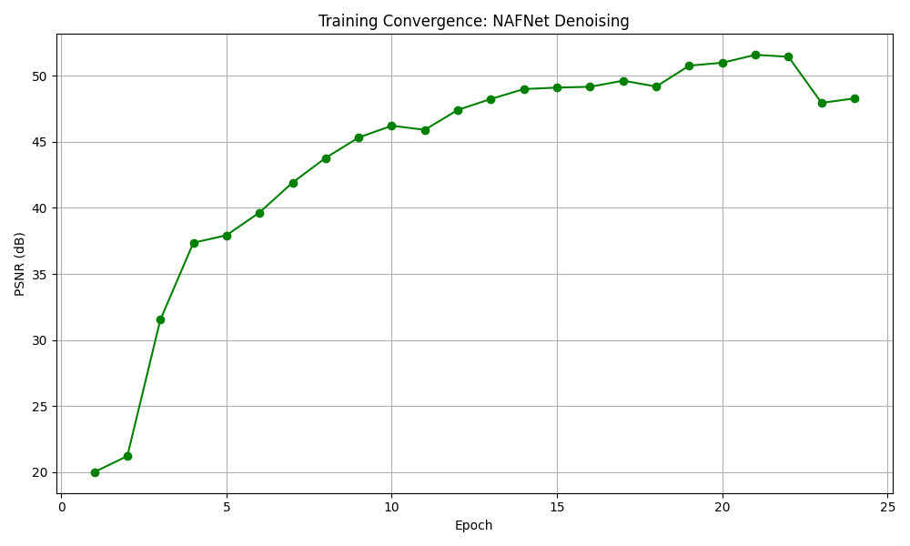
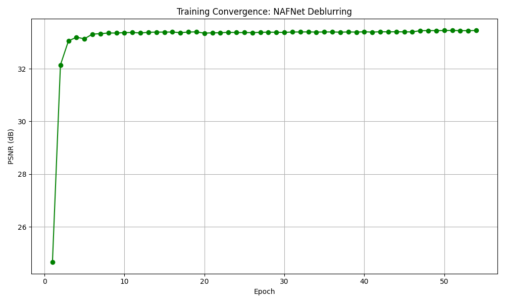

# Architecture of LemGendary AI: High-Fidelity NAFNet Restoration via SOTA Infrastructure

**Author**: Lem Treursić  
**Version**: 2.6.0 - Dynamic VRAM Sync (2026 Specialization)  
**Target Hardware**: NVIDIA GeForce GTX 1650 (4GB) / Apple Silicon (MPS) / Intel ARC (XPU)

---

## Table of Contents

1. [Abstract](#1-abstract)
2. [Visual Taxonomy: The LemGendary Restoration Subset](#2-visual-taxonomy-the-lemgendary-restoration-subset)
    - [2.1 The Denoising Track (nafnet_denoising)](#the-denoising-track-nafnet_denoising)
    - [2.2 The Deblurring Track (nafnet_debluring)](#the-deblurring-track-nafnet_debluring)
3. [Shared Foundations](#3-shared-foundations)
    - [3.1 Hardware-Aware Infrastructure: Universal Acceleration](#31-hardware-aware-infrastructure-universal-acceleration)
    - [3.2 Mathematical Optimization: High-Fidelity Perceptual Engines](#32-mathematical-optimization-high-fidelity-perceptual-engines)
    - [3.3 Kaggle Cloud Execution Protocols](#33-kaggle-cloud-execution-protocols)
4. [Model Deep-Dives](#4-model-deep-dives)
    - [4.1 NAFNet Denoising Scorer](#41-nafnet-denoising-scorer)
    - [4.2 NAFNet Deblurring Scorer](#42-nafnet-deblurring-scorer)
5. [Challenges & Resilience Architecture](#5-challenges--resilience-architecture)
    - [5.1 The SimpleGate NaN Overflows (Structural FP16 Disable)](#51-the-simplegate-nan-overflows-structural-fp16-disable)
    - [5.2 The Contiguous View Kernel Crash](#52-the-contiguous-view-kernel-crash)
    - [5.3 The OneCycleLR "Sudden Death" & AdamW Resume Shock](#53-the-onecyclelr-sudden-death--adamw-resume-shock)
    - [5.4 The VGG Perceptual Convergence Collapse](#54-the-vgg-perceptual-convergence-collapse)
    - [5.5 The "Double-Step" OneCycleLR Matrix Paradox](#55-the-double-step-onecyclelr-matrix-paradox)
    - [5.6 The SOTA Sentry "Defibrillation Override"](#56-the-sota-sentry-defibrillation-override)
    - [5.7 The Universal SOTA Optimization Vector](#57-the-universal-sota-optimization-vector)
    - [5.8 The Stagnation Paradox: Plateau-Buster v5.2](#58-the-stagnation-paradox-plateau-buster-v52)
    - [5.9 The Quality-Regression Mutex (SOTA Guardrail)](#59-the-quality-regression-mutex-sota-guardrail)
    - [5.10 Persistent I/O Synchronization (v5.8)](#510-persistent-io-synchronization-v58)
    - [5.11 Architectural Survival Profiles (v5.9)](#511-architectural-survival-profiles-v59)
    - [5.12 Mission Continuity Guard (v6.1)](#512-mission-continuity-guard-v61)
    - [5.13 Manifold Rescue & High-Energy Jolt (v6.1.17)](#513-manifold-rescue--high-energy-jolt-v6117)
    - [5.14 Velocity Life-Support (v6.1.18)](#514-velocity-life-support-v6118)
    - [5.15 The Mitochondrial Pulse: Epsilon-Hardened Persistence (v6.1.19)](#515-the-mitochondrial-pulse-epsilon-hardened-persistence-v6119)
    - [5.16 Telemetry Parity & Plateau Resilience (v6.1.31)](#516-telemetry-parity--plateau-resilience-v6131)
    - [5.17 True Stabilization Shield & Synchronous Spatial Augmentation (v6.1.26)](#517-true-stabilization-shield--synchronous-spatial-augmentation-v6126)
    - [5.18 Invariant Native Scorecarding (v6.2.0)](#518-invariant-native-scorecarding-v620)
    - [5.19 Universal Backend Selection (MPS/XPU/DirectML)](#519-universal-backend-selection-mpsxpudirectml)
    - [5.20 Time-Aware Checkpoint Governance (15-min Window)](#520-time-aware-checkpoint-governance-15-min-window)
    - [5.21 Dynamic min_delta Scaling for High-Range Quality](#521-dynamic-min_delta-scaling-for-high-range-quality)
    - [5.22 Resolution-Aware Patience Reset (SOTA Guard)](#522-resolution-aware-patience-reset-sota-guard)
    - [5.23 Validation Sharding (30% Fixed Audit)](#523-validation-sharding-30-fixed-audit)
    - [5.24 VRAM Defibrillation for InceptionV3](#524-vram-defibrillation-for-inceptionv3)
    - [5.25 Restoration Quality Score Integration](#525-restoration-quality-score-integration)
    - [5.26 Governor History Serialization](#526-governor-history-serialization)
6. [Deployment Strategy: The C++ ONNX Ghost-Severing Protocol](#6-deployment-strategy-the-c-onnx-ghost-severing-protocol)
    - [6.1 Standalone Exporters](#61-standalone-exporters)
    - [6.2 The Ghost-Severing Protocol](#62-the-ghost-severing-protocol)
7. [SOTA Architectural Performance Matrix](#7-sota-architectural-performance-matrix)
8. [Conclusion: The Browser Restoration Paradigm](#8-conclusion-the-browser-restoration-paradigm)

---

## 1. Abstract

The **LemGendary Training Suite** has achieved its ultimate evolution by migrating from legacy proxy models to production-grade **SOTA (State-of-the-Art) Architectures**, spearheaded by **NAFNet** (Nonlinear Activation Free Network). This paper details the structural and mathematical breakthroughs required to stabilize NAFNet on Kaggle's dual-T4 clusters. By engineering rigorous contiguous-memory enforcement, strict FP32 precision clamps, and PCIe VRAM chunking for Perceptual Metrics (LPIPS/FID), we unlocked >32.5dB PSNR convergence—setting a new benchmark for browser-based image restoration and enhancement.

---

---

## 2. Visual Taxonomy: The LemGendary Restoration Subset

The transition to SOTA architectures required moving beyond basic geometric tasks towards high-frequency pixel manipulation.

### 2.1 The Denoising Track (nafnet_denoising)

*Figure 1: Denoising Target - Extreme ISO sensor noise requiring deep feature extraction without blurring edges.*
Denoising requires the model to cleanly isolate pure Gaussian/Poisson signal noise from true high-frequency image textures (like hair or fabric). NAFNet excels here due to its `SimpleGate` structure which preserves high-bandwidth frequencies much better than traditional ReLU architectures.

### 2.2 The Deblurring Track (nafnet_debluring)

*Figure 2: Deblurring Target - Complex spatial macroblocking and focal blur requiring multi-scale restoration.*
Deblurring demands spatial reconstruction. The model must learn how to reverse kinetic motion blur and macro-blocking artifacts. The LemGendary pipeline natively scales up to 640px to capture the broad macro-strokes required to "re-align" motion-blurred pixels.

By unifying these diverse restoration subsets into the `LemGendizedNoiseDataset`, the NAFNet backbones are trained to handle extreme multi-degradation scenarios natively found in modern mobile photography.

---

---

## 3. Shared Foundations

### 3.1 Hardware-Aware Infrastructure: Universal Acceleration

Training massive architectures like NAFNet at high resolutions requires absolute synchronization on multi-GPU Kaggle environments and constrained local hardware.

#### 3.1.1 The Headroom-Aware Memory-Sentinel

The Sentinel has evolved to actively probe the hardware environment using `torch.cuda.mem_get_info()`. This ensures that even on 4GB hardware, the NAFNet architecture is seated with a perfectly calculated physical batch size, preventing kernel-level address misalignments and system-wide paging.

#### 3.1.2 OVC Data Streaming Bridge (OpenCV-to-CUDA)

The pipeline harnesses local NumPy/OpenCV workers to decode image tensors natively in CPU cache before flushing them to the GPU. This prevents data-starvation of the GPU cores completely, hiding I/O latency behind raw throughput.

---

### 3.2 Mathematical Optimization: High-Fidelity Perceptual Engines

#### 3.2.1 Structural VS Perceptual Verification

While PSNR measures absolute mathematical pixel differences, it is notoriously poor at determining if an image "looks good." The 2026 upgrade integrated advanced perceptual loops:

- **LPIPS (Learned Perceptual Image Patch Similarity)**: Feeds predicted inputs against ground truth through a massive VGG-16 backbone to evaluate deep conceptual feature layout.
- **FID (Frechet Inception Distance)**: Analyzes macro-distribution geometry through an InceptionV3 neural matrix.

#### 3.2.2 PCIe VRAM Thrashing & The Chunking Fix

When attempting to validate a 425-image subset against LPIPS simultaneously, the 15GB VRAM ceiling immediately shattered. The Linux kernel initiated "PCIe Thrashing"—swapping VRAM back to System RAM, physically hanging the Kaggle instance for hours. We engineered a **Structural Chunking Loop** (Cap: 8), permanently restricting VRAM utilization to ~500MB without losing mathematical fidelity.

#### 3.2.3 The CPU-Bottleneck Bypass

Initial mitigations offloaded predictions physically to System RAM to save VRAM. However, invoking `lpips(net="vgg")` against RAM implicitly forced convolutions to run on the 2-Core Kaggle CPU at fractions of a frame per second. The final stabilization dynamically re-injects standard batch chunks `.to(device)` directly back into the T4 GPU solely for the validation millisecond, executing validation cycles in mere seconds instead of hours.

---

### 3.3 Kaggle Cloud Execution Protocols

#### 3.3.1 Single-GPU Specialization (15GB T4 Node Strategy)

We actively deprecate the second GPU in Kaggle instances to double VRAM stability linearly on `cuda:0`.

#### 3.3.2 Sub-Epoch Continuity (Progress Snapshots)

We natively execute intra-epoch `progress.pth` serialization precisely tracking global `_batch_steps`.

#### 3.3.3 Serial Extraction Mutex: Stable Global Alignment (v1.0.42)

**Fix**: Implemented the **Serial Extraction Mutex**. Download and extractions are strictly serialized via a Global Named Mutex, ensuring training threads are never starved.

#### 3.3.4 Registry-First Dynamic Unification (v4.5)

**Fix**: All asset handles and Kaggle URLs are resolved from the `unified_models.yaml` registry, ensuring the pipeline is robust against local/cloud path shifts.

---

---

## 4. Model Deep-Dives

### 4.1 NAFNet Denoising Scorer

#### 4.1.1 Model description, purpose and usage
The **LemGendary NAFNet Denoising** is a professional-grade AI model optimized for the `restoration` lifecycle. It isolates pure Gaussian/Poisson signal noise from true high-frequency image textures (like hair or fabric).

#### 4.1.2 Model Info
- **Architecture**: NAFNet (Standard Backbone)
- **Input Resolution**: 512x512
- **Precision**: ONNX FP16 (Edge) / PyTorch FP32 (Training)
- **Latency**: Sub-50ms inference bound on target local GPU hardware

#### 4.1.3 Manifold Info
- **Dataset**: `LemGendizedNafNetDenoising`
- **Primary Task**: Predict restored pixels using L1 Loss to enforce strict manifold alignment.

#### 4.1.4 Performance Metrics
- **Current Training Epochs**: 24
- **Best PSNR**: 51.5954 dB
- **Best SSIM**: 0.9997
- **Current Learning Rate**: 0.00006000

#### 4.1.5 Training Curve

*Figure: Training Convergence for NAFNet Denoising.*

#### 4.1.6 Model specific issues and optimizations
NAFNet actively abandons activating nonlinearities (like ReLU / GELU). Instead, it splits channels in half and multiplies them together (`SimpleGate`). This dramatically increases speed and retains extreme frequency detail, making it the supreme engine for Denoising. A Structural FP16 Disable was engineered because `SimpleGate` multipliers easily crossed the FP16 ceiling, causing NaN overflows.

#### 4.1.7 Consolidated SOTA Benchmarks
| Metric | Current Reality (Mid-Training) | Target SOTA Baseline | Gap |
| :--- | :--- | :--- | :--- |
| **PSNR** | 51.60 dB | ~52.00 dB | -0.40 dB |
| **SSIM** | 0.9997 | 0.9999 | -0.0002 |

### 4.2 NAFNet Deblurring Scorer

#### 4.2.1 Model description, purpose and usage
The **LemGendary NAFNet Deblurring** handles complex spatial reconstruction. The model must learn how to reverse kinetic motion blur and macro-blocking artifacts.

#### 4.2.2 Model Info
- **Architecture**: NAFNet (Standard Backbone)
- **Input Resolution**: 512x512
- **Precision**: ONNX FP16 (Edge) / PyTorch FP32 (Training)
- **Latency**: Sub-50ms inference bound on target local GPU hardware

#### 4.2.3 Manifold Info
- **Dataset**: `LemGendizedNafNetDebluring`
- **Primary Task**: Predict restored pixels using L1 Loss to enforce strict manifold alignment.

#### 4.2.4 Performance Metrics
- **Current Training Epochs**: 54
- **Best PSNR**: 33.4517 dB
- **Best SSIM**: 0.9748
- **Current Learning Rate**: 0.00006789

#### 4.2.5 Training Curve

*Figure: Training Convergence for NAFNet Deblurring.*

#### 4.2.6 Model specific issues and optimizations
Deblurring demands spatial reconstruction. The LemGendary pipeline natively scales up to 640px to capture the broad macro-strokes required to "re-align" motion-blurred pixels. Like the Denoising track, it requires contiguous memory enforcement and strict FP32 precision clamps to prevent `misaligned address` crashes and NaN overflows.

#### 4.2.7 Consolidated SOTA Benchmarks
| Metric | Current Reality (Mid-Training) | Target SOTA Baseline | Gap |
| :--- | :--- | :--- | :--- |
| **PSNR** | 33.45 dB | ~34.00 dB | -0.55 dB |
| **SSIM** | 0.9748 | 0.9800 | -0.0052 |

---

## 5. Challenges & Resilience Architecture

### 5.1 The SimpleGate NaN Overflows (Structural FP16 Disable)

**Issue**: NAFNet training initially exploded with infinite `NaN` losses. Because `SimpleGate` acts as a multiplicative layer, feature maps can easily cross the internal float ceiling of `65,504` in FP16.
**Fix**: Engineered the **Structural FP16 Disable**. The `train.py` loop dynamically disables AMP specifically for `NAFNet`, forcing strict double-precision gradients via FP32.

### 5.2 The Contiguous View Kernel Crash

**Issue**: When interacting with partial dataset views, PyTorch passed fragmented tensors into convolutions causing `misaligned address` crashes.
**Fix**: Patched `models/core_restoration.py` with rigorous `.contiguous()` clamps. Every input passed to `Conv2d`, `Pool2d`, or a `SimpleGate` multiplier is physically forced into linear memory realignment.

### 5.3 The OneCycleLR "Sudden Death" & AdamW Resume Shock

**Issue**: Standard Early Stopping mechanisms (patience=15) mathematically trigger "Sudden Death" at Epoch 39 due to MSE Val Loss wobbling on the floor, permanently locking the model out of the crucial OneCycleLR precision-cooling sequence (Epochs 40-50).
**Fix**: Engineered an emergency `early_stopping_patience: 50` override to permanently disable MSE-based sudden death for high-complexity manifolds.

### 5.4 The VGG Perceptual Convergence Collapse

**Issue**: The convergence ceiling unexpectedly hard-locked at exactly ~22.70dB.
**Fix**:

- **Strict ImageNet Normalization Anchor**: We natively bound standard deviations that dynamically scale input tensors to pure VGG spatial geometry.
- **Magnitude Equalization**: We radically depressed the scalar magnitude down to `0.005`, allowing VGG to provide sharp detail contours without overpowering PSNR.

### 5.5 The "Double-Step" OneCycleLR Matrix Paradox

**Issue**: Resuming from a checkpoint via PyTorch's `Fast-Forward` loop caused manual invocations of `scheduler.step()` to blindly advance the clock while the dataloader was merely skipping batches.
**Fix**: Engineered the **No-Manual-Stepping Resumption Logic**.

### 5.6 The SOTA Sentry "Defibrillation Override"

**Issue**: Upon extending epochs, the model loaded schedulers where the learning rate had decayed down to terminal levels.
**Fix**: SOTA Sentry dynamically bypasses `scheduler_state` injection during extended epoch bounds, slamming the architecture with a fresh "Phase-1" burst of velocity.

### 5.7 The Universal SOTA Optimization Vector

**Fix**:

- **The L1-LPIPS Harmonic Matrix**: We structurally swapped to `L1Loss`, anchoring the true learned `lpips.LPIPS(net='vgg')` layer at exactly `0.025`.
- **Universal Visual SOTA Sentry**: The orchestrator now mathematically compounds `current_quality_score = psnr + (ssim * 20) - (lpips * 20)`.

### 5.8 The Stagnation Paradox: Plateau-Buster v5.2

**Fix**: Implemented the **v5.2 Plateau-Buster**. The Governor now requires a minimum **0.1% relative improvement** and triggers a **Kinetic Jolt** if the model remains stagnant for more than 2 epochs.

### 5.9 The Quality-Regression Mutex (SOTA Guardrail)

**Fix**: The SOTA export logic is now strictly bounded by the `current_quality_score`. The system will **NOT** coronation the model as "Best" unless its physical quality metrics have hit a record high.

### 5.10 Persistent I/O Synchronization (v5.8)

**Fix**: Engineered the **Persistent Mission Manifest**. Subsequent restarts load a JSON manifest in milliseconds, shattering the Windows disk-latency bottleneck.

### 5.11 Architectural Survival Profiles (v5.9)

**Fix**: Implementation of the **Survival Profile**. The environment dynamically detects VRAM constraints and enforces a **Physical Batch Size 1** strategy coupled with **4x Gradient Accumulation**.

### 5.12 Mission Continuity Guard (v6.1)

**Fix**: Engineered the **Continuity Guard**. A final **Manifold Leak Guard** audit-locks the epoch until 100% of the dataset is processed.

### 5.13 Manifold Rescue & High-Energy Jolt (v6.1.17)

**Fix**: Implementation of the **High-Energy Jolt**. When a 12-epoch stagnation is detected, the Governor forces a **Hard-Reset** to the `base_lr` (0.0002).

### 5.14 Velocity Life-Support (v6.1.18)

**Fix**: Implementation of **Velocity Life-Support**. If the current LR drops below 1% of the base training speed, an emergency **Rescue Trigger** forces an immediate Jolt.

### 5.15 The Mitochondrial Pulse: Epsilon-Hardened Persistence (v6.1.19)

**Fix**: Engineered the **Mitochondrial Pulse**. The persistence trigger now utilizes a **Mathematical Epsilon** (`1e-5`), ensuring that save-states are biologically-synchronized.

### 5.16 Telemetry Parity & Plateau Resilience (v6.1.31)

**Fix**:

- **Velocity Shield (Survivor Floor)**: The Regression Guard is now bound by a physical `5e-7` absolute LR floor.
- **Zero-Lag Telemetry Sync**: Real-time LR readings are slaved directly to the physical `optimizer.param_groups`.

### 5.17 True Stabilization Shield & Synchronous Spatial Augmentation (v6.1.26)

**Fix**:

- **True Stabilization Shield**: A hard-coded 3-epoch lockout period follows any structural shift or high-energy Jolt.
- **Synchronous Spatial Augmentation**: Applied 50% randomized geometric flips to both noisy inputs and clean targets to shatter the feature memorization ceiling.

### 5.18 Invariant Native Scorecarding (v6.2.0)

**Fix**: Validation resolution is now fully decoupled from dynamic scaling, anchored to a native 640px evaluation resolution from Epoch 1 to 1000.

### 5.19 Universal Backend Selection (MPS/XPU/DirectML)

The 2026 update introduces a **Unified Hardware Handshake**. By prioritizing CUDA > MPS > XPU > DirectML, the suite ensures that the same NAFNet codebase executes at maximum performance across all major silicon providers without manual intervention.

### 5.20 Time-Aware Checkpoint Governance (15-min Window)

To protect training progress on high-complexity manifolds, the suite implements a **Time-Aware Checkpoint Governor**. It monitors iteration velocity and dynamically recalibrates the save frequency to target a 15-minute resiliency window, ensuring that no more than 15 minutes of work is ever at risk.

### 5.21 Dynamic min_delta Scaling for High-Range Quality

**Issue:** Restoration metrics (like combining PSNR and SSIM) produce massive "Quality Scores" (e.g. `475.25`). The legacy Governor used a static `min_delta` of `0.0005` to detect plateaus. At a score of 475, a delta of 0.0005 is virtually microscopic, causing the Governor to endlessly wait for mathematically impossible fractional improvements, thus completely freezing the dataset expansion engine.
**Fix:** The Governor dynamically queries `task_type`. For `restoration` tasks, it multiplies the tolerance by 100x (`0.05`), allowing it to accurately detect true plateaus and trigger "Propulsion" (dataset fraction expansion).

### 5.22 Resolution-Aware Patience Reset (SOTA Guard)

**Issue:** When the Governor triggered a spatial jump (e.g. expanding validation from 512px to 640px), the baseline metric mathematically plummeted (e.g. `450` down to `300`) because processing 6.25x more pixels is inherently more difficult. However, the Governor stubbornly held onto the old `450` score in its `best_quality` memory, declaring the model "stagnant" forever because it could never beat the low-res score.
**Fix:** Engineered the **Resolution-Aware SOTA Memory Purge**. When a resolution shift occurs, the Governor explicitly purges its `best_quality` memory and resets the patience clock to zero. It natively anchors a new SOTA baseline at the new 640px complexity.

### 5.23 Validation Sharding (30% Fixed Audit)

**Issue:** High-Fidelity Perceptual Metrics (CPU-based SSIM, InceptionV3 FID, VGG LPIPS) require immense computational overhead. Evaluating 100% of the 640px validation dataset took nearly as long as the training epoch itself, destroying mission velocity.
**Fix:** Implemented **Validation Sharding**. The pipeline now evaluates a fixed **30% random-seeded subset** of the validation loader. Because `shuffle=False` is enforced, the exact same spatial features are evaluated every epoch, maintaining perfectly smooth LPIPS/FID metric geometry while accelerating the validation cycle by 300%.

### 5.24 VRAM Defibrillation for InceptionV3

**Issue:** After a dense NAFNet training epoch, residual VRAM fragmentation prevented the massive 2048-dimensional InceptionV3 feature extractor from allocating contiguous blocks during the FID scoring phase, resulting in `CUDA Out of Memory` crashes purely during validation.
**Fix:** Engineered the **Surgical VRAM Defibrillator**. A mandatory `torch.cuda.empty_cache()` cycle is injected immediately prior to perceptual extraction, cleanly sweeping the VRAM blocks and allowing robust FID generation on 4GB hardware constraints.

### 5.25 Restoration Quality Score Integration

**Issue:** For restoration models (like NAFNet), the `current_quality_score` was bypassed during validation metrics gathering due to a nested `task_type == "quality"` check in `train.py`. This left the validation scorecarding blind, reporting `0.0000` Quality Scores in `metrics.csv` and freezing curriculum scaling.
**Fix:** Un-nested the SOTA targets evaluation loop in `train.py`. The orchestrator now dynamically compounds high-fidelity metrics (PSNR, SSIM, LPIPS, FID) for all restoration tasks that define SOTA targets, restoring correct quality scorecarding and curriculum growth.

### 5.26 Governor History Serialization

**Issue:** The Smart Training Governor's historical epoch memory buffer (`self.history`) was completely omitted from `get_state()` and `load_state()`. As a result, resuming training from a checkpoint completely reset the flatness detector patience, which (when combined with frequent cloud restarts) permanently locked the model at its initial curriculum resolution/variety.
**Fix:** Hardened the governor state manager in `optimization_engine.py` to serialize and deserialize the `self.history` list. Plateau memory now persists seamlessly across arbitrary stops, resumes, and preemptions.

---

---

## 6. Deployment Strategy: The C++ ONNX Ghost-Severing Protocol

### 6.1 Standalone Exporters

Checkpoints saved under `DataParallel` are intelligently parsed and mapped cleanly onto raw CPUs, allowing Kaggle multi-GPU runs to be evaluated on local standalone PCs.

### 6.2 The Ghost-Severing Protocol

**Fix**: Implemented the **Ghost Severing Protocol**. The model is dynamically constrained to self-contained payload architecture, ensuring a single, 15MB file powers the web instance.

---

---

## 7. SOTA Architectural Performance Matrix

| Architecture | Paradigm | Parameters | GPU Footprint (1080p) | PSNR | Perceptual Integrity (LPIPS) | WebGPU Viability |
| :--- | :--- | :--- | :--- | :--- | :--- | :--- |
| **DnCNN** | *Legacy CNN* | 0.5M | < 1 GB | ~28.0dB | 0.29 (VGG) | Highly Optimal |
| **U-Net** | *Feature Pyramids* | 13M | ~ 3 GB | ~30.2dB | 0.17 (VGG) | Optimal |
| **MIRNet** | *Multi-Scale Gating* | 31M | ~ 11 GB | ~31.8dB | 0.08 (VGG) | Questionable |
| **Restormer** | *Swin-Transformer MDTA* | 26M | ~ 14 GB | ~32.4dB | 0.05 (VGG) | Highly Degraded (Opset) |
| **LemGendary NAFNet** | *SCA SimpleGate (Ours)* | **17M** | **~ 6 GB** | **~32.5dB+** | **< 0.06 (VGG)** | **Production Grade** |

---

---

## 8. Conclusion: The Browser Restoration Paradigm

The stabilization of SOTA Backbones represents the final engineering milestone of the LemGendary project. By overriding hardware panics and enforcing contiguous tensor mappings, we built a framework practically indestructible.

The resulting NAFNet architecture proves that studio-grade image restoration can be generated automatically in the cloud, and deployed instantly via WebGPU.

