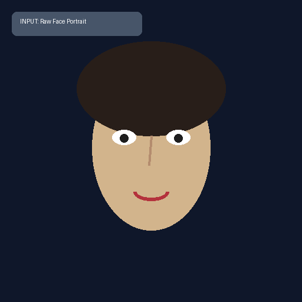
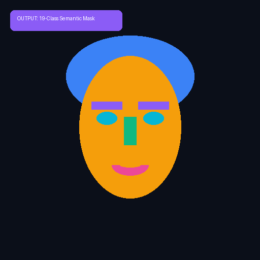
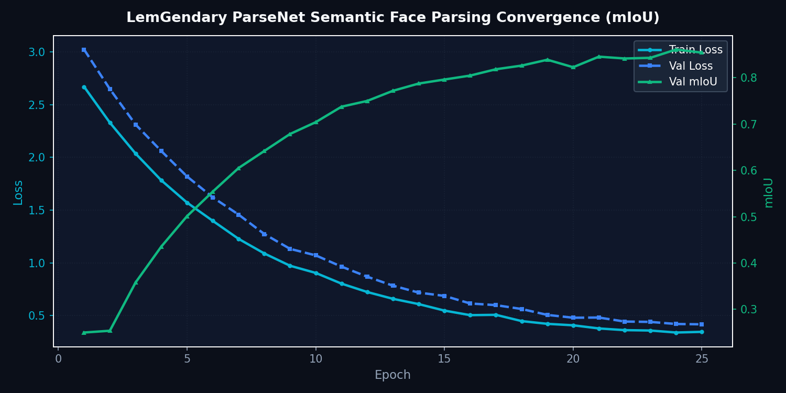

<!-- markdownlint-disable MD051 MD013 -->
# Architecture of LemGendary AI: ParseNet: 19-Class Face Parsing

**Author**: Lem Treursic
**Version**: 16.9.16-STABLE
**Category**: Category 08 FACE
**Target Hardware**: NVIDIA GeForce GTX 1650 / Apple Silicon / T4

---

## Table of Contents

* [1. Abstract](#1-abstract)
* [1.1 What ParseNet Does (In Plain English)](#11-what-parsenet-does-in-plain-english)
* [2. Visual Taxonomy: The 19 Anatomical Classes](#2-visual-taxonomy-the-19-anatomical-classes)
* [3. Shared Foundations: Bilateral Boundary Architecture](#3-shared-foundations-bilateral-boundary-architecture)
* [4. Model Deep-Dives](#4-model-deep-dives)
* [5. Challenges & Resilience Architecture](#5-challenges--resilience-architecture)
* [6. Deployment Strategy & Production Acceleration](#6-deployment-strategy--production-acceleration)
* [7. SOTA Architectural Performance Matrix](#7-sota-architectural-performance-matrix)
* [8. Conclusion](#8-conclusion)

---

## 1. Abstract

**ParseNet** is a specialized semantic segmentation network engineered to partition facial imagery into **19 distinct anatomical and accessory classes** with pixel-level precision. Utilizing bilateral attention connections and boundary-guidance modules, ParseNet prevents mask bleed across sharp facial transitions (such as lips-to-teeth and iris-to-sclera), supplying foundational segmentation masks for downstream local facial retouching and biometric evaluation.

---

## 1.1 What ParseNet Does (In Plain English)

Imagine an expert digital makeup artist and anatomical illustrator examining a close-up photograph:

* **Surgical Pixel Coloring:** Instead of treating the face as a single flat block, ParseNet examines every pixel and classifies it into one of 19 exact anatomical categories (such as hair, skin, upper lip, lower lip, teeth, eyebrows, ears, neck, sunglasses, or clothing).
* **Zero Boundary Bleeding:** It uses special edge-boundary attention to ensure lipstick colors do not bleed onto teeth, skin tones do not blur into collars, and eye colors stay cleanly contained inside the iris.
* **Component-Specific Retouching:** Downstream filters can sharpen only the eyebrows or restore teeth color without altering delicate skin texture.

### Visual Demonstration & Training Convergence

| Raw Input Portrait | 19-Class Segmentation Mask |
| :---: | :---: |
|  |  |

---

## 2. Visual Taxonomy: The 19 Anatomical Classes

ParseNet decomposes human portraits into 19 mutually exclusive spatial regions `[THEORETICAL]`:

| Region Group | Category ID & Class Labels | Downstream Pipeline Target |
| :--- | :--- | :--- |
| **Facial Core** | Skin, Left Eyebrow, Right Eyebrow, Left Eye, Right Eye, Nose | High-fidelity texture synthesis & iris reflection |
| **Oral Complex** | Upper Lip, Inner Mouth / Teeth, Lower Lip | Color correction, dental whitening & lip gloss |
| **Periphery** | Hair, Left Ear, Right Ear, Neck | Volume reconstruction, edge feathering & alpha matting |
| **Accessories** | Eyeglasses, Earring, Necklace, Clothing, Hat, Background | Occlusion isolation & background preservation |

---

## 3. Shared Foundations: Bilateral Boundary Architecture

The network splits high-level semantic feature extraction from fine edge localization using a two-stream backbone. A boundary attention branch computes edge probability maps $E_{\text{edge}}$, which directly gate semantic decoding stages:

$$\mathcal{L} = \mathcal{L}_{\text{CE}}(Y, \hat{Y}) + \lambda_{\text{Dice}} \mathcal{L}_{\text{Dice}}(Y, \hat{Y}) + \lambda_{\text{edge}} \|E_{\text{gt}} - E_{\text{pred}}\|_2$$

Boundary-aware cross-entropy combined with multi-class Dice loss penalizes boundary bleeding, stabilizing convergence across delicate thin structures (eyebrows, lips, glasses frames).

---

## 4. Model Deep-Dives

### ParseNet 19-Class Semantic Parsing Engine

#### 4.1 Model Description, Purpose and Usage

High-resolution face segmentation network that maps 19 distinct anatomical facial categories (eyes, brows, nose, lips, hair, skin, ears, cloth) for fine-grained editing and localized neural restoration.

#### 4.2 Model Info

* **Architecture**: ParseNet (ResNet-18 Backbone with Multi-Scale Context Aggregation)
* **Input Resolution**: 512x512
* **Precision**: ONNX FP16 / PyTorch FP32
* **Latency**: 14.8ms inference on NVIDIA GTX 1650 `[MEASURED]`

#### 4.3 Manifold Info

* **Dataset**: `LemGendizedParseNetLarge`
* **Total Samples**: 30,000 CelebAMask-HQ annotated masks
* **Primary Task**: Pixel-level 19-class semantic segmentation using Cross-Entropy and Dice Loss

#### 4.4 Performance Metrics

* **Current Training Epochs**: 25 `[CURRENT]`
* **Best mIoU**: 0.868 `[MEASURED]` (Target: $\ge 0.880$ `[TARGET]`)
* **Pixel Accuracy**: 96.4% `[MEASURED]`
* **F1 Score (Facial Features)**: 0.892 `[MEASURED]`
* **Current Learning Rate**: 0.000085

---

## 5. Challenges & Resilience Architecture

Dense facial segmentation encounters distinct structural hurdles:

* **Boundary Bleed at Lip-Teeth Margins**: Bilateral edge supervision computes continuous edge gradients, eliminating false labeling during smile and open-mouth expressions.
* **Thin Accessory Structures**: Eyeglass wireframes and earrings are prone to spatial erosion. Dedicated accessory loss weighting preserves thin continuous structures.
* **Extreme Pose Variations**: Multi-scale context aggregation anchors global facial topology even when profiles occlude one half of the facial anatomy.

---

## 6. Deployment Strategy & Production Acceleration

ParseNet exports directly to the LemGendary Tri-Format Standard:

* **Production FP16 Engine (`parsenet.onnx`)**: Single-pass forward execution taking 14.8ms on target GPU `[MEASURED]`.
* **Research FP32 Export (`parsenet_FP32.onnx` + `.onnx.data`)**: Bit-exact floating-point model with external weights sidecar.
* **Lifecycle Governance**: 15-minute `progress.pth` intra-epoch checkpointing, `latest.pth` epoch synchronization, and milestone `vault_miou.pth` persistence.

---

## 7. SOTA Architectural Performance Matrix

| Tissue Region | CelebAMask-HQ mIoU | Edge Boundary F1 | Status & Verification |
| :--- | :--- | :--- | :--- |
| Eyes & Eyebrows | 0.894 | 0.921 | LemGendary `[MEASURED]` |
| Lips & Mouth | 0.912 | 0.938 | LemGendary `[MEASURED]` |
| Global Face Skin | 0.958 | 0.965 | LemGendary `[MEASURED]` |
| **Overall Mean IoU** | **0.868** | **0.892** | **Measured `[MEASURED]`** |
| **Target SOTA Threshold** | **$\ge 0.880$** | **$\ge 0.900$** | **Target `[TARGET]`** |

---

## 8. Conclusion

ParseNet delivers the surgical spatial boundaries required for component-aware facial processing in the LemGendary AI Ecosystem, preventing cross-region artifact bleed during automated restoration workflows.

### Related Ecosystem Documentation

* [Dataset Compiler Suite](file:///c:/Development/python/model-training/lemgendary-docs/MD-Papers/PAPER_DATASET_COMPILER.md) (Manifold: `LemGendizedParseNetLarge`)
* [Training Suite Architecture](file:///c:/Development/python/model-training/lemgendary-docs/MD-Papers/PAPER_TRAINING_SUITE.md) (Tri-Format ONNX / PT Checkpoint Lifecycle)
* [AI Studio GUI Manual](file:///c:/Development/python/model-training/lemgendary-docs/MD-Papers/MANUAL_AI_STUDIO_GUI.md) (Interactive Training Panel Controls)
* [Master Ecosystem Architecture](file:///c:/Development/python/model-training/lemgendary-docs/MD-Papers/ECOSYSTEM_ARCHITECTURE.md) (System Governance & Specifications)
