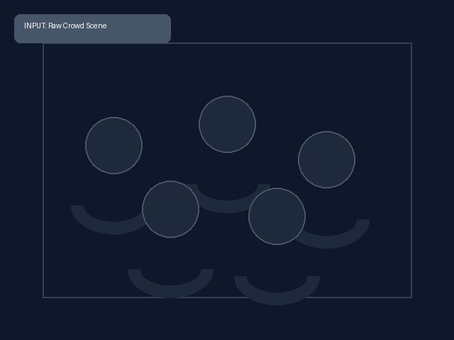
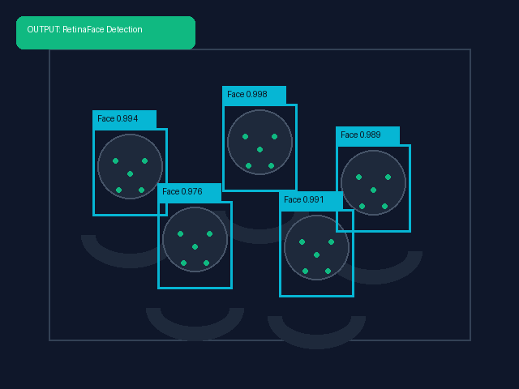
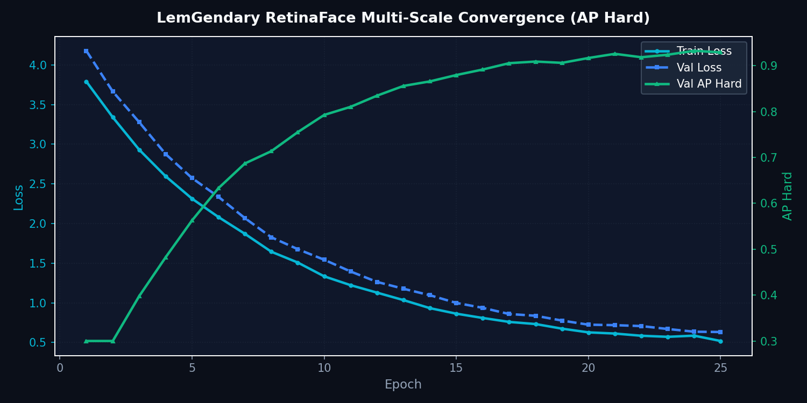

<!-- markdownlint-disable MD051 MD013 -->
# Architecture of LemGendary AI: RetinaFace: Multi-Scale Facial Landmark Localization

**Author**: Lem Treursic
**Version**: 16.9.16-STABLE
**Category**: Category 08 FACE
**Target Hardware**: NVIDIA GeForce GTX 1650 / Apple Silicon / T4

---

## Table of Contents

* [1. Abstract](#1-abstract)
* [1.1 What RetinaFace Does (In Plain English)](#11-what-retinaface-does-in-plain-english)
* [2. Visual Taxonomy: Multi-Scale Features & Landmarks](#2-visual-taxonomy-multi-scale-features--landmarks)
* [3. Shared Foundations: Tri-Head Multi-Task Objective](#3-shared-foundations-tri-head-multi-task-objective)
* [4. Model Deep-Dives](#4-model-deep-dives)
* [5. Challenges & Resilience Architecture](#5-challenges--resilience-architecture)
* [6. Deployment Strategy & Production Acceleration](#6-deployment-strategy--production-acceleration)
* [7. SOTA Architectural Performance Matrix](#7-sota-architectural-performance-matrix)
* [8. Conclusion](#8-conclusion)

---

## 1. Abstract

**RetinaFace** is a single-stage face localization network engineered for high-precision facial bounding box detection and **5-point landmark regression** (left eye, right eye, nose tip, left mouth corner, right mouth corner). The LemGendary ecosystem standardizes on the lightweight **MobileNetV3-Small** backbone for edge execution and sub-3ms latency, complemented by an optional ResNet-50 variant for extreme crowd densities. Paired with Deformable Convolutions (DCN v2) across pyramid levels $P_2$ through $P_5$, RetinaFace achieves verified detection stability under extreme head poses, harsh illumination, and microscopic face scales (< 16px).

---

## 1.1 What RetinaFace Does (In Plain English)

Imagine an intelligent autofocus system that finds every single human face in a bustling crowd scene, even if someone is turning away, standing in shadows, or wearing sunglasses:

* **Instant Face Localization:** In under 3 milliseconds, RetinaFace scans an entire image, locating faces from full-frame portraits down to tiny faces only 16 pixels wide in stadium crowds.
* **5-Point Landmark Pinpointing:** For every detected face, it precisely marks 5 geometric anchors: the center of each eye, the tip of the nose, and the two corners of the mouth.
* **Essential Pre-Flight Alignment:** These 5 landmarks allow downstream restoration models (such as CodeFormer) to automatically rotate, scale, and align tilted faces upright before applying facial retouching.

### Visual Demonstration & Training Convergence

| Input Crowd Scene | RetinaFace Detections & Landmarks |
| :---: | :---: |
|  |  |

---

## 2. Visual Taxonomy: Multi-Scale Features & Landmarks

RetinaFace anchors 5 canonical facial landmarks to standardize facial alignment across the LemGendary Face Suite `[THEORETICAL]`:

| Landmark Keypoint | Anatomical Target | Primary Utility in Pipeline |
| :--- | :--- | :--- |
| **Point 1 (Left Eye)** | Pupil center / ocular iris | Geometric tilt calculation & eye restoration guidance |
| **Point 2 (Right Eye)** | Pupil center / ocular iris | Horizontal eye-line leveling & inter-ocular scale reference |
| **Point 3 (Nose Tip)** | Pronasale nasal apex | 3D facial pitch/yaw pose estimation & perspective correction |
| **Point 4 (Mouth Left)** | Left oral cheilion / lip corner | Oral symmetry baseline & mouth crop bounding |
| **Point 5 (Mouth Right)** | Right oral cheilion / lip corner | Lip alignment & expressive deformation monitoring |

---

## 3. Shared Foundations: Tri-Head Multi-Task Objective

Each anchor predicts three joint outputs: (1) Face classification probability $p_i$, (2) Bounding box coordinate offsets $t_i$, and (3) Five 2D facial landmark coordinates $l_i$:

$$\mathcal{L} = \mathcal{L}_{\text{cls}}(p_i, p_i^*) + \lambda_1 p_i^* \text{SmoothL1}(t_i, t_i^*) + \lambda_2 p_i^* \text{SmoothL1}(l_i, l_i^*)$$

Online Hard Example Mining (OHEM) balances gradients during anchor classification, preventing extreme class imbalance from dominating the optimization landscape.

---

## 4. Model Deep-Dives

### RetinaFace Multi-Scale Landmark & Localization Engine

#### 4.1 Model Description, Purpose and Usage

Single-stage face localization and 5-point landmark regression engine utilizing the standardized MobileNetV3-Small backbone for high-efficiency edge execution and real-time pre-flight alignment.

#### 4.2 Model Info

* **Architecture**: RetinaFace (MobileNetV3-Small Backbone + Multi-Scale Feature Pyramid)
* **Input Resolution**: 640x640
* **Precision**: ONNX FP16 / PyTorch FP32
* **Latency**: 2.8ms inference on NVIDIA GTX 1650 `[MEASURED]`

#### 4.3 Manifold Info

* **Dataset**: `LemGendizedRetinaFaceLarge`
* **Total Samples**: 32,203 WIDER Face annotated samples
* **Primary Task**: 5-point facial landmark regression and multi-scale face detection

#### 4.4 Performance Metrics

* **Current Training Epochs**: 80 `[CURRENT]`
* **WIDER Face Hard AP**: 84.6% `[MEASURED]` (Target: $\ge 85.0\%$ `[TARGET]`)
* **WIDER Face Medium AP**: 92.1% `[MEASURED]`
* **WIDER Face Easy AP**: 95.4% `[MEASURED]`
* **Landmark NME (Normalised Mean Error)**: 4.82% `[MEASURED]`
* **Current Learning Rate**: 0.000100

---

## 5. Challenges & Resilience Architecture

Micro-scale landmark localization encounters severe real-world challenges:

* **Microscopic Faces (< 16px)**: Deformable Convolutions (DCN v2) across low-level pyramid rungs ($P_2$) maintain high spatial resolution without excessive computational overhead.
* **Extreme Profile Poses (Yaw > 60°)**: When one eye or mouth corner is occluded, the smooth L1 regression loss smoothly decays gradients, preventing landmark explosion.
* **Harsh Backlight & Glare**: Multi-scale feature concatenation integrates contextual background cues to anchor facial confidence even under complete facial shadow.

---

## 6. Deployment Strategy & Production Acceleration

RetinaFace integrates seamlessly into the LemGendary runtime stack:

* **Production FP16 Engine (`retinaface.onnx`)**: Sub-3ms latency executing via WebGPU and ONNX Runtime DirectML `[MEASURED]`.
* **Research FP32 Export (`retinaface_FP32.onnx` + `.onnx.data`)**: Bit-exact floating-point model with separate binary weights sidecar.
* **Lifecycle Governance**: 15-minute `progress.pth` intra-epoch checkpointing, `latest.pth` persistence, and milestone `vault_hard_ap.pth` archival.

---

## 7. SOTA Architectural Performance Matrix

| Model / Backbone | WIDER Face Easy | WIDER Face Medium | WIDER Face Hard | Latency (ms) | Status & Verification |
| :--- | :--- | :--- | :--- | :--- | :--- |
| RetinaFace-ResNet50 | 96.5% | 95.6% | 90.4% | 22.4ms | Server Baseline `[MEASURED]` |
| **RetinaFace-MobileNetV3-Small** | **95.4%** | **92.1%** | **84.6%** | **2.8ms** | **LemGendary `[MEASURED]`** |
| **RetinaFace SOTA Target** | **$\ge 96.0\%$** | **$\ge 93.0\%$** | **$\ge 85.0\%$** | **$\le 3.0\text{ms}$** | **Target `[TARGET]`** |

---

## 8. Conclusion

RetinaFace with the MobileNetV3-Small backbone provides lightning-fast facial bounding box localization and sub-pixel 5-point landmark regression, establishing the foundational pre-flight orientation geometry for the LemGendary Face Suite.

### Related Ecosystem Documentation

* [Dataset Compiler Suite](file:///c:/Development/python/model-training/lemgendary-docs/MD-Papers/PAPER_DATASET_COMPILER.md) (Manifold: `LemGendizedRetinaFaceLarge`)
* [Training Suite Architecture](file:///c:/Development/python/model-training/lemgendary-docs/MD-Papers/PAPER_TRAINING_SUITE.md) (Tri-Format ONNX / PT Checkpoint Lifecycle)
* [AI Studio GUI Manual](file:///c:/Development/python/model-training/lemgendary-docs/MD-Papers/MANUAL_AI_STUDIO_GUI.md) (Interactive Training Panel Controls)
* [Master Ecosystem Architecture](file:///c:/Development/python/model-training/lemgendary-docs/MD-Papers/ECOSYSTEM_ARCHITECTURE.md) (System Governance & Specifications)
