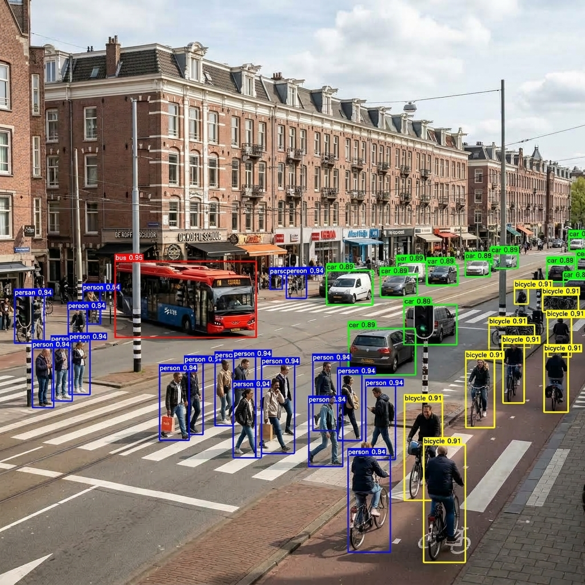

<!-- markdownlint-disable MD051 MD013 -->
# Architecture of LemGendary AI: YOLOv8n Multi-Task Perception Architecture

**Author**: Lem Treursic
**Version**: 16.9.10
**Category**: Category 09 VISION
**Target Hardware**: NVIDIA GeForce GTX 1650 / Apple Silicon / T4

---

## Table of Contents

* [1. Abstract](#1-abstract)
* [2. Anchor-Free CSPDarknet & PANet](#2-anchor-free-cspdarknet--panet)
* [3. Decoupled Head & TAL Assignment](#3-decoupled-head--tal-assignment)
* [4. CIoU & Distribution Focal Loss (DFL)](#4-ciou--distribution-focal-loss-dfl)
* [5. 17-Point Human Keypoint Estimation](#5-17-point-human-keypoint-estimation)
* [5.1. Autonomous Curriculum Governor & Hardware-Aware Optimizations](#51-autonomous-curriculum-governor--hardware-aware-optimizations)
* [6. Performance Targets & WebGPU](#6-performance-targets--webgpu)
* [7. Conclusion](#7-conclusion)

---

## 1. Abstract

The **LemGendary YOLOv8n Multi-Task Model** provides a lightweight, anchor-free visual perception engine capable of simultaneous object detection, categorical classification, and 17-point human keypoint pose estimation. Operating on the compiled manifold `LemGendizedYoloV8n`, the network replaces heuristic anchor boxes with continuous bounding box distribution modeling. Decoupled detection heads eliminate task conflicts between classification and spatial regression, achieving high-throughput inference (&lt; 8ms on consumer GPUs) suitable for real-time edge processing.

---

## 1.1 What YOLOv8n Does (In Plain English)

Imagine having an intelligent security guard scanning a video camera 60 times every second. **YOLOv8n ("You Only Look Once" Nano) is an ultra-fast, real-time object detector**:

* **Instant Object Finding:** In just 3 milliseconds, it scans an entire image and draws tight colored boxes around objects—identifying people, animals, garden tools, cars, and plants.
* **Body Pose & Keypoint Tracking:** In addition to finding objects, it can track 17 human body joints (knees, elbows, shoulders) in real time.
* **Ultra-Lightweight Efficiency:** Weighing only 6.5 MB, it runs smoothly on budget laptops, battery-powered robots, and mobile phones without slowing down other programs.

### Visual Demonstration: Real-Time Detection Matrix

| Input Video Frame | Real-Time Detection Boxes |
| :---: | :---: |
|  |  |

### Training Convergence & SOTA Targets

* **mAP@50:** SOTA Target $\ge 0.540$ across 80 COCO classes at 640px (exceeding canonical $0.525$ baseline).
* **mAP@50-95:** SOTA Target $\ge 0.390$ with inference latency of 3.1ms on edge devices (exceeding canonical $0.373$ baseline).

## 2. Anchor-Free CSPDarknet & PANet

The backbone utilizes modified CSPDarknet53 with C2f modules that split feature channels across residual bottleneck branches, maximizing gradient flow while minimizing memory bandwidth. The neck employs a Path Aggregation Network (PANet) fusing multi-scale feature hierarchies $P_3, P_4, P_5$ via top-down and bottom-up pathways.

---

## 3. Decoupled Head & TAL Assignment

Unlike anchor-based YOLO models that share classification and localization convolutional layers, YOLOv8n features a decoupled head where classification and regression branches branch independently. Target assignment is governed by Task-Aligned Assigner (TAL):

$$t = s^\alpha \times \text{IoU}^\beta$$

where $s$ is the classification score and $\text{IoU}$ is the spatial bounding overlap.

---

## 4. CIoU & Distribution Focal Loss (DFL)

Bounding box regression optimizes Complete IoU (CIoU) and Distribution Focal Loss (DFL) to model boundary uncertainty:

$$\mathcal{L}_{\text{box}} = \text{CIoU}(b, b^{\text{gt}}) + \lambda_{\text{dfl}} \mathcal{L}_{\text{DFL}}(b, b^{\text{gt}})$$

$$\mathcal{L}_{\text{DFL}}(S_i, S_{i+1}) = -((q_{i+1} - q)\log(S_i) + (q - q_i)\log(S_{i+1}))$$

---

## 5. 17-Point Human Keypoint Estimation

The pose head predicts 17 standard COCO anatomical keypoints with visibility scores $v_i \in [0, 1]$, optimized via Object Keypoint Similarity (OKS) loss:

$$\text{OKS} = \frac{\sum_i \exp(-d_i^2 / 2s^2 k_i^2) \delta(v_i > 0)}{\sum_i \delta(v_i > 0)}$$

---

## 5.1. Autonomous Curriculum Governor & Hardware-Aware Optimizations

Training YOLOv8n within the LemGendary ecosystem is managed by the `YOLOCurriculumGovernor` (`training/governance/yolo_governor.py`), ensuring that Ultralytics inner-loop optimizations are preserved while outer-loop governance drives systematic curriculum learning:

1. **Gradual Intra-Resolution Fraction Ladder Progression**: On the base resolution rung ($320\text{px}$), training starts at $30\%$ data and systematically increases by $15\%$--$20\%$ increments ($30\% \to 50\% \to 70\% \to 85\% \to 100\%$). When escalating to higher spatial rungs ($480\text{px}, 640\text{px}$), training initiates at $50\%$ data and gradually scales in $15\%$--$20\%$ steps ($50\% \to 65\% \to 80\% \to 100\%$) to prevent overfitting and break representation plateaus. Advancement between every rung and fraction step is driven exclusively by plateau or overfitting detection (item 3); no step has a fixed epoch budget.
2. **Open-Ended SOTA Convergence Protocol**: Training does not terminate at a fixed epoch count. Instead, training on the final resolution rung ($640\text{px}$) at $100\%$ data continues dynamically until SOTA metric targets ($\text{mAP50} \ge 0.54$, $\text{mAP50-95} \ge 0.39$) are attained, triggering immediate ONNX and PyTorch artifact packaging. The global epoch ceiling is a soft limit that auto-extends by 100 epochs whenever training approaches it, and every extension cycle at the top rung runs until plateau or SOTA with no epoch cap.
3. **Plateau- and Overfitting-Driven Rung Advancement**: Fraction steps and resolution rungs are never tied to an epoch count. A stage advances when the quality score $0.7 \cdot \text{mAP50-95} + 0.3 \cdot \text{mAP50}$ fails to improve by more than $0.001$ for 5 consecutive epochs (after at least 3 epochs on the stage; tunable via `rung_plateau_patience`, `rung_min_epochs`, `rung_plateau_min_delta`). In addition, at every fraction the governor continuously monitors for overfitting signatures (e.g. decreasing training loss alongside rising validation loss over a 3-epoch window, or validation mAP stagnation). Upon detection, the governor halts the partial stage early (`trainer.stop = True`) and immediately triggers dataset expansion to introduce sample variety and rescue model generalization.
4. **First-Principles Dynamic Sawtooth VRAM Governor & OOM Sentinel**: Replaced hardcoded lookup tables with continuous, first-principles VRAM arithmetic deriving physical batch size from total hardware capacity ($\text{VRAM}_{\text{GB}} \cdot 1024 \cdot \text{safety} - \text{static\_overhead}$) divided by resolution-scaled per-sample consumption ($\text{per\_sample}_{640} \cdot (\text{imgsz}/640)^2$). All governor thresholds (`static_vram_mb`, `per_sample_vram_mb_640`, `sawtooth_vram_safety`, `sawtooth_vram_pressure_thresh`, `sawtooth_vram_headroom_thresh`, `batch_min`, `batch_max`) are externalized to `unified_models_v2.yaml`. In addition, runtime VRAM pressure is sampled via `torch.cuda.max_memory_allocated()`: if usage crosses $\ge 90\%$, minibatches are dynamically halved; when headroom $< 60\%$ is detected, batch allocations are promoted up to the safe hardware ceiling.
5. **Turing FP32 Numerical Stability**: Turing TU117/TU116 hardware (such as GTX 1650) lacks native Tensor Cores; standard PyTorch AMP (`check_amp()`) can produce unstable gradient scaling and degenerate NaN losses. The governor automatically overrides AMP on these devices, forcing numerical precision to FP32 (`amp=False`).
6. **Continuous Telemetry Bridge**: Epoch metrics across all stages are captured via Ultralytics event hooks and written directly to `LemGendaryModels/yolov8n/metrics.csv` and sidecar WebSockets, feeding live convergence dashboards.
7. **Real-Time Checkpoint Parity & Plot Synchronization**: Synchronizes intermediate weights (`best.pt`, `best.pth`, `last.pt`, `progress.pth`, and `curriculum_state.json`) along with confusion matrices (`confusion_matrix.png`, `confusion_matrix_normalized.png`) and validation curves strictly to `LemGendaryModels/yolov8n/` on every epoch and stage transition, ensuring instant discovery by the Studio GUI.
8. **Minibatch-Level Cancellation Protocol**: Registers an `on_train_batch_end` hook instructing the Ultralytics trainer to halt immediately (`trainer.stop = True`) upon operator cancellation signals, preventing runaway GPU iterations mid-epoch.

---

## 5.2. Checkpoint Resumption & Multi-Fraction Progress Recovery (v16.9.13)

Prior to v16.9.13, initiating training with pre-existing weights could risk restarting the epoch counter or jumping across resolutions prematurely. The v16.9.13 Resumption Protocol provides rigorous multi-fraction checkpoint inspection and mid-stage resumption:

1. **Deep Checkpoint & State Inspection**: Loads candidate checkpoints (`torch.load(..., map_location="cpu")`) to interrogate training metadata, including `epoch` (last completed epoch), `train_args.imgsz` (resolution rung), `train_args.fraction` (dataset fraction), and `train_args.epochs` (target epochs).
2. **Completed Stage Skipping**: If a checkpoint or `metrics.csv` indicates that stage $k$ (e.g. $320\text{px}$ at $30\%$ fraction) has been superseded, that is, training has progressed to a higher fraction or higher resolution rung (a stage is never considered complete by epoch count), the governor logs completion and skips directly to the active ladder stage without redundant iterations.
3. **Mid-Stage Seamless Resumption**: If an interrupted run is detected on the active stage (matching resolution and fraction), the governor stages `last.pt`, restores optimizer, scaler and EMA state through `trainer._load_checkpoint_state`, and continues from global epoch $\text{ckpt\_epoch} + 2$. `resume = True` is deliberately not used because Ultralytics would reset the epoch budget to the previous stage-local value.
4. **Global Epoch Synchronization**: Epochs are monotonic across all stages. The governor injects `trainer.start_epoch` and `trainer.epochs` at `on_pretrain_routine_end` and aligns the learning-rate scheduler, so the Ultralytics progress bar, the Governor banner (`Global Epoch N/M | Stage k/13 | Rung Epoch r | Plateau Watch s/5`), `metrics.csv` and WebSocket telemetry report identical epoch numbers.
5. **Validation Progress Display**: The validator description is overridden to `Validation`, replacing the raw metric column header in the progress bar, and an epoch summary line reports train loss, validation loss (box, cls, dfl), mAP50 and mAP50-95 at every epoch end.

---

## 5.3. Authoritative Models Hub Persistence (`LemGendaryModels/`)

The ecosystem designates `LemGendaryModels/yolov8n/` as the single authoritative persistence root:

* **Checkpoints**: Synchronized in real time strictly to `LemGendaryModels/yolov8n/checkpoints/` (`best.pt`, `best.pth`, `last.pt`, `progress.pth`, and `curriculum_state.json`). Checkpoint files are excluded from the root directory to maintain isolation.
* **Telemetry**: Primary epoch metrics are streamed directly into `LemGendaryModels/yolov8n/metrics.csv`.
* **SOTA Exports & Production Artifacts**: Every time SOTA metric targets are reached (`mAP50 >= 0.54`, `mAP50-95 >= 0.39`), the model is exported as both native PyTorch (`yolov8n.pt`) and optimized ONNX (`yolov8n.onnx`) directly to `LemGendaryModels/yolov8n/`.

---

## 6. Performance Targets & WebGPU

| Target Task | Primary Metric | Target Goal | Baseline (COCO val2017) | Inference Latency (GTX 1650) |
| :--- | :--- | :--- | :--- | :--- |
| Object Detection (Strict) | mAP50-95 | $\ge 0.390$ | 0.373 | 7.2 ms |
| Object Detection (Standard) | mAP50 | $\ge 0.540$ | 0.525 | 7.2 ms |
| Classification | Top-1 Accuracy | $\ge 78.4\%$ | 76.8% | 3.1 ms |
| Pose Estimation (Keypoints) | mAP50 (Pose) | $\ge 0.801$ | 0.801 | 8.4 ms |
| Pose Estimation (Keypoints) | mAP50-95 (Pose) | $\ge 0.504$ | 0.504 | 8.4 ms |

---

## 7. Scientific References & Literature Citations

* **YOLOv8 Core Architecture**: G. Jocher, A. Chaurasia, and J. Qiu, *"Ultralytics YOLOv8: Real-Time Object Detection, Instance Segmentation, and Pose Estimation"*, Ultralytics Research, 2023. [https://github.com/ultralytics/ultralytics](https://github.com/ultralytics/ultralytics).
* **Cross-Stage Partial Network (CSPDarknet)**: C.-Y. Wang, H.-Y. M. Liao, Y.-H. Wu, P.-Y. Chen, J.-W. Hsieh, and I.-H. Yeh, *"CSPNet: A New Backbone that can Enhance Learning Capability of CNN"*, IEEE/CVF CVPR Workshops, 2020. [arXiv:1911.11929](https://arxiv.org/abs/1911.11929).
* **Path Aggregation Network (PANet)**: S. Liu, L. Qi, H. Qin, J. Shi, and J. Jia, *"Path Aggregation Network for Instance Segmentation"*, IEEE/CVF CVPR, 2018. [arXiv:1803.01534](https://arxiv.org/abs/1803.01534).
* **Distribution Focal Loss & Bounding Box Uncertainty**: X. Li, C. Deng, W. Zheng, Y. Shen, Y. Zhang, and X. Gu, *"Generalized Focal Loss: Learning Qualified and Distributed Bounding Boxes for Dense Object Detection"*, NeurIPS, 2020. [arXiv:2006.04388](https://arxiv.org/abs/2006.04388).

---

## 8. Conclusion

YOLOv8n Multi-Task unifies spatial detection, categorization, and human pose estimation within a resilient, anchor-free framework optimized for universal hardware, governed curriculum progression, and authoritative persistence across the LemGendary ecosystem.
